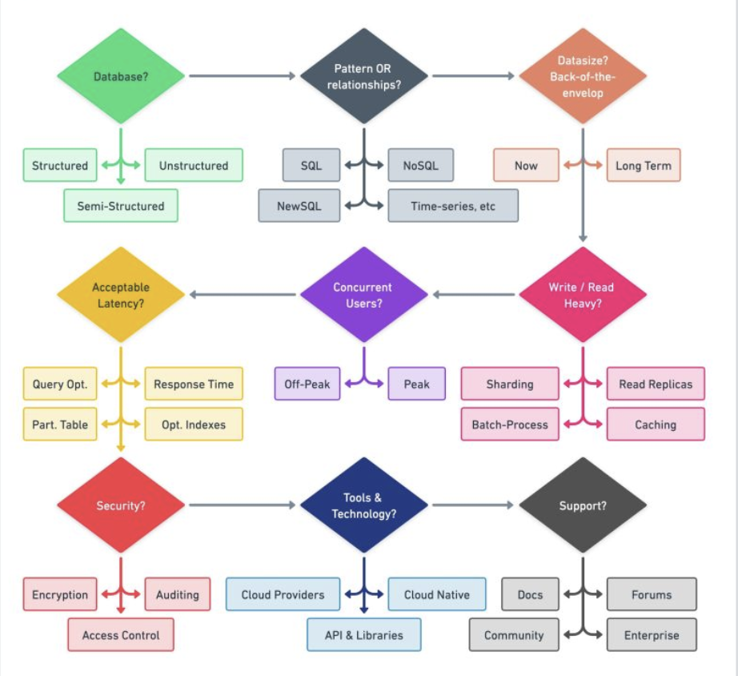

Hey everyone! If there's one decision in system design that often feels like a long-term commitment, it's choosing your database. I remember early in my career, the world of databases seemed like an endless buffet of options, each promising to be the perfect solution. Picking one felt a bit like choosing a life partner – you better get it right! And indeed, choosing the right database is probably one of the most important technical decisions a company will make.

Over the years, I've learned that there's no single "best" database, but there's definitely a "best fit" for your specific needs. The important thing to keep in mind, as many visual guides suggest, is to choose the right database for the right job. So, I thought I'd share some of my personal insights and the mental checklist I've developed when facing this crucial task.

### The First Big Question: What Kind of Data Are We Talking About?

My first step, always, is to deeply understand the nature of the data I'll be working with. It sounds basic, but I've seen projects go sideways because this wasn't clearly defined upfront. Generally, data falls into a few broad categories:

* **Structured Data:** This is data that fits neatly into predefined tables with rows and columns, much like a well-organized spreadsheet. Think traditional customer records, financial transactions, etc. Relational databases (SQL) are typically the champions here.
* **Semi-structured Data:** This data has some organizational properties but doesn't fit into a rigid relational schema. Think JSON, XML, or log files. Document databases and other NoSQL varieties often handle this beautifully.
* **Unstructured Data:** This is data in its most raw form, like images, videos, audio files, or large text documents (Blob). Object storage or specialized databases often come into play here.

For me, just classifying the primary data type often cuts the list of potential candidates in half!

### Use Case, Use Case, Use Case! (My "Right Job" Mantra)

Once I have a handle on the data *type*, the next critical thing is the *use case*. What will this database primarily *do*?

* **ACID Transactions (OLTP):** If your application demands strong consistency, reliability for transactions (like banking, e-commerce checkouts), then traditional relational databases are often the gold standard. Think systems like AWS RDS, Azure SQL Database, Google Cloud SQL, or self-managed MySQL and PostgreSQL. These are built for Online Transaction Processing.
* **Analytics & Reporting (OLAP):** Need to run complex queries, aggregations, and generate reports on massive datasets? Columnar databases are your friends here. They are optimized for Online Analytical Processing. Examples include Amazon Redshift, Azure Synapse Analytics, Google BigQuery, and Snowflake.
* **High-Speed Key-Value Access:** For scenarios like caching, session management, or real-time leaderboards where you need super-fast reads and writes based on a simple key, key-value stores are unbeatable. Think Redis, Memcached, Amazon DynamoDB, or Azure Cosmos DB.
* **Time-Series Data:** This is a big one I've learned to respect. If you're dealing with data points indexed by time – like metrics from monitoring systems, IoT sensor readings, or stock prices – a specialized time-series database (TSDB) is a lifesaver. Trying to manage high write loads and time-bucketed queries in a general-purpose relational database at scale can become a real headache. TSDBs like InfluxDB, Prometheus, OpenTSDB, or AWS Timestream are optimized for this. They often come with custom query interfaces and features for data retention and aggregation by labels.
* **Flexible Document Storage:** When dealing with semi-structured data like JSON or BSON, where each record might have a slightly different structure, document databases shine. MongoDB, Couchbase, and Google Firestore are popular choices here.
* **Navigating Complex Relationships:** If your data is all about connections – like social networks, recommendation engines, or fraud detection rings – a graph database is designed for this. Examples include Amazon Neptune or Neo4j.
* **Full-Text Search:** For applications needing powerful search capabilities over text data, dedicated search engines like Elasticsearch or OpenSearch are often integrated.

My personal mantra has become: don't try to force a square peg into a round hole. Using a general-purpose database for a highly specialized task often leads to performance bottlenecks and operational nightmares down the line.

### Considering the "Ilities" and Other Factors (My Evolving Checklist)

Beyond data type and primary use case, a host of other factors come into play. These are the "non-functional requirements" and practical considerations that can make or break your choice:

* **Volume of Data:** How much data do you expect today, and more importantly, in the future?  This will influence storage costs and query performance.
* **Concurrency:** How many users or services will be hitting the database at the same time?
* **Performance:** What are your latency and throughput requirements for reads and writes?
* **Security:** What are your data encryption needs (at rest and in transit)? What about access control and auditing?
* **Data Access Patterns:** Is your application read-heavy, write-heavy, or balanced?  For instance, a metrics collection system is typically very write-heavy with spiky read patterns for dashboards.
* **Consistency Model:** Do you need strong consistency (every read sees the latest write) or can you live with eventual consistency for higher availability or performance? (Think CAP theorem).
* **Scalability:** How will the database scale as your data and load grow? Vertically (bigger server) or horizontally (more servers)?
* **Reliability & Availability:** What are the uptime requirements? Do you need features like automated backups, point-in-time recovery, and failover?
* **Existing Ecosystem & Integrations:** How easily does the database integrate with your current technology stack, programming languages, and third-party tools?
* **Team Expertise:** Does your team have the skills to manage and operate the chosen database? The learning curve for a new technology can be significant.
* **Cost:** This includes licensing (if any), infrastructure, operational effort, and talent. Open-source options like PostgreSQL are often very attractive from a cost perspective.

I find that creating a matrix of these requirements and then mapping potential database solutions against it helps bring clarity to the decision-making process.

### A Final Personal Thought

Choosing a database is a journey of understanding your specific problem space as deeply as possible. The landscape is always evolving, with new databases and new features on existing ones appearing constantly. What works for a massive e-commerce site might be overkill for a startup's MVP. What's perfect for IoT data might be a terrible fit for financial ledgers.

My advice? Start with your data and your use cases. Understand the trade-offs. Don't be swayed by hype. And remember, picking a database is a long-term commitment, so choose wisely!
