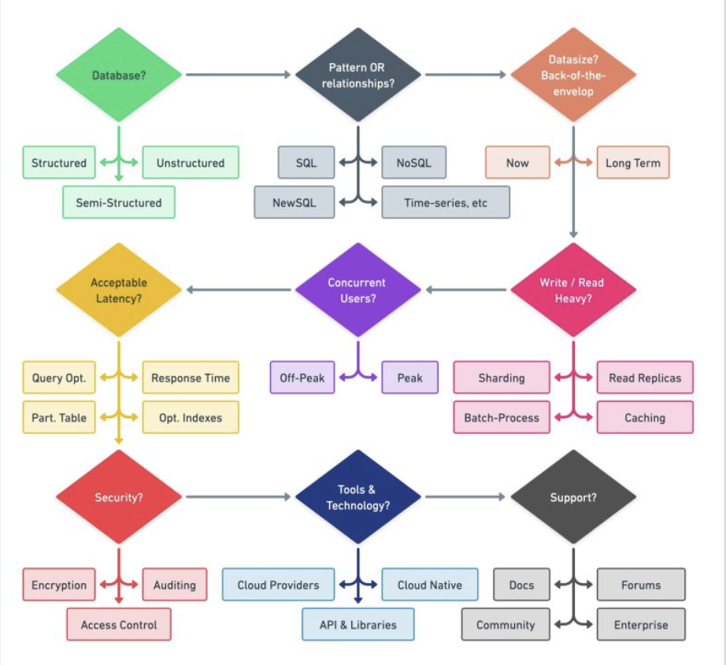

Choosing a database is one of the stickiest decisions in system design. Migrations are expensive, and everything built on top inherits the choice. Early in my career the field looked like a buffet where every option claimed to be the whole meal.

What I've settled on: there's no best database, only a best fit, and you find the fit in a fixed order. Classify the data, pin down what the database mostly has to *do*, then score the survivors against the non-functional requirements. Here's the checklist I actually use.

## Start with the data type

Understand the shape of the data before anything else. Projects go sideways when this isn't nailed down up front. Data falls into three broad buckets:

- **Structured** — fits predefined tables of rows and columns, like a tidy spreadsheet. Customer records, financial transactions. Relational (SQL) databases own this.
- **Semi-structured** — has some organisation but no rigid schema. JSON, XML, log lines. Document databases and other NoSQL stores handle it well.
- **Unstructured** — raw blobs: images, video, audio, large text. Object storage or specialised stores.

Classifying the primary data type usually cuts the candidate list in half on its own.

## Then the dominant use case

With the data type fixed, ask what the database primarily *does*. Match the workload to the family built for it — see also [the underlying data models](/citadel/interview/db-models):

- **ACID transactions (OLTP).** Strong consistency and transactional reliability — banking, e-commerce checkout. Relational databases are the gold standard: AWS RDS, Azure SQL Database, Google Cloud SQL, or self-managed MySQL and PostgreSQL.
- **Analytics and reporting (OLAP).** Complex queries and aggregations over large datasets. Columnar stores are built for it: Amazon Redshift, Azure Synapse Analytics, Google BigQuery, Snowflake.
- **High-speed key-value access.** Caching, session storage, real-time leaderboards — fast reads and writes on a simple key. Redis, Memcached, Amazon DynamoDB, Azure Cosmos DB.
- **Time-series data.** Points indexed by time: monitoring metrics, IoT sensors, prices. A purpose-built time-series database handles the heavy writes and time-bucketed queries that would choke a general-purpose relational database at scale, and adds retention and label-based aggregation. InfluxDB, Prometheus, OpenTSDB, AWS Timestream.
- **Flexible document storage.** Semi-structured records where each one may differ slightly in shape. MongoDB, Couchbase, Google Firestore.
- **Complex relationships.** When the data is mostly about connections — social graphs, recommendations, fraud rings — a graph database is designed for the traversal. Amazon Neptune, Neo4j.
- **Full-text search.** Powerful search over text: Elasticsearch or OpenSearch, usually alongside the primary store rather than replacing it.

The mantra is: don't force a square peg into a round hole. A general-purpose database on a specialised task turns into a performance and operations problem later.

## Then the non-functional requirements

Data type and use case narrow the field; these break the tie. They're the practical constraints that make or sink a choice:

- **Data volume** — how much now, and more importantly in a few years. Drives storage cost and query performance.
- **Concurrency** — how many users or services hit the database at once.
- **Performance** — target latency and throughput for reads and writes.
- **Security** — encryption at rest and in transit, access control, auditing.
- **Access patterns** — read-heavy, write-heavy, or balanced. A metrics pipeline is write-heavy with spiky dashboard reads; [sharding and partitioning choices](/citadel/interview/data-sharding) follow from this.
- **Consistency model** — strong (every read sees the latest write) or eventual, [traded against availability and latency](/citadel/interview/latency-consistency) per the CAP theorem.
- **Scalability** — vertical (a bigger server) or horizontal (more servers) as load grows.
- **Reliability and availability** — uptime targets, automated backups, point-in-time recovery, failover.
- **Ecosystem and integrations** — how cleanly it fits the existing stack, languages, and tooling.
- **Team expertise** — whether the team can actually run it. The learning curve is a real cost.
- **Cost** — licensing, infrastructure, operational effort, and hiring. Open-source options like PostgreSQL score well here.

A matrix of these requirements against the shortlisted databases turns a vague decision into a scored one.

## A closing thought

Start with the data and the use case; let the non-functional list settle the rest. The landscape keeps shifting — new engines, new features on old ones — so resist choosing by hype or by what you used last time. A wrong database doesn't hurt today; it hurts in three years, as a migration you can't schedule.
