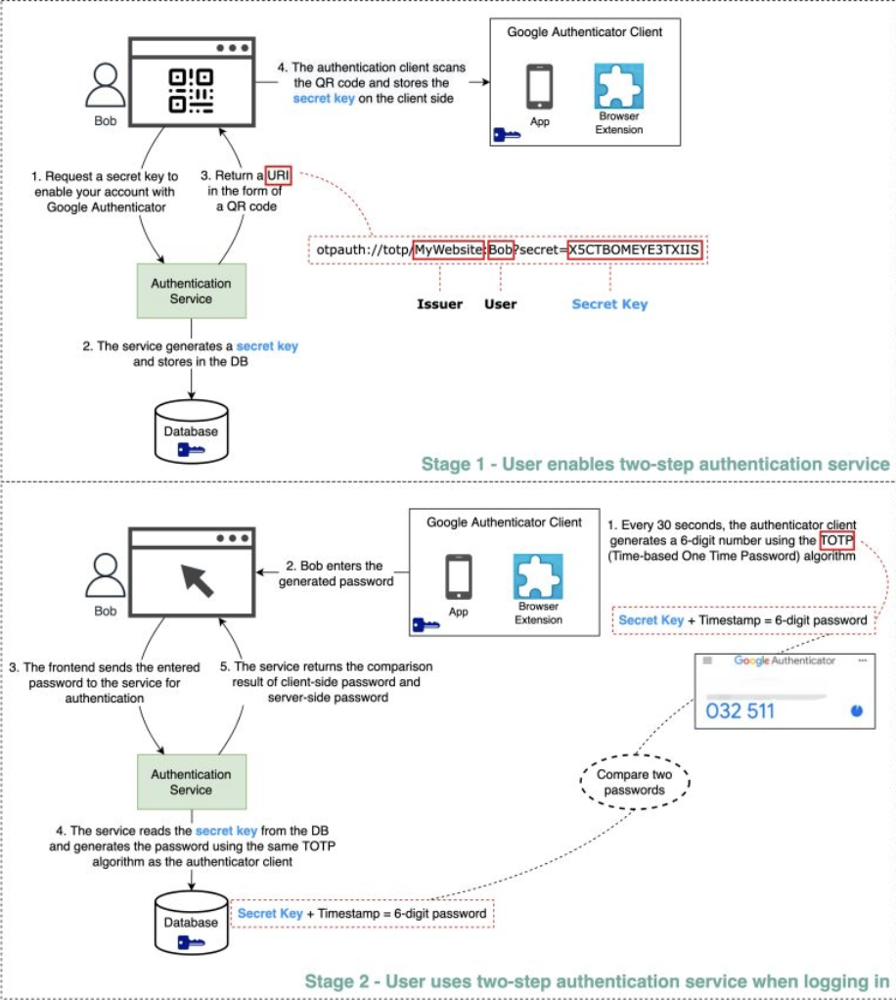

Hey everyone, and welcome back to the blog! In our increasingly digital lives, passwords have long been the primary gatekeepers to our online accounts. But let's be honest, with data breaches becoming more frequent and phishing attacks getting more sophisticated, relying solely on a password – no matter how strong you think it is – is like leaving your front door locked but the windows wide open. This is where **Two-Factor Authentication (2FA)** steps in as a crucial additional layer of security.

In today's digital world, where so much of our work and personal life happens online, enabling 2FA on important accounts is becoming standard advice. But how does it actually work, especially those nifty codes generated by apps like Google Authenticator? Let's demystify the process!

## What is Two-Factor Authentication (2FA)? Beyond Just a Password

**Two-Factor Authentication (2FA)** is a security process that requires users to provide **two different authentication factors** to verify their identity before granting access to an account or system. It’s a subset of Multi-Factor Authentication (MFA), which can involve even more factors. The idea is that even if one factor (like your password) is compromised, an attacker would still need the second factor to gain access.

These authentication factors typically fall into three categories:
1.  **Something you know:** This is usually a password, a PIN, or answers to security questions.
2.  **Something you have:** This refers to a physical item in your possession, such as:
    * A hardware token that generates one-time codes (e.g., an RSA SecurID fob).
    * Your smartphone, which can receive SMS codes, push notifications, or run an authenticator app.
    * A USB security key (e.g., YubiKey using FIDO2/WebAuthn standards).
3.  **Something you are:** This involves biometric verification, like a fingerprint scan, facial recognition, or voice recognition.

By requiring two distinct factors, 2FA significantly increases the difficulty for attackers to successfully impersonate a user.

## How App-Based 2FA (like Google Authenticator) Works: A Step-by-Step Guide

Software-based authenticators like Google Authenticator, Authy, Microsoft Authenticator, and others are a very common and convenient way to implement 2FA. They typically use the **Time-based One-Time Password (TOTP)** algorithm. Let's break down the process into two main stages:

### Stage 1: Enabling 2FA - The Setup Process

This is what happens when you decide to turn on 2FA for an online service using an authenticator app:

1.  **User Initiates Setup:** You, the user, navigate to the security settings of a website or application (let's call it `YourService.com`) and choose to enable 2FA using an authenticator app. The frontend of `YourService.com` then requests a secret key from its backend authentication service.
2.  **Secret Key Generation by Server:** The authentication service for `YourService.com` generates a **unique, cryptographically strong secret key** specifically for your account. This secret key is the cornerstone of the 2FA setup between you and this service. The service stores this secret key securely in its database, associated with your user profile.
3.  **Sharing the Secret via QR Code:** The authentication service typically returns a URI (Uniform Resource Identifier) to the frontend. This URI contains the secret key along with other information like the issuer's name (e.g., `YourService.com`) and your username. This URI is then displayed to you on the webpage in the form of a **QR code**.
4.  **User Scans with Authenticator App:** You open your preferred authenticator app (e.g., Google Authenticator) on your smartphone and use it to scan the QR code displayed by `YourService.com`. The authenticator app extracts the secret key from the QR code and stores it securely on your device. *At this point, both your authenticator app and the `YourService.com` server share the same secret key for your account.*

### Stage 2: Using 2FA for Login - The Verification Process

Now that 2FA is set up, here's how it works each time you log in:

1.  **Initial Login (Factor 1 - Password):** You go to `YourService.com` and enter your primary authentication factor, which is usually your username and password.
2.  **Prompt for 2FA Code:** If your password is correct, the website doesn't log you in immediately. Instead, it prompts you to enter the 2FA code from your authenticator app.
3.  **Code Generation by Authenticator App (Factor 2 - TOTP):** You open your authenticator app. The app uses two crucial pieces of information:
    * The **shared secret key** (stored during setup).
    * The **current time** (usually in 30-second or 60-second intervals).
    Using the TOTP algorithm, it generates a 6-digit (typically) one-time password that is valid only for that short time interval. This code appears on your app's screen.
4.  **User Enters TOTP Code:** You read the 6-digit code from your app and type it into the 2FA prompt on the `YourService.com` login page.
5.  **Server-Side Verification:**
    * The frontend of `YourService.com` sends this 6-digit code (along with your username/session context) to its backend authentication service.
    * The authentication service retrieves your unique secret key (the one shared during setup) from its database.
    * Using the *exact same TOTP algorithm* and the current time (importantly, servers allow for a small time window or "drift" to account for slight clock differences between your phone and the server), the server *independently generates its own 6-digit code*.
    * The authentication service then compares the code you submitted with the code it just generated on its side.
6.  **Access Granted or Denied:**
    * If the two codes match (and fall within the valid time window), the second factor is successfully verified! `YourService.com` logs you in.
    * If the codes do not match, access is denied, and you might be asked to try again or use a recovery method.

## The Security Behind TOTP-Based 2FA

The strength of app-based TOTP 2FA relies on a few key aspects:

* **The Shared Secret Key:** This is the linchpin.
    * **Secure Transmission:** It must be transmitted securely during the setup phase. This is why QR codes are typically shown over HTTPS connections.
    * **Secure Storage:** The secret key must be stored securely (ideally encrypted at rest) both in the authenticator app on your client device and in the service's database. If an attacker gets this secret key, they can generate valid TOTP codes.
* **Resistance to Guessing the 6-Digit Code:**
    * A 6-digit code offers 1 million ($10^6$) possible combinations.
    * The code changes frequently, typically every 30 seconds.
    * To brute-force this within the short 30-second window, an attacker would need to attempt roughly 30,000 combinations per second, assuming they could submit that many attempts. Most systems implement rate limiting on login and 2FA attempts to prevent such rapid guessing.
* **Protection Against Phishing (Partially):** While a very determined attacker running a sophisticated real-time man-in-the-middle phishing attack *could* potentially capture both a password and a current TOTP code and use it immediately, 2FA still offers significant protection against simpler phishing attacks where credentials are stolen for later use. A stolen TOTP code quickly becomes invalid.

## Other Forms of 2FA Factors

While app-based TOTP is popular, it's not the only "something you have" factor:
* **SMS/Email OTPs:** One-time passwords sent via text message or email. These are generally considered less secure due to risks like SIM swapping attacks or email account compromise.
* **Hardware Tokens:** Physical devices (like YubiKey or RSA SecurID fobs) that either display an OTP or use more advanced cryptographic protocols like FIDO2/WebAuthn when plugged into a device.
* **Push Notifications:** Some services send a push notification to a trusted mobile app, asking you to approve or deny a login attempt with a simple tap.

## Key Takeaways

* Two-Factor Authentication (2FA) significantly enhances account security by requiring two distinct pieces of evidence (factors) to prove your identity.
* App-based authenticators (like Google Authenticator) primarily use the Time-based One-Time Password (TOTP) algorithm, which relies on a shared secret key (set up via QR code) and the current time to generate short-lived codes.
* The server validates the user-provided TOTP code by independently generating its own code using the same secret and time, then comparing the two.
* The security of TOTP 2FA depends on the secrecy of the shared key and the time-sensitive, hard-to-guess nature of the generated codes.

In an era of pervasive cyber threats, enabling 2FA wherever available is one of the most effective steps you can take to protect your digital identity. It might add a few seconds to your login process, but the security boost is well worth it!
