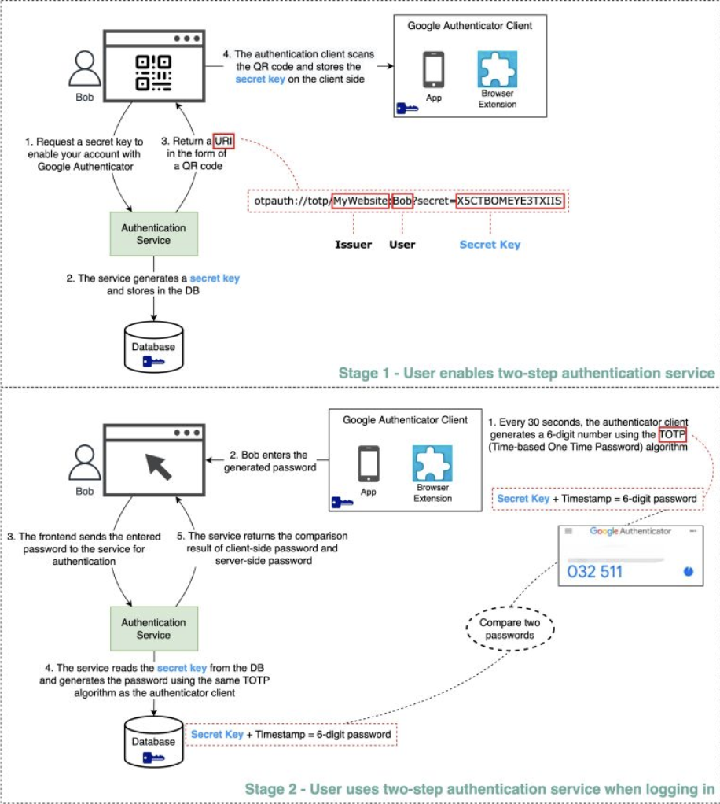

A password is one secret, and a stolen password is a break-in. Two-factor authentication (2FA) demands a second, independent proof of identity, so a leaked password on its own is not enough. The most common second factor is a six-digit code from an app like Google Authenticator — and that code isn't sent from anywhere. Your phone and the server each compute it from the same inputs and check that they match.

## The three kinds of factor

2FA requires two factors from *different* categories (it's the two-factor case of the more general multi-factor authentication):

- **Something you know** — a password, PIN, or security answer.
- **Something you have** — a hardware token that shows one-time codes (an RSA SecurID fob), a phone receiving an SMS or push or running an authenticator app, or a USB security key (a YubiKey speaking FIDO2/WebAuthn).
- **Something you are** — a fingerprint, face, or voice.

Two passwords is not 2FA. A password plus a code from your phone is.

## Setup: sharing one secret

Turning on app-based 2FA for `YourService.com`:

1. You choose "enable authenticator app" in security settings. The frontend asks the backend for a secret.
2. The server generates a **unique, cryptographically strong secret key** for your account and stores it against your profile.
3. It returns a URI containing that secret plus the issuer name and your username, rendered on the page as a **QR code**.
4. Your authenticator app scans the QR code, extracts the secret, and stores it on the device.

Now your app and the server hold the same secret for your account, and it never travels again.

## Login: computing the code on both sides

1. You enter username and password — factor one.
2. On a correct password the server doesn't log you in; it asks for the 2FA code.
3. Your app runs the **TOTP** (time-based one-time password) algorithm over two inputs: the **shared secret**, and the **current time** bucketed into 30- or 60-second intervals. Out comes a six-digit code, valid for that interval.
4. You type the six digits.
5. The server retrieves your secret, runs the *same* algorithm over the *same* time bucket, and generates its own six digits. It allows a small window on either side — a "drift" tolerance — for clock differences between your phone and the server.
6. If the codes match within the window, factor two is verified and you're in. Otherwise, denied.

The code is never transmitted at setup and never stored; it's recomputed each time from a secret and a clock.

## Where the security comes from, and where it stops

**The shared secret is everything.** It has to be transmitted safely during setup (the QR page is served over HTTPS) and stored encrypted at rest on both the phone and the server. Anyone who gets the secret can generate valid codes forever.

**The code resists guessing.** Six digits is $10^6$ combinations, and it rolls every 30 seconds. Brute-forcing it in the window would need ~30,000 attempts per second, and login endpoints rate-limit long before that.

**Phishing is only partly covered.** A real-time man-in-the-middle page can capture your password *and* a live code and replay both immediately. What TOTP defeats is the common case — credentials stolen now and used later — because a captured code expires in seconds.

## Other second factors

- **SMS or email OTP** — weaker, because a SIM-swap or a compromised mailbox intercepts the code.
- **Hardware tokens** — a YubiKey or SecurID fob; FIDO2/WebAuthn keys also bind the login to the site's domain, which does stop the real-time phishing case above.
- **Push approval** — a notification to a trusted app that you approve or deny with a tap.

For where the password itself is stored, see [salting and password hashing](/citadel/interview/salting); for how a verified login becomes a session, [JWTs](/citadel/interview/jwt) and [single sign-on](/citadel/interview/sso); and [a password manager](/citadel/system-design/password-manager) is the natural place to keep the recovery codes 2FA hands you.
