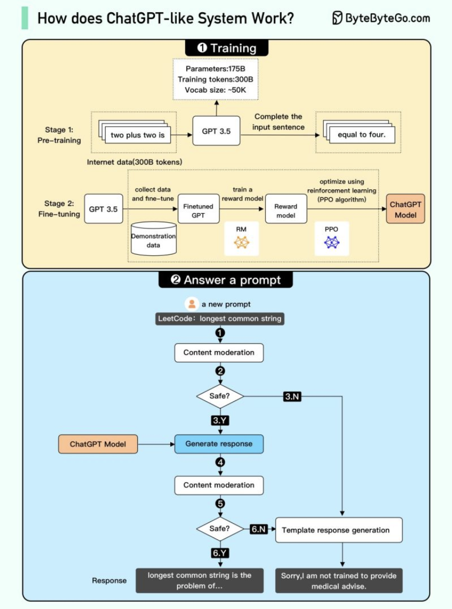
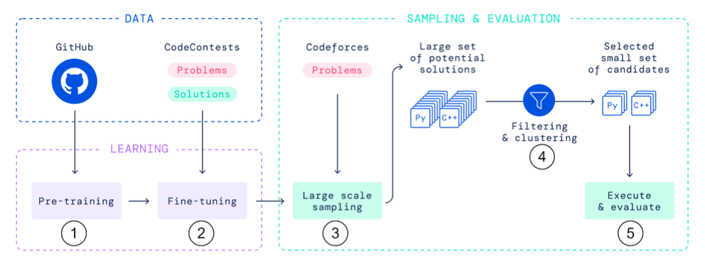

Hey everyone, and welcome back! The buzz around Artificial Intelligence, particularly **Large Language Models (LLMs)** and their application in software development, is impossible to ignore. Tools that can write essays, create art, and, most relevant to us, generate, debug, and explain code are rapidly moving from futuristic concepts to daily drivers for many developers. From conversational powerhouses like ChatGPT to specialized **AI coding engines** such as DeepMind's AlphaCode and widely used assistants like GitHub Copilot, these technologies are reshaping our interaction with code.

But what's really going on under the hood? How does an LLM learn to understand the nuances of human language and the strict syntax of programming languages? And what does the rise of AI coding engines mean for the future of software development? Let's embark on a more detailed exploration.

## The Engine Room: Deconstructing Large Language Models (LLMs)

Large Language Models are the foundational technology behind many recent AI breakthroughs.

* **What are LLMs?**
  LLMs are a type of AI model, often characterized by their massive size (billions to trillions of parameters) and training on vast quantities of text and code data. Their primary capability is to understand, generate, summarize, translate, and manipulate human language. Many state-of-the-art LLMs, especially those for generation tasks like GPT (Generative Pre-trained Transformer), are based on a **decoder-only transformer architecture**.
* **The Transformer Architecture - A Deeper Look:**
  The 2017 paper "Attention Is All You Need" was a watershed moment, introducing the **transformer model**. Its core innovation is the **self-attention mechanism**. This allows the model to weigh the importance of different words (or tokens) in an input sequence relative to each other, regardless of their distance within the sequence. This is crucial for understanding context and long-range dependencies.
  Transformers typically consist of:

  * **Embedding Layers:** Convert input tokens (words or sub-words) into numerical vectors.
  * **Positional Encodings:** Since transformers process tokens in parallel and don't have an inherent sense of sequence order like RNNs, positional information is added to the embeddings.
  * **Multi-Head Attention Blocks:** These allow the model to jointly attend to information from different representational subspaces at different positions. Essentially, it looks at the input sequence from multiple "perspectives" simultaneously.
  * **Feed-Forward Neural Networks:** Applied independently to each position after the attention mechanism.
  * **Layer Normalization and Residual Connections:** Help stabilize training and enable deeper networks.
    While the original transformer had an encoder-decoder structure (good for translation), many generative LLMs like GPT use only the decoder part, stacked multiple times.
* **The Epic Training Saga of an LLM:**
  Training these colossal models is a multi-stage, resource-intensive endeavor:

  1. **Phase 1: Pre-training on a Planetary Scale:**

     * The model is trained on an enormous and diverse dataset, often scraped from the internet (e.g., Common Crawl, Wikipedia, books, articles) and large code repositories like GitHub. The scale can be hundreds of billions or even trillions of tokens.
     * The primary objective during this unsupervised or self-supervised phase is usually a form of language modeling. For GPT-style models, this is **Causal Language Modeling (CLM)** – predicting the next token in a sequence given all previous tokens. This forces the model to learn grammar, semantics, factual knowledge, reasoning abilities, and coding patterns embedded in the data.
     * The sheer number of parameters (e.g., GPT-3 has 175 billion) and the dataset size necessitate massive computational resources (thousands of GPUs/TPUs running for weeks or months).
  2. **Phase 2: Fine-tuning - Teaching the LLM New Tricks (Instruction Following & Conversation):**
     A pre-trained LLM is a powerful language predictor, but it's not inherently an instruction-following assistant. To make it more useful and aligned with human intent (like ChatGPT), further fine-tuning is required, often involving these steps:

     * **Supervised Fine-Tuning (SFT):** A smaller, high-quality dataset of instruction-response pairs (demonstrations of desired behavior) is curated by human labelers. The pre-trained model is then fine-tuned on this dataset to learn to follow instructions and generate helpful, detailed answers.
     * **Reward Modeling (RM):** To teach the model what humans consider a "good" or "preferred" response, multiple outputs from the SFT model for various prompts are generated. Human labelers then rank these responses from best to worst. This ranking data is used to train a separate "reward model" whose job is to learn human preferences and output a scalar "reward" score for any given model response.
     * **Reinforcement Learning from Human Feedback (RLHF):** The SFT model is further optimized using reinforcement learning algorithms, most notably **Proximal Policy Optimization (PPO)**. In this stage, the LLM generates responses, the reward model scores them, and PPO updates the LLM's parameters to maximize these reward scores. This iteratively steers the model towards generating outputs that are more helpful, harmless, and honest.
* **Operational Aspects (e.g., Answering a Prompt in ChatGPT):**
  When a user interacts with a system like ChatGPT:

  1. The user's prompt is received.
  2. It typically undergoes **content moderation** to filter for harmful or inappropriate input. If it fails, a predefined template response might be sent.
  3. If the prompt passes, it's fed to the fine-tuned LLM.
  4. The LLM generates a response token by token, often using sampling techniques (like temperature sampling or top-k/top-p sampling) to control the randomness and creativity of the output.
  5. The generated response also usually goes through **content moderation** to ensure it's safe, harmless, and unbiased.
  6. If it passes, the response is displayed to the user; otherwise, a template response might be shown.
* **Current State and Capabilities (e.g., GPT-4):**
  Modern LLMs like GPT-4 have shown remarkable capabilities, including:

  * **Multimodality:** Ability to process and understand information from multiple types of input, such as text and images.
  * **Larger Context Windows:** Ability to process and remember much longer sequences of text (e.g., increased word limits to around 25,000 words ).
  * **Improved Reasoning & Performance:** Human-level performance on many academic and professional benchmarks.
  * **Enhanced Creativity and Collaboration:** Better at tasks requiring creative generation and nuanced understanding.
  * **Focus on Safety:** Significant efforts are made to make these models safer and less prone to generating harmful content. However, transparency can be a concern, with fewer details sometimes being shared about model architecture or training specifics.

## AI Coding Engines: The Rise of Algorithmic Teammates

AI coding engines or assistants are a specialized application of AI, often powered by LLMs that have been extensively trained and fine-tuned on massive amounts of source code. Their goal is to transform the software development process.

### How They Work (General Principles)

Most AI coding assistants analyze the context of the code a developer is currently working on—including existing code in the file, open tabs, comments, and even the cursor's position—to provide relevant suggestions. They can:

* Offer multi-line code completions.
* Generate entire functions or classes based on natural language comments or docstrings.
* Translate code from one programming language to another.
* Help identify bugs and suggest fixes.
* Explain complex code snippets in natural language.
* Generate unit tests.

### Popular AI Coding Assistants in the Wild

Several powerful tools are now available, often integrating directly into IDEs:

* **GitHub Copilot:** Initially powered by OpenAI's Codex model (a descendant of GPT-3 fine-tuned on code), Copilot provides real-time code suggestions and can generate substantial code blocks. It's one of the most widely adopted AI pair programmers.
* **Amazon CodeWhisperer:** Focuses on providing code recommendations, trained on a combination of Amazon's internal codebase and open-source code. It also includes features for security scanning to identify vulnerabilities in generated or existing code.
* **Tabnine:** Uses a combination of cloud-based large models and smaller models that can run locally for enhanced privacy. It offers team-specific models that can learn from a company's own codebase.
* **Replit Ghostwriter:** Integrated into the Replit online IDE, offering features like code completion, generation, transformation, and explanation.
* *(Many other tools like Codeium, Google's Studio Bot in Android Studio, etc., are also emerging and evolving rapidly.)*

### Deep Dive: DeepMind's AlphaCode (A Research Benchmark)

AlphaCode serves as a compelling example of AI tackling highly complex coding tasks—competitive programming.

* Its performance in Codeforces competitions, where it ranked favorably against human programmers (e.g., achieving an average rank better than 54.3% of human contestants in a set of contests ), showcased AI's potential in creative problem-solving through code.
* **AlphaCode's Multi-Stage Process:**
  1. **Pre-training:** Large-scale transformer models are initially pre-trained on a vast amount of code from public repositories like GitHub.
  2. **Fine-tuning:** These models are then specifically fine-tuned on a dataset of competitive programming problems and their corresponding correct solutions.
  3. **Massive Solution Generation:** For a new, unseen problem, AlphaCode generates a very large number (potentially millions) of candidate code solutions.
  4. **Filtering, Clustering, and Reranking:** This enormous set of generated solutions undergoes a rigorous process. They are filtered (e.g., to remove syntactically invalid or non-compiling code), clustered to group similar approaches, and then reranked based on various heuristics to identify a small set of the most promising candidates (e.g., at most 10 distinct, viable solutions).
  5. **Testing and Selection:** These few candidate programs are then executed against the problem's provided test cases. Their outputs are evaluated for correctness and performance, and the best solution (ideally one that passes all tests) is selected.

## The Reality Check: Capabilities, Limitations, and the Road Ahead

AI coding tools and LLMs are incredibly powerful, but it's important to have a realistic perspective.

* **Current Strengths:**
  * Rapidly generating boilerplate code and common patterns.
  * Assisting with learning new programming languages or frameworks by providing examples.
  * Acting as an "always-on" pair programmer for brainstorming and getting unstuck.
  * Automating repetitive coding tasks.
* **Current Limitations:**
  * **Correctness:** Generated code can sometimes be subtly incorrect, contain bugs, or be suboptimal. Thorough human review and testing are still essential.
  * **Contextual Understanding:** While good at local context, LLMs may not always grasp the broader architectural design or long-term maintainability implications of the code they generate.
  * **Security Vulnerabilities:** Generated code can inadvertently include security flaws if not carefully scrutinized.
  * **"Hallucinations":** LLMs can sometimes confidently generate plausible-sounding but entirely incorrect or non-functional code or explanations.
  * **Novelty:** They tend to excel at problems similar to what they've seen in their training data but may struggle with highly novel or abstract problem-solving.
* **Ethical Considerations & Concerns:**
  * **Bias:** Training data can contain biases, which might be reflected in the generated code or suggestions.
  * **Intellectual Property:** The use of vast amounts of publicly available code for training raises complex IP questions.
  * **Job Roles:** The role of human developers is likely to evolve, focusing more on system design, critical thinking, verification, and guiding AI tools, rather than purely manual coding of routine tasks.
* **The Future:**
  The most probable future is one of **human-AI collaboration**. AI will likely take on more sophisticated tasks, from complex refactoring to assisting in architectural design, but human oversight, creativity, and domain expertise will remain crucial. The models will continue to improve in accuracy, reasoning, and their ability to understand larger contexts.

## Key Takeaways

* Large Language Models (LLMs), powered by transformer architectures and trained through massive pre-training and careful fine-tuning (often including RLHF), are the driving force behind many current AI advancements.
* AI Coding Engines, like AlphaCode and GitHub Copilot, are specialized applications of these LLMs, demonstrating impressive capabilities in generating, assisting with, and even solving complex coding tasks.
* While these tools offer tremendous potential to boost productivity and change software development workflows, they also come with limitations and raise important considerations about code quality, security, and the evolving role of human developers.

The journey of AI, from its rule-based origins to today's sophisticated generative models, is a testament to decades of research. The synergy between human ingenuity and artificial intelligence promises an exciting future for software engineering.
