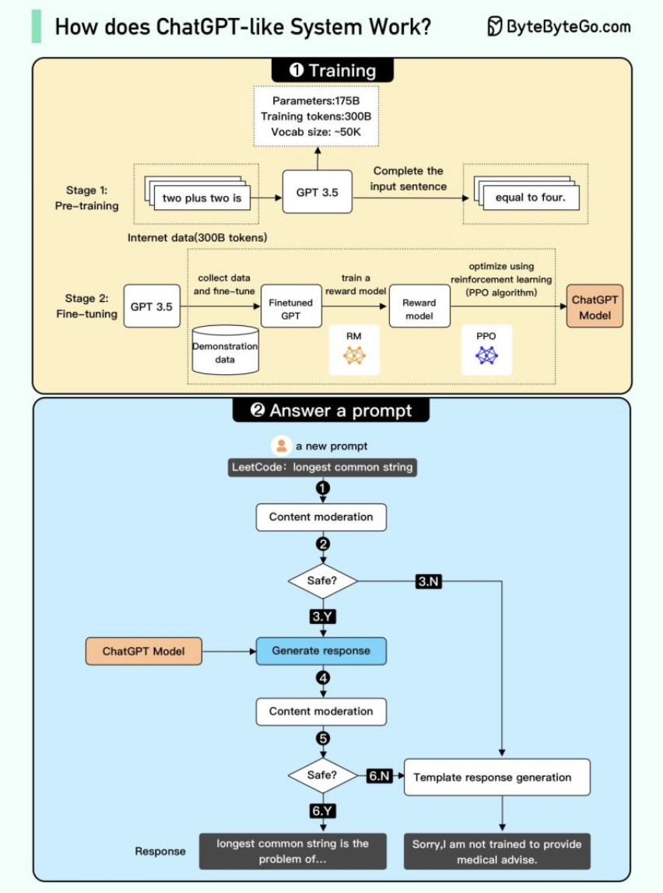
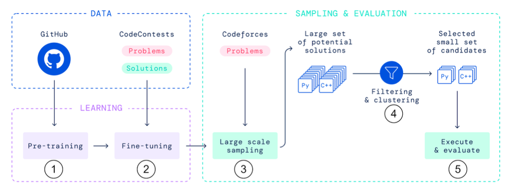

A large language model does one thing: predict the next token given the tokens so far. Everything a tool like ChatGPT or GitHub Copilot appears to "know" is a consequence of doing that at enormous scale, plus a second training stage that aligns the raw predictor with what people actually want. This walks through both, and then how coding assistants are built on top.

## What an LLM is

An LLM is a model with billions to trillions of parameters, trained on huge amounts of text and code. Generative models in the GPT family use a **decoder-only transformer**.

The transformer comes from the 2017 paper *Attention Is All You Need*. Its core is **self-attention**: for each token, the model weighs how much every other token in the sequence matters to it, regardless of distance, which is how it captures long-range context. Around that sit:

- **Embedding layers** — turn tokens into vectors.
- **Positional encodings** — add sequence-order information, since attention processes tokens in parallel with no inherent order.
- **Multi-head attention** — attend to the sequence from several "perspectives" at once.
- **Feed-forward networks** — applied per position after attention.
- **Layer normalization and residual connections** — keep training stable and let the network go deep.

The original had an encoder and a decoder (good for translation); GPT-style models stack only the decoder, many times over.

## Training

**Phase 1: pre-training.** Train on a vast, diverse corpus — Common Crawl, Wikipedia, books, GitHub — hundreds of billions to trillions of tokens. The objective is **causal language modeling**: predict the next token from all previous ones. Grammar, facts, reasoning patterns, and coding idioms all fall out of doing this well enough. GPT-3 has 175 billion parameters; a run takes thousands of GPUs or TPUs for weeks to months.

**Phase 2: alignment.** A pre-trained model predicts text; it isn't yet a helpful assistant. Three steps fix that:

- **Supervised fine-tuning (SFT).** Human labelers write instruction-response demonstrations; the model is fine-tuned to imitate them.
- **Reward modeling.** For many prompts, generate several SFT outputs; humans rank them best-to-worst; train a separate **reward model** to predict that ranking as a scalar score.
- **Reinforcement learning from human feedback (RLHF).** Optimize the SFT model with reinforcement learning — usually **Proximal Policy Optimization** — to maximize the reward model's score, steering it toward helpful, harmless, honest output.

## Answering a prompt

In a system like ChatGPT: the prompt is received, run through **content moderation**, and if it passes, fed to the aligned model. The model generates the response **token by token**, using sampling (temperature, top-k, top-p) to control randomness. The output is moderated again before display.

Modern models like GPT-4 add multimodality (text and images), larger context windows (around 25,000 words), stronger reasoning on academic and professional benchmarks, and heavier safety work — with less disclosure about architecture and training specifics.

## AI coding engines

A coding assistant is an LLM extensively fine-tuned on source code. It reads the local context — the current file, open tabs, comments, cursor position — and offers multi-line completions, whole functions from a comment, language translation, bug fixes, code explanations, and unit tests.

- **GitHub Copilot** — originally OpenAI's Codex (a GPT-3 descendant fine-tuned on code).
- **Amazon CodeWhisperer** — trained on Amazon and open-source code, with vulnerability scanning.
- **Tabnine** — cloud plus local models for privacy, and team models trained on a company's own code.
- **Replit Ghostwriter**, Codeium, and others in the IDE.

**DeepMind's AlphaCode** is a research benchmark for hard problems — competitive programming. On Codeforces contests it placed better than 54.3% of human contestants on average. Its pipeline:

1. **Pre-train** transformers on public GitHub code.
2. **Fine-tune** on competitive-programming problems and their correct solutions.
3. **Generate** a very large number of candidate solutions — up to millions — for one unseen problem.
4. **Filter, cluster, rerank** — discard non-compiling code, group similar approaches, rank by heuristics down to at most ~10 distinct candidates.
5. **Test and select** — run the candidates against the provided test cases and pick one that passes.

## The reality check

Strengths: boilerplate, learning a new framework by example, an always-on pair for getting unstuck, automating repetitive edits. Limits: generated code can be subtly wrong and needs review; local context is understood better than architecture; security flaws slip in; **hallucinations** produce confident nonsense; genuinely novel problems are hard. And the ethics are unsettled — training-data bias, the IP status of code trained on public repos, and a developer role shifting toward design, review, and steering the tools. The realistic future is human-AI collaboration, not replacement. For the network architecture underneath, see [neural networks](/citadel/interview/neural-network).
