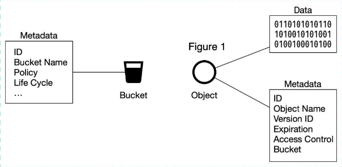
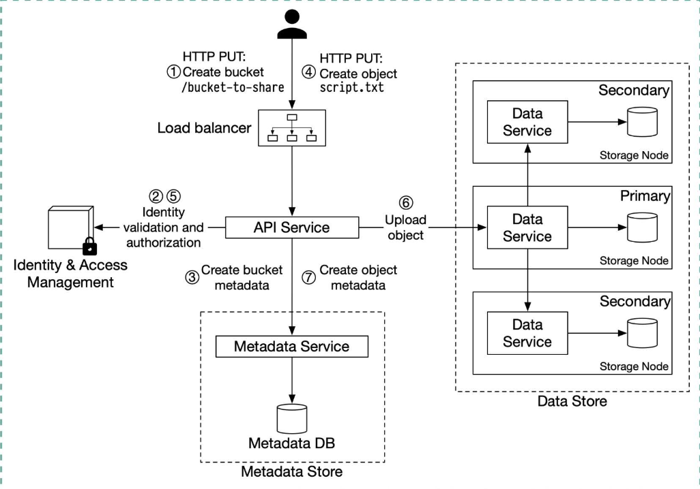

Hey everyone, and welcome back to the blog! When you think of "scale" in the tech world, Amazon inevitably springs to mind. From a simple online bookstore to a global e-commerce dominator and the provider of AWS, the world's most comprehensive cloud platform, Amazon operates at a mind-boggling magnitude. But how does it all *work*? How do they build and operate software that handles millions of users, processes countless transactions, and powers a significant portion of the internet?

While the full picture is incredibly vast and complex, we can get fascinating glimpses through their engineering blogs, public talks, and services like AWS. Today, let's explore some of the core principles and systems that make Amazon tick, taking a deeper dive into some crucial AWS services.

## Core Principles: Lessons from The Amazon Builders' Library

Amazon is quite open about its engineering culture and shares many insights through **The Amazon Builders' Library**. This collection contains architecture-based articles describing how Amazon architects, releases, and operates technology. If you're serious about system design, it's a treasure trove!

Several key themes emerge from their approach:

* **Designing for High Availability & Resilience:** Amazon systems are built with the expectation that failures *will* happen. They focus on:
    * Achieving "Beyond five 9s" of availability for critical data planes.
    * Implementing robust strategies like timeouts, retries, and backoff with jitter to handle transient issues.
    * Making retries safe with idempotent APIs, ensuring an operation can be repeated multiple times with the same effect as doing it once.
    * Employing techniques like workload isolation using shuffle-sharding to drastically limit the scope of impact of operational issues.
* **Scalability:** Systems are designed to handle massive growth.
* **Efficient Operations:**
    * "Going faster with continuous delivery" is a key mantra.
    * Ensuring rollback safety during deployments is crucial.
* **Performance Focus:** Amazon understood early on the impact of latency. For example, about a decade ago, they found that every 100ms of latency cost them 1% in sales.
* **Caching Strategies:** Effective caching is vital for performance and reducing load on backend systems.

## The E-commerce Engine: Scaling from Zero to Millions

Amazon's e-commerce platform is a masterclass in scaling. While the specifics are internal, we can look at general principles for scaling large e-commerce sites, which Amazon would have undoubtedly pioneered and perfected:

* **From Monolith to Microservices:** Like many large systems, the journey often involves evolving from a monolithic design to a more manageable and scalable microservice architecture. This means splitting functionalities like inventory management, user services, and payment processing into independent services.
* **Load Balancing:** Essential for distributing the massive influx of user traffic across numerous application servers.
* **Database Scaling:** This is critical. Strategies include:
    * Using read replicas to offload read queries from the primary database, significantly increasing read throughput.
    * Data partitioning, both vertical (more power to a server)  and horizontal (sharding data across servers), to handle growing data volumes and load.
    * Aggressive caching at multiple layers.

### A Critical E-commerce Service: The Payment System

Processing payments reliably and at scale is non-negotiable. A simplified payment flow on an e-commerce site like Amazon might look like this:
1.  A user action (like clicking "Buy") generates a payment event sent to a payment service.
2.  The payment service records this event and might break it down into payment orders (e.g., if items are from multiple sellers).
3.  A payment executor handles each order, interacting with external Payment Service Providers (PSPs) for credit card processing.
4.  Upon successful execution, the seller's wallet is updated, and the transaction is recorded in a ledger for financial reconciliation.
    Ensuring idempotency in such payment operations is crucial to avoid issues like double charging.

## AWS: The Cloud Behemoth - Powering Amazon and the World

It's impossible to talk about how Amazon works without discussing Amazon Web Services (AWS). What started as an internal project to manage their own infrastructure has grown into the world's leading cloud platform, offering over 200 fully-featured services as of recent years. AWS itself is a testament to Amazon's engineering prowess in building scalable, reliable, and secure distributed systems. Let's take a closer look at how some of these foundational services operate.

### Amazon S3 (Simple Storage Service) - Deeper Dive

S3 is an object storage service offering industry-leading scalability, data availability, security, and performance.
* **Core Concepts:**

    * **Buckets:** Globally unique, logical containers for objects. To upload data to S3, you must first create a bucket.
    * **Objects:** The fundamental entities stored in S3, comprising object data (the payload, which is immutable) and metadata (a set of name-value pairs describing the object, which is mutable).
* **Simplified Upload Process:**

    1.  A client sends an HTTP PUT request to create a bucket  or an object within a bucket (e.g., `/bucket-to-share/script.txt`).
    2.  The request is routed to an API service.
    3.  The API service interacts with IAM (Identity and Access Management) to ensure the user is authorized and has the necessary permissions (e.g., WRITE permission).
    4.  For object creation, once validation succeeds, the API service sends the object data (payload) to the Data Store. The Data Store persists the payload and returns a UUID for the object.
    5.  The API service then calls the Metadata Service (or metadata store) to create or update an entry in the metadata database with object information (e.g., `object_id` (UUID), `bucket_id`, `object_name`).
* **Handling Large Files: Multipart Upload**
    For large files (e.g., several GBs), uploading directly can be time-consuming and prone to failure if the network connection drops. S3 supports **Multipart Upload**:
    1.  The client initiates a multipart upload, and S3 returns an `uploadID`.
    2.  The client splits the large file into smaller parts and uploads them independently, each with the `uploadID` and a part number.
    3.  S3 returns an `ETag` (MD5 checksum) for each uploaded part.
    4.  After all parts are uploaded, the client sends a complete multipart upload request with the `uploadID`, part numbers, and their `ETags`.
    5.  S3 reassembles the object from its parts.
* **Ensuring Durability: Erasure Coding**
    To achieve high data durability, object storage systems like S3 commonly use **Erasure Coding**. Instead of just making multiple full copies, erasure coding breaks data into chunks, calculates parity chunks, and distributes these across different servers/devices. If some data chunks are lost (e.g., due to node crashes), the original data can be reconstructed using the remaining data and parity chunks. This offers very high durability (e.g., "11 nines") with less storage overhead than simple 3-copy replication.

### Amazon EC2 (Elastic Compute Cloud) - The Virtual Backbone

While S3 handles storage, EC2 is a cornerstone for compute power in AWS.
* **What it is:** EC2 provides resizable compute capacity in the cloud, essentially offering virtual servers (known as instances) that you can launch and manage. It's designed to make web-scale cloud computing easier for developers.
* **Key Features & Concepts:**
    * **AMIs (Amazon Machine Images):** These are pre-configured templates for your instances, typically including an operating system and potentially additional software. You launch instances from AMIs.
    * **Instance Types:** EC2 offers a vast array of instance types optimized for different use cases, with varying combinations of CPU, memory, storage (e.g., EBS-optimized), and networking capacity.
    * **EBS (Elastic Block Store):** Provides persistent block-level storage volumes for use with EC2 instances. These are like virtual hard drives that can be attached to your instances.
    * **Security Groups:** Act as virtual firewalls for your instances to control inbound and outbound traffic at the instance level.
    * **Auto Scaling:** Allows you to automatically adjust your EC2 capacity up or down according to conditions you define, helping to maintain application availability and control costs.
    * **Underlying Infrastructure:** As noted, other AWS services, like the execution environments for AWS Lambda functions, run on EC2 instances.

### AWS Lambda (Serverless Computing) - Deeper Dive

Lambda lets you run code in response to events without provisioning or managing servers.
* **Execution Model & Isolation:** Lambda functions run within **Firecracker MicroVMs**. Firecracker is a virtualization technology developed at Amazon specifically for creating and managing secure, multi-tenant, minimal-overhead microVMs for serverless workloads. Each function execution runs in a sandbox environment that provides a minimal Linux userland with some common libraries and utilities. The overall execution environment (worker) is hosted on EC2 instances.
* **Invocation Flow (Simplified):**
    * **Synchronous Execution:**
        1.  An event (e.g., API Gateway request) triggers a function. The request is handled by a Frontend service.
        2.  The **Worker Manager** communicates with a **Placement Service**, which is responsible for finding an available worker or provisioning a new sandbox on an EC2 host.
        3.  The Worker Manager then calls `Init()` on the chosen worker to initialize the function for execution. This involves downloading the Lambda package (your code and dependencies) from S3 and setting up the Lambda runtime.
        4.  The Frontend Worker is now able to call `Invoke()` to execute your function code.
    * **Asynchronous Execution:**
        1.  An event (e.g., S3 event, SNS notification) triggers a function. The Application Load Balancer (or another entry point) forwards the invocation to an available Frontend.
        2.  The Frontend places the event onto an internal queue (like Amazon SQS).
        3.  A set of **pollers** assigned to this internal queue retrieve messages and move them to a Frontend synchronously.
        4.  From there, it largely follows the synchronous invocation pattern (Worker Manager, Placement, Init, Invoke).

## Engineering Culture and Tools: Building at Scale

Amazon's scale necessitates unique approaches to software development and tooling.

### Brazil Build System

To enhance productivity, especially with their micro-repository (many small repos) approach, Amazon developed its own innovative build system called Brazil.
* It uses a concept called **VersionSets**, which are collections of package versions providing a private, consistent space for a package and its dependencies.
* Brazil is designed to guarantee build consistency and reproducibility, with each build process being snapshotted and output artifacts versioned.

### Architectural Evolution: The Prime Video Example

Amazon isn't afraid to revisit and evolve its architectures, even if it means moving against prevailing trends. A fascinating example is the Amazon Prime Video monitoring service.
* Initially, parts of this service used a serverless architecture involving AWS Step Functions, Lambda, and S3 for intermediate data storage.
* However, to optimize costs for this high-volume, high-frequency task, the team re-architected it into a more monolithic service running on Amazon ECS (Elastic Container Service). This change reportedly led to **90% cost savings**!
* As Amazon CTO Werner Vogels aptly put it, "Building evolvable software systems is a strategy, not a religion. And revisiting your architectures with an open mind is a must.".

## Key Takeaways

* Amazon's operations are built on robust engineering principles focusing on availability, scalability, resilience, and performance, as detailed in their Builders' Library.
* Their e-commerce platform leverages common (and often pioneered by them) scaling techniques like microservices, advanced database strategies, and aggressive caching.
* AWS underpins much of Amazon's infrastructure and provides the world with a vast array of cloud services, each a complex distributed system in itself (e.g., S3 with erasure coding and multipart upload, EC2 as a virtual server backbone, Lambda with Firecracker microVMs).
* A strong engineering culture, supported by custom tools like the Brazil build system  and a willingness to evolve architectures, is key to their success.

The sheer scale and complexity of Amazon's systems are truly astounding, offering endless learning opportunities for anyone interested in system design.
