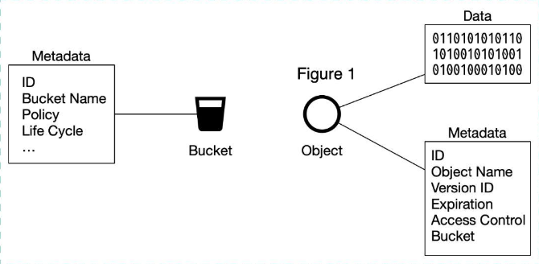
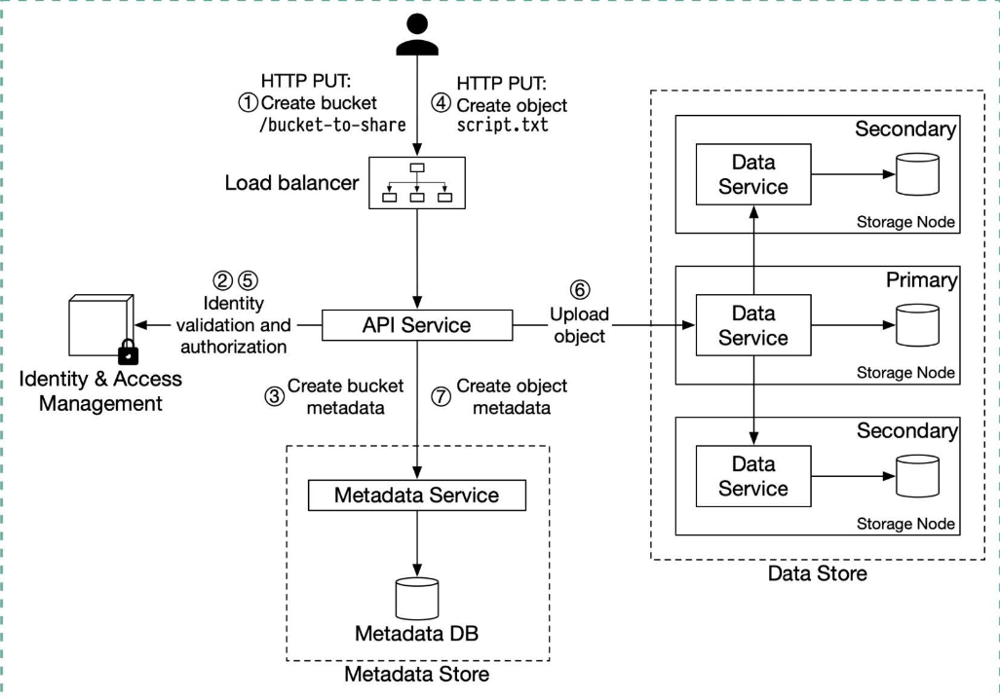

Amazon runs two things at once: the e-commerce platform, and AWS — the cloud that started as internal infrastructure and now offers over 200 services. Both are held together by a set of engineering principles Amazon publishes openly, and both are worth reading for the patterns that show up everywhere at scale. This post covers those principles, a sketch of the payment path, and how three foundational AWS services actually work underneath.

## The principles

The **Amazon Builders' Library** collects architecture write-ups on how Amazon builds, ships, and runs software. A few themes recur:

- **Assume failure.** Critical data planes target "beyond five nines" of availability. Transient failures are handled with timeouts, **retries with exponential backoff and jitter** (randomised delay so retrying clients don't synchronise into a thundering herd), and **idempotent APIs** so a retried operation has the same effect as running it once.
- **Contain blast radius.** **Shuffle sharding** assigns each customer a random subset of workers, so one customer's bad traffic degrades only the few shards they share, not the whole fleet.
- **Ship safely and often.** Continuous delivery, with rollback safety as a first-class deployment requirement.
- **Latency is money.** Amazon measured that every extra 100 ms of latency cost about 1% in sales — one of the original data points for taking web performance seriously.
- **Cache deliberately** at multiple layers to cut backend load.

## The e-commerce engine

The platform followed the familiar path: a monolith split into microservices — inventory, user, payments — each scaled independently behind load balancers, with the database scaled by [read replicas](/citadel/interview/read-replica-pattern), vertical and horizontal [partitioning](/citadel/interview/data-sharding), and layered caching.

**The payment flow**, simplified:

1. A "Buy" click sends a payment event to the payment service.
2. The service records the event and may split it into payment orders — one per seller, if the cart spans several.
3. A payment executor processes each order, calling external payment service providers for card processing.
4. On success, the seller's wallet is credited and the transaction is written to a ledger for [reconciliation](/citadel/interview/payment-ecosystem).

Every step must be **idempotent** — a retried payment must not double-charge.

## AWS S3

S3 is object storage. Two concepts:

- **Buckets** — globally unique named containers. You create one before you can store anything.
- **Objects** — the stored entity: an **immutable** data payload plus **mutable** name-value metadata.

**The upload path:**

1. The client sends an HTTP `PUT` for a bucket or an object (`/bucket-to-share/script.txt`).
2. It's routed to the API service.
3. The API service checks **IAM** for the caller's permissions (e.g. `WRITE`).
4. For an object, the payload goes to the data store, which persists it and returns a **UUID**.
5. The API service writes an entry to the metadata store: `object_id` (the UUID), `bucket_id`, `object_name`.

**Multipart upload** handles large files, where a single stream risks timing out or dropping:

1. The client starts a multipart upload; S3 returns an `uploadID`.
2. The client splits the file and uploads parts independently, each tagged with the `uploadID` and a part number.
3. S3 returns an `ETag` (an MD5 checksum) per part.
4. The client sends a complete request listing part numbers and `ETag`s.
5. S3 reassembles the object.

**Durability comes from [erasure coding](/citadel/interview/erasure-coding).** Rather than storing three full copies, S3 splits data into chunks, computes parity chunks, and spreads them across devices. Lost chunks are reconstructed from the survivors plus parity, reaching roughly eleven nines of durability at far less storage overhead than 3× replication.

## AWS EC2

EC2 is resizable virtual servers (instances). The pieces:

- **AMIs (Amazon Machine Images)** — templates (OS plus software) that instances launch from.
- **Instance types** — fixed CPU/memory/storage/network profiles tuned for different workloads.
- **EBS (Elastic Block Store)** — persistent block volumes that attach to instances like virtual disks.
- **Security groups** — per-instance virtual firewalls for inbound and outbound traffic.
- **Auto Scaling** — adds and removes instances against rules you define.

EC2 is also the substrate for higher-level services — Lambda's execution workers run on EC2.

## AWS Lambda

Lambda runs code on events with no server to manage. Underneath:

- **Isolation.** Each function runs in a **Firecracker microVM** — a lightweight virtualization technology Amazon built for secure, multi-tenant, low-overhead serverless sandboxes. The sandbox is a minimal Linux userland; the worker hosting it is an EC2 instance.
- **Synchronous invocation.** An event (say an API Gateway request) hits a Frontend service. The **Worker Manager** asks a **Placement Service** for an available worker or a fresh sandbox on an EC2 host. It calls `Init()` on that worker — download the function package from S3, set up the runtime — then `Invoke()` to run the code.
- **Asynchronous invocation.** The event reaches a Frontend via a load balancer, which puts it on an internal queue (Amazon SQS). **Pollers** pull from that queue and hand events to a Frontend, which then follows the synchronous path.

## Engineering culture

**Brazil** is Amazon's build system, built for a many-small-repos codebase. It uses **VersionSets** — curated collections of package versions that give a package and its dependencies a consistent, private build space. Every build is snapshotted and its artifacts versioned, so builds are reproducible.

**Amazon revises its own architectures.** The Prime Video monitoring service started on serverless — Step Functions, Lambda, S3 for intermediate state — and the team later re-architected it into a monolith on ECS to cut cost on a high-frequency workload, reporting a **90% saving**. As CTO Werner Vogels put it: "Building evolvable software systems is a strategy, not a religion. And revisiting your architectures with an open mind is a must."

## The through-line

The Builders' Library patterns — idempotency, backoff with jitter, shuffle sharding, rollback safety — aren't Amazon-specific; they're what any system needs once failure is routine rather than rare. And the Prime Video reversal is the honest footnote: the same company that sells serverless will move a workload off it when the numbers say so. See [microservices](/citadel/interview/cloud-native), [erasure coding](/citadel/interview/erasure-coding), and [the payment ecosystem](/citadel/interview/payment-ecosystem) for the pieces this post leans on.
