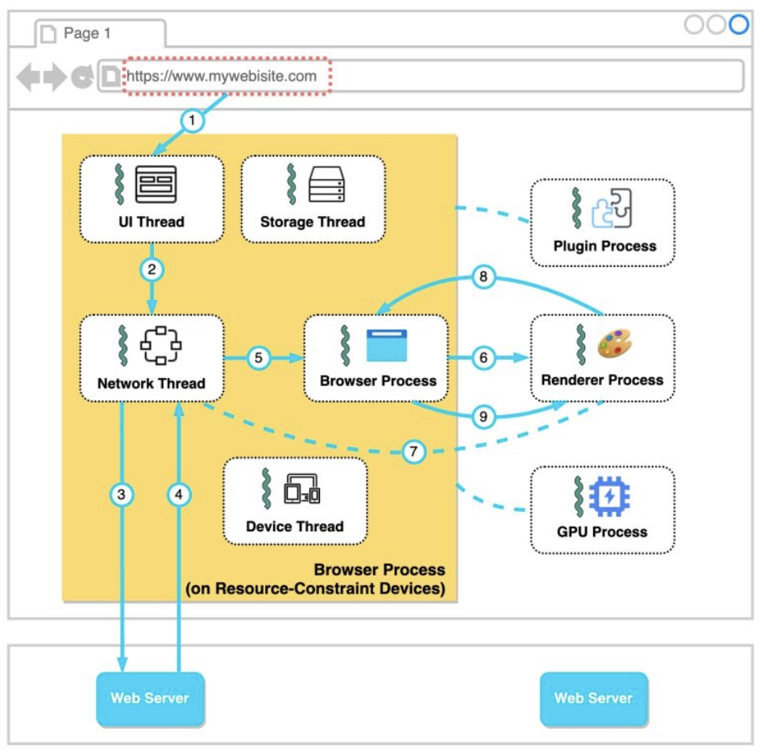

Hey everyone, and welcome back to the blog! Our web browser is arguably the most used application on our computers and phones. It's our portal to the vast expanse of the internet, a window to information, entertainment, and connection. But have you ever stopped to think about the sheer complexity humming beneath that sleek interface? How does it take a simple URL and transform it into a rich, interactive webpage in milliseconds?

Modern web browsers like Google Chrome are incredibly sophisticated pieces of software. Today, let's embark on a journey to demystify their inner workings, exploring their architecture and the intricate process of bringing a webpage to your screen. We'll often use Chrome as an example, as its architecture is well-documented by its team.

## The Big Picture: A Multi-Process Architecture

To handle the demands of the modern web—stability, security, and responsiveness—many browsers, including Chrome, employ a **multi-process architecture**. Instead of running everything as a single, monolithic application, the browser divides its tasks among several independent processes. This is a key design choice: if one process (say, for a misbehaving tab) crashes, it ideally won't bring down the entire browser or other unrelated tabs.

Generally, you'll find these main types of processes:

* **Browser Process:** This is the main coordinator or the "brain" of the browser. It controls the user interface elements like the address bar, bookmarks, back and forward buttons, and manages the overall browser windows. It also handles network requests, file access, and coordinates with all the other processes.
* **Renderer Process(es):** These are the workhorses responsible for actually displaying website content within a tab. Critically, modern browsers like Chrome often create a separate renderer process for each open tab (or even for each iframe within a tab). This significantly improves stability and security.
* **GPU Process:** Modern web pages often involve complex graphics, animations, and videos. The GPU process is dedicated to handling these GPU-accelerated tasks, offloading graphics rendering from the main CPU to improve performance.
* **Plugin Process(es):** For any browser plugins that a website might use (though plugins like Flash are much less common now), a separate process is typically used to manage each plugin instance.

On powerful hardware, Chrome might even further break down services within the browser process into different threads for enhanced responsiveness, a concept sometimes referred to as **Servicification**.

## The Journey of a URL: From Typing to Display

So, what happens when you type a URL like `https://sandeepswain.dev` and hit Enter? Let's follow the data flow:

### 1. You Type a URL and Hit Enter

* The moment you start typing, the **UI thread** within the Browser process handles your input. It might offer suggestions from your history or search engines.
* When you hit Enter, the UI thread instructs the Browser process to initiate a network call to fetch the resource specified by the URL. This involves several sub-steps:
    * **DNS Lookup:** The browser first needs to translate the human-readable domain name (e.g., `sandeepswain.dev`) into a machine-readable IP address. It checks various caches in order: browser cache, OS cache, local network cache (router), and ISP cache. If not found, a recursive DNS lookup is performed via DNS servers.
    * **TCP Handshake:** Once the IP address is obtained, the browser establishes a TCP (Transmission Control Protocol) connection with the server at that IP address. This creates a reliable communication channel. (If it's HTTPS, a TLS handshake follows to secure the connection – a topic for another day!).
    * **HTTP Request:** The browser then sends an HTTP request (e.g., `GET / HTTP/1.1 Host: sandeepswain.dev`) to the server asking for the webpage.

### 2. Receiving the Response

* The web server processes the request and sends back an HTTP response. This response typically contains the HTML content of the page, along with status codes and headers.
* The **Network thread** within the Browser process is responsible for receiving this response data. It inspects the `Content-Type` header and the first few bytes of the data stream to determine what kind of content it has received (e.g., HTML, image, CSS).

### 3. Handing Off to the Renderer

* If the received content is HTML, the Browser process needs to hand it over to a Renderer process to actually display it.
* The Browser process either finds an existing Renderer process suitable for this site or starts a new one.
* It then sends an IPC (Inter-Process Communication) message to the chosen Renderer process to "commit navigation" – essentially telling it to get ready to render the new page.
* A data pipe is established so the Renderer process can start receiving the HTML data directly from the Network thread in the Browser process. Once the Browser process gets confirmation from the Renderer that the navigation commit has happened, the navigation is considered complete, and the document loading phase officially begins within the Renderer.

### 4. The Renderer Process Takes Over: Building the Page

This is where the raw HTML, CSS, and JavaScript are transformed into the vibrant webpage you see. The Renderer process's main thread typically goes through these stages:

* **Parsing HTML (DOM Construction):** The main thread parses the incoming HTML data, character by character, to build the **Document Object Model (DOM) tree**. The DOM is an in-memory tree-like representation of the HTML document's structure, where each HTML tag becomes a node in the tree.
* **Fetching Subresources:** As the HTML parser encounters tags like `<link>` for CSS, `` for images, or `<script>` for JavaScript, it dispatches requests (via the Browser process's network stack) to fetch these external resources.
* **Parsing CSS (CSSOM Construction):** Downloaded CSS files are parsed to build the **CSS Object Model (CSSOM)**. This is another tree-like structure that represents all the styles associated with the DOM elements.
* **Executing JavaScript:** JavaScript files are fetched, parsed, compiled, and executed. JavaScript is powerful; it can interact with and modify both the DOM (e.g., adding or removing elements) and the CSSOM (e.g., changing styles dynamically). Importantly, JavaScript execution can often block the HTML parsing process unless scripts are loaded asynchronously (`async`) or deferred (`defer`).
* **Render Tree Construction:** Once the DOM and CSSOM are available, they are combined to form a **Render Tree**. This tree contains only the nodes that will actually be visible on the page (e.g., elements with `display: none` are excluded). Each node in the render tree contains its content and its computed style information.
* **Layout (or Reflow):** With the render tree ready, the browser calculates the geometry of each visible element – its exact size and position on the screen (e.g., `x, y` coordinates, width, height). This stage is called layout or reflow.
* **Painting:** Finally, the browser "paints" the pixels onto the screen for each element, rendering the visual representation of the page based on the layout information and styles (colors, backgrounds, borders, etc.). This involves converting the render tree into actual pixels.
* **Compositing (Optional but Common):** For complex pages with many layers, elements that overlap, or CSS animations/transforms, an additional step called compositing might occur. Different parts of the page might be painted onto separate layers. The GPU process can then efficiently combine (composite) these layers to produce the final image displayed on the screen, especially for smooth animations and scrolling.

## Why Separate Renderer Processes Per Tab?

As mentioned, Chrome often uses a renderer process per tab. The primary reasons are:
* **Stability:** If a single webpage (or its scripts) misbehaves and crashes its renderer process, only that tab is affected. The main browser and other tabs remain responsive.
* **Security:** Each renderer process can be run in a tighter sandbox (a restricted environment). This limits the potential damage a malicious website could do if it exploits a vulnerability in the renderer.

## Key Takeaways

* Modern web browsers are complex applications, often using a multi-process architecture (Browser, Renderer, GPU, Plugin processes) for stability and security.
* Loading a webpage involves a detailed sequence: user input, DNS lookup, TCP connection, HTTP request/response, and then the intricate rendering pipeline.
* The Renderer process is responsible for parsing HTML (DOM), CSS (CSSOM), executing JavaScript, calculating layout, and finally painting pixels to the screen.
* Features like per-tab renderer processes significantly enhance browser robustness and security.

The journey from a simple URL to a fully rendered webpage is a testament to decades of web engineering and standardization. The next time you browse, take a moment to appreciate the incredible work your browser is doing!
