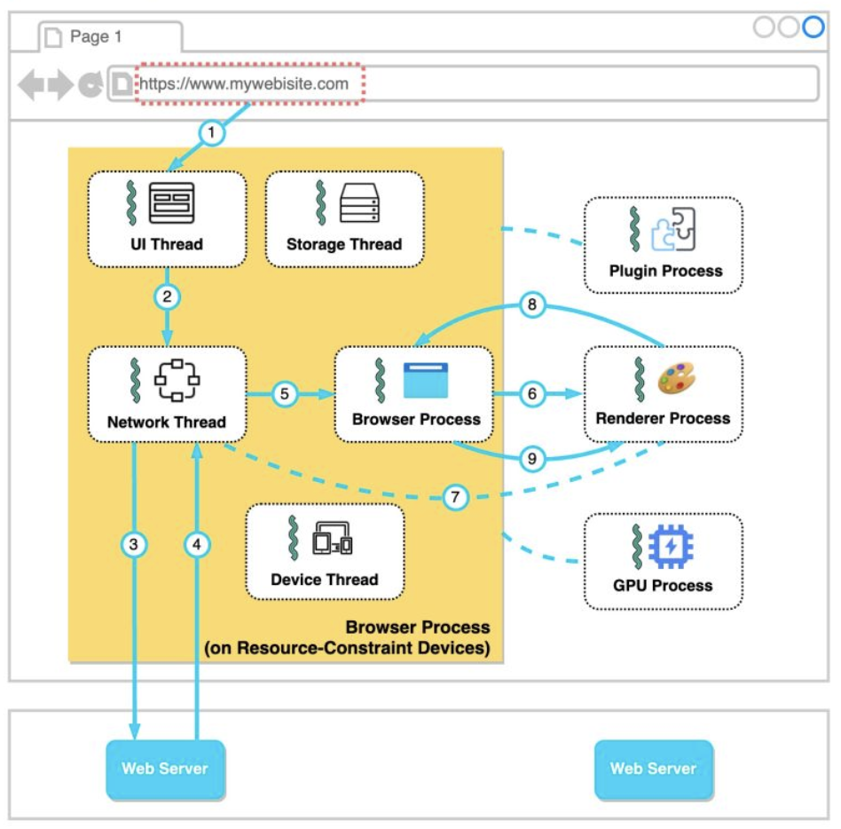

A browser turns a URL into an interactive page in a few hundred milliseconds, and to do it reliably it behaves less like one program than like a small operating system — several isolated processes, a network stack, and a rendering pipeline with well-defined stages. This walks through that path, using Chrome as the example because its architecture is the best documented.

## The multi-process architecture

Running everything in one process means one bad tab takes down the browser. So Chrome splits the work:

- **Browser process** — the coordinator. Owns the UI (address bar, bookmarks, back/forward), and handles network requests, file access, and coordination between the other processes.
- **Renderer processes** — one per tab, sometimes one per iframe. These do the actual work of turning page content into what you see. Isolating them per tab is the core stability and security move.
- **GPU process** — handles GPU-accelerated drawing, animations, and video, off the main CPU.
- **Plugin processes** — one per plugin instance, so a plugin crash is contained.

On capable hardware Chrome breaks browser-process services into separate threads too, an approach it calls **servicification**.

## Fetching the page

Type `https://example.com` and hit Enter:

1. **Input.** The **UI thread** in the browser process handles typing and suggestions. On Enter it tells the browser process to fetch the URL.
2. **DNS lookup.** The domain has to become an IP address. The browser checks caches in order — browser, OS, router, ISP — and if none has it, a recursive DNS lookup resolves it.
3. **TCP handshake.** The browser opens a TCP connection to that IP, a reliable channel. For HTTPS, a [TLS handshake](/citadel/interview/https) follows to encrypt it.
4. **HTTP request.** The browser sends `GET / HTTP/1.1` with a `Host` header.

## Receiving and handing off

The server replies with an HTTP response — status, headers, and usually the page's HTML. The **network thread** in the browser process receives it, and checks the `Content-Type` header plus the first bytes of the stream to confirm what it is.

If it's HTML, the browser process picks an existing renderer for that site or starts a new one, sends it an **IPC** message to "commit navigation," and opens a data pipe so the renderer receives the HTML directly from the network thread. Once the renderer confirms the commit, navigation is complete and document loading begins.

## The renderer pipeline

The renderer's main thread turns HTML, CSS, and JavaScript into pixels through a fixed sequence:

1. **Parse HTML → DOM.** The HTML is parsed into the **Document Object Model**, an in-memory tree where every tag is a node.
2. **Fetch subresources.** When the parser hits `<link>`, ``, or `<script>`, it fires off requests (through the browser process's network stack) for those files.
3. **Parse CSS → CSSOM.** Stylesheets are parsed into the **CSS Object Model**, a parallel tree of computed styles.
4. **Execute JavaScript.** Scripts are fetched, compiled, and run. JS can rewrite both the DOM and the CSSOM, so by default it *blocks* HTML parsing until it finishes — unless the script is marked `async` or `defer`.
5. **Render tree.** DOM and CSSOM are combined into a tree of only the visible nodes (`display: none` elements are excluded), each carrying its content and computed style.
6. **Layout (reflow).** The browser computes the geometry of every visible node — position and size, `x, y, width, height`.
7. **Paint.** It fills in pixels: colours, backgrounds, borders, text.
8. **Composite.** For pages with overlapping layers, transforms, or animations, parts are painted onto separate layers and the GPU process combines them — which is what makes scrolling and animation smooth.

## Why per-tab renderers

The per-tab split buys two things. **Stability**: a script that crashes its renderer only kills that tab. **Security**: each renderer runs in a tight sandbox, limiting what a malicious page can reach if it finds a renderer bug.

The pipeline stages also explain a lot of [front-end performance](/citadel/interview/fe-performance) advice: `defer` your scripts so they don't block parsing, minimise layout-triggering changes, and prefer transforms that the compositor can handle without a repaint. Every rule maps to a stage above.
