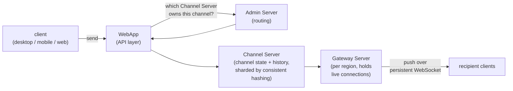

Two things happen when you send a Slack message. It travels to everyone in the channel, near-instantly, over connections that stay open. And Slack decides, separately and per recipient, whether that message is worth a notification. The first is a multi-server relay; the second is a decision tree with more branches than you'd guess.

Both are drawn from Slack's own engineering write-ups.

## The journey of a message

1. **WebApp (the API layer).** Your client — desktop, mobile, or web — sends the message to a WebApp server, which defines the API Slack clients use to send and receive.
2. **Admin Server (routing).** The WebApp asks the Admin Server which **Channel Server** owns the target channel, a lookup by channel ID.
3. **Channel Server (channel state).** Slack has millions of channels, spread across many Channel Server instances by **consistent hashing** so the set of channels can grow without a full reshuffle. The one that owns your channel holds its state and history, and it processes the incoming message.
4. **Gateway Server (connections).** The Channel Server pushes the message to a **Gateway Server** — deployed per region, close to users — which manages the live client connections. An **Envoy** proxy commonly sits in this path to handle service-to-service traffic.
5. **WebSockets (delivery).** Each recipient's client holds a persistent, bidirectional **WebSocket** to its regional Gateway Server. The Gateway pushes new messages down that connection, so clients never poll.

## Deciding whether to notify you

Delivering a message to an open client is the easy part. Deciding whether to interrupt someone is where the logic piles up. Slack has published this as a flowchart, and it's the standard example of why a "quick" feature takes a quarter longer than estimated — when the design is good, none of this complexity is visible.

The decision weighs, roughly in order:

- Is it a thread reply, and is the user subscribed to that thread?
- Is the channel muted?
- Is the user in Do Not Disturb — and does anything override DnD?
- Is it an `@channel`, `@everyone`, or `@here`?
- What's the user's notification preference for *this* device: Everything, Mentions, or Nothing?
- Is it a direct message?
- Does the message contain one of the user's highlight words?
- Is the user currently active or away?
- On mobile, has the mobile-push timing threshold passed — the delay that suppresses a phone buzz while you're clearly active on desktop?

The point of the tree is relevance: a ping should mean something.

## The patterns underneath

The separate roles — WebApp, Admin Server, Channel Server, Gateway Server — are a microservices split, each scaled on its own load. Consistent hashing spreads channels; regional Gateways keep the WebSocket hop short; and a system at this scale has to assume Channel Servers fail and be able to rebuild their assignments. The recurring lesson is the notification tree: at scale, the visible simplicity of a feature is usually paid for in invisible decision logic. For the connection layer itself, see [sockets and persistent connections](/citadel/interview/socket-program); for how consistent hashing distributes the channels, [sharding](/citadel/interview/data-sharding).
