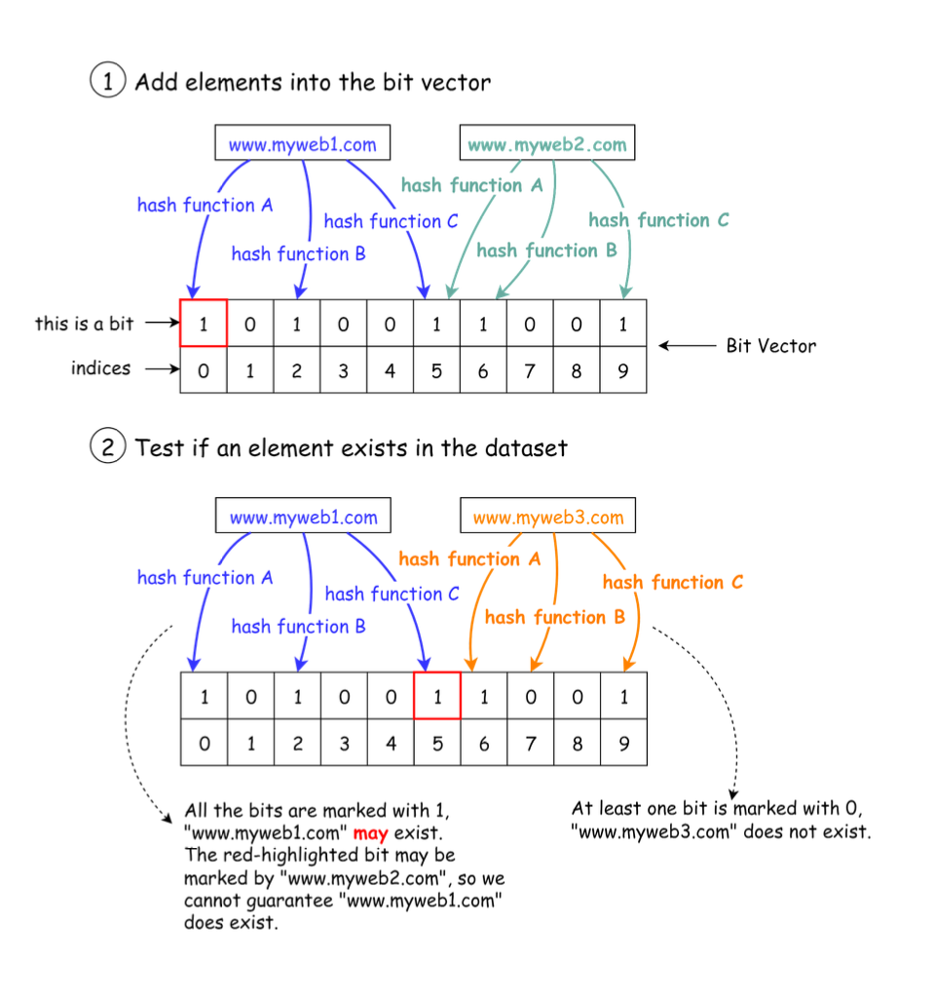

Hey everyone, and welcome back to the blog! The internet is an unimaginably vast ocean of information, with new web pages, articles, and links appearing every second. For a search engine like Google, whose job is to crawl, index, and make sense of this ocean, one enormous challenge is dealing with **duplicate URLs**. Imagine the wasted resources if Google's crawlers kept visiting and processing the exact same content just because it appeared under slightly different web addresses!

Avoiding crawling and indexing duplicate URLs is critical for efficiency, storage, and providing clean search results. But how can this be done at "Google scale," dealing with potentially trillions of URLs? Let's dive into some of the smart techniques, particularly focusing on a probabilistic hero: the Bloom filter.

## The Problem: The Web's Infinite Echoes

Duplicate URLs are rampant on the web for many reasons:
* `http` vs. `https` versions of the same page.
* `www.example.com` vs. `example.com`.
* Session IDs or tracking parameters added to URLs (e.g., `example.com/page?sessionid=123` vs. `example.com/page`).
* Print-friendly versions of pages.
* Content syndicated across multiple sites or subdomains.
* Default filenames like `/` vs. `/index.html`.

Without effective deduplication, search engines would waste enormous amounts of bandwidth, processing power, and storage indexing redundant content. This also pollutes search results with multiple identical entries.

## Initial Thoughts: Simpler (but Less Scalable) Solutions

When faced with checking if we've "seen this URL before," a couple of straightforward ideas might come to mind:

1.  **The In-Memory Set:**
    * You could try to keep all unique URLs encountered so far in a giant `Set` data structure in memory.
    * **Pros:** Checking for existence in a hash set is very fast.
    * **Cons:** The web has billions, if not trillions, of URLs. Storing them all in memory is simply not space-efficient or feasible for any single machine, or even a moderately sized cluster.

2.  **The Database Check:**
    * Another approach is to store all URLs in a massive database and query this database every time a new URL is discovered.
    * **Pros:** Conceptually simple and persistence is handled.
    * **Cons:** At Google scale, the load on this database would be astronomical, making it a severe bottleneck.

These options struggle with the sheer scale and speed required. We need something more... probabilistic and space-efficient.

## The Probabilistic Powerhouse: Enter the Bloom Filter

For avoiding crawling duplicate URLs at Google scale, the **Bloom filter** is often cited as a preferred option.

### What is a Bloom Filter?

* A Bloom filter, proposed by Burton Howard Bloom in 1970, is a space-efficient probabilistic data structure.
* It's designed to tell you whether an element *may be* in a set or is *definitely not* in the set.
* **Key Characteristic:** Bloom filters can have **false positives** (they might say an item is in the set when it isn't), but they **never have false negatives** (if they say an item is not in the set, it's definitely not there). This is perfect for our use case: if the Bloom filter says a URL is new, we can trust it. If it says it's *probably* been seen, we might need a more definitive check if accuracy is paramount, or accept a small false positive rate for efficiency.

### The Inner Workings: Bits and Hashes

The basic data structure for a Bloom filter is a **Bit Vector** (a large array of bits, initially all set to 0). Here's how it works:

**1. Adding a URL to the Filter:**
When a URL is determined to be unique and needs to be "remembered":
* The URL is fed into several (say, `k`) different independent **hash functions** (e.g., Hash Function A, Hash Function B, Hash Function C in the diagram).
* Each hash function outputs an index (a position) in the bit vector.
* The bits at these `k` calculated positions in the bit vector are then set to `1`.
* *Important Note:* It's possible that different URLs, when hashed, might result in one or more of the same bit positions being set. This is what leads to false positives.

**2. Checking if a URL Has Been Seen (Querying the Filter):**
When a web crawler discovers a new URL and needs to check if it has been processed before:
* The URL is passed through the *exact same* `k` hash functions that were used for adding URLs.
* The filter then looks at the bits in the bit vector at the `k` positions generated by these hash functions.
* **If *any* of these bits is `0`:** The URL has *definitely not* been seen before. The crawler can proceed to process it (and then add it to the filter).
* **If *all* of these bits are `1`:** The URL *may have been* seen before. It's "probably" in the set. This could be a true positive (the URL was indeed added before) or a false positive (other URLs just happened to set all those same bits).

### Managing False Positives & Choosing Hash Functions

The probability of false positives depends on the size of the bit vector, the number of items added to the filter, and the number of hash functions used. These parameters can be tuned to achieve an acceptable false positive rate for the application.

The choice of hash functions is also critical. They must be:
* **Uniformly Distributed:** To ensure bits are set as evenly as possible across the vector, minimizing unnecessary collisions.
* **Fast:** As they are computed for every URL added or checked.
    Examples of hash functions suitable for Bloom filters include MurmurHash and xxHash.

## Beyond Bloom Filters: Canonicalization and Other Layers

While Bloom filters are a powerful tool for quickly checking if a URL *might* have been seen, Google's deduplication process is undoubtedly more sophisticated and layered:

1.  **URL Canonicalization:** Before a URL even hits a Bloom filter, it's almost certain that Google performs extensive **URL normalization or canonicalization**. This process transforms a URL into a standard, consistent format. Steps might include:
    * Converting the scheme and hostname to lowercase.
    * Removing default port numbers (e.g., port 80 for HTTP).
    * Removing default filenames (e.g., `index.html`, `default.aspx`).
    * Resolving relative paths (e.g., `../../`) into absolute paths.
    * Adding trailing slashes to directory names.
    * Ordering query parameters alphabetically.
    * Removing unnecessary query parameters (like tracking tags or session IDs that don't alter content).
    The goal is to ensure that URLs which are syntactically different but point to the exact same content are treated as one canonical URL.

2.  **Definitive Checks for False Positives (if needed):** If a Bloom filter indicates a URL has "probably" been seen, and the cost of *not* processing a genuinely new, important URL is high, a secondary, more definitive check (perhaps against a database shard or a more detailed index for "important" URLs) might be performed.

3.  **Content-Based Deduplication:** Even if two URLs are different and pass URL-level deduplication, they might still serve identical or very similar content. Google employs sophisticated techniques (like using shingles, simhashes, or other content fingerprinting methods) to detect and cluster pages with duplicate or near-duplicate content.

## Key Takeaways

* Deduplicating URLs at web scale is a massive challenge crucial for the efficiency of search engines like Google.
* Simple methods like in-memory sets or direct database lookups don't scale.
* **Bloom filters** offer a space-efficient, probabilistic way to quickly check if a URL has likely been seen before, with the understanding that false positives can occur but false negatives cannot.
* Effective URL deduplication likely involves multiple layers, starting with **URL canonicalization** to standardize URLs, followed by techniques like Bloom filters for rapid "seen before" checks, and potentially content-based analysis for deeper semantic deduplication.

The engineering behind making the web's chaos navigable is truly fascinating, and probabilistic data structures like Bloom filters play a vital, if often unseen, role!
