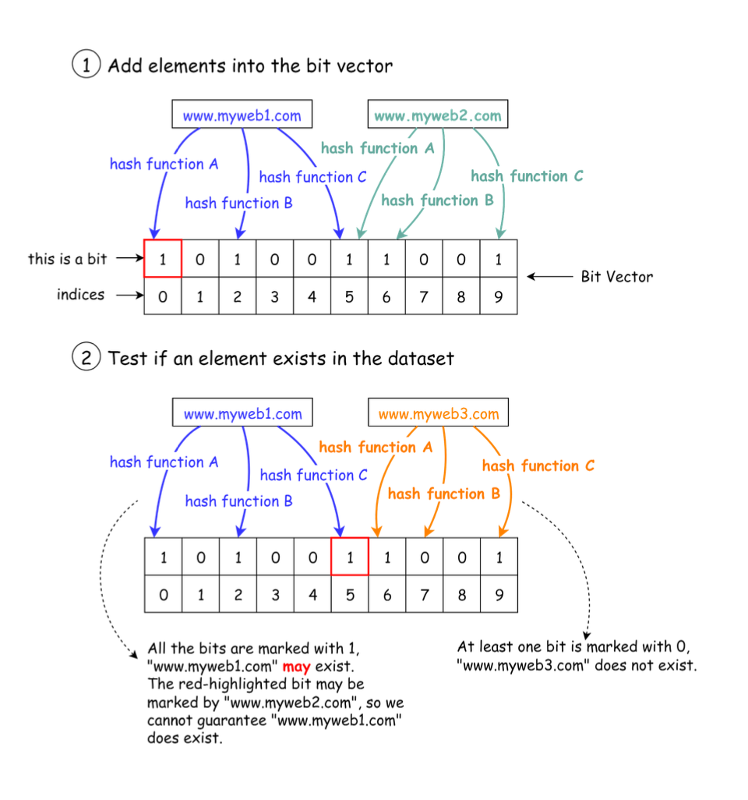

The same web page shows up under many URLs: `http` and `https`, `www` and bare domain, with and without a tracking parameter, `/` versus `/index.html`, print versions, syndicated copies. A crawler that treats each as new burns bandwidth and compute re-fetching identical content and pollutes the index with duplicates. The core question — "have I processed this URL before?" — has to be answered across trillions of URLs, fast.

## Why the obvious answers don't scale

- **An in-memory set.** Lookups are O(1), but trillions of URLs won't fit in the RAM of one machine or a modest cluster.
- **A database lookup per URL.** Simple and persistent, but the query rate at crawl scale makes the database the bottleneck.

Both break on size and speed. What fits is something probabilistic.

## The Bloom filter

A **Bloom filter** (Burton Howard Bloom, 1970) is a space-efficient probabilistic structure that answers "**maybe in the set**" or "**definitely not in the set**". It can give **false positives** — claim it's seen something it hasn't — but **never false negatives**. That asymmetry is exactly right here: if the filter says a URL is new, that's trustworthy, so you crawl it; if it says "probably seen", you skip it (or do a definitive check when a miss would be costly).

The structure is a **bit vector**, all zeros to start.

- **Add a URL.** Feed it to `k` independent hash functions; each returns an index into the vector; set those `k` bits to 1. Different URLs can share bit positions — that's the source of false positives.
- **Check a URL.** Hash it with the same `k` functions and look at those `k` bits. If **any is 0**, the URL is definitely new. If **all are 1**, it's *probably* seen — either genuinely added before, or other URLs happened to set all those bits.

The false-positive rate is a function of the vector size, the number of URLs added, and `k`; you tune those to an acceptable rate. The hash functions must be **uniformly distributed** (to spread bits evenly) and **fast** (they run on every add and every check) — MurmurHash and xxHash are typical choices.

## The layers around it

A real deduplication pipeline is more than one filter:

1. **URL canonicalization.** Before a URL reaches the filter, normalize it to a single canonical form: lowercase the scheme and host, drop default ports, drop default filenames (`index.html`), resolve `../` to absolute paths, normalize trailing slashes, sort query parameters, and strip ones that don't change content (session IDs, tracking tags). Now syntactically different URLs for the same page collapse to one.
2. **A definitive check for false positives.** When the filter says "probably seen" and missing a genuinely new important URL would be expensive, fall back to an exact lookup against a database shard or a detailed index for important URLs.
3. **Content-based deduplication.** Two genuinely different URLs can still serve identical or near-identical content. Fingerprinting techniques — shingles, SimHash — detect and cluster those.

## The takeaway

Canonicalization does the semantic work of deciding two URLs are the same; the Bloom filter does the cheap, high-volume "seen it?" check that a set or a database can't do at this scale. The same trade — accept a tunable false-positive rate to save enormous space — is why Bloom filters guard against [cache penetration](/citadel/interview/cache-pitfalls), and URL dedup is one stage of a full [search engine](/citadel/system-design/search-engine).
