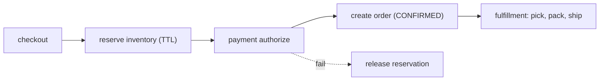

An e-commerce platform is really two different systems wearing one domain name. **Browsing** — catalogue, search, product pages, recommendations — is read-heavy, tolerant of a few seconds of staleness, and served from caches and a CDN. **Checkout** — reserve stock, take payment, create an order, kick off fulfillment — is write-heavy, must be correct, and gets brutal during a sale when many buyers converge on the last unit.

The two meet at the cart. Getting the boundary right — fast-and-stale on one side, correct-and-coordinated on the other — is the design.

## What it has to do

- Catalogue browse and search with filters; product pages; recommendations.
- Cart (persistent across sessions and devices), then checkout.
- Reserve inventory so two buyers don't both get the last item; release it if payment fails.
- Orchestrate order → payment → inventory → fulfillment → shipping, with clean rollback.
- Survive flash-sale spikes.

## Browse path

- **Product service** owns the canonical product data; a **search service** (Elasticsearch) holds a denormalized, indexed copy for faceted queries ("running shoes, size 10, under ₹5000, in stock"). Search is eventually consistent with the product service via a change stream.
- **Heavy caching + CDN** for product pages and category listings; images and static assets on the CDN edge.
- [Recommendations](/citadel/system-design/recommendation-system) ("customers also bought") are a separate two-stage service.
- Price and stock badges on listing pages come from a fast cache and may lag by seconds — acceptable, because the truth is re-checked at checkout.

## Cart

- Stored server-side keyed by user (and by a cookie for guests), so it follows the user across devices; merge the guest cart into the account cart on login.
- The cart holds product IDs and quantities, **not** a price snapshot — re-price at checkout so a promo ending or a price change is reflected. Stock is *not* held while an item sits in a cart; adding to cart is not a reservation.

## Checkout and inventory reservation



**Inventory** is a count per SKU per warehouse. Reserving is a conditional decrement:

```sql
UPDATE inventory SET available = available - :qty
WHERE sku = :sku AND available >= :qty;
```

Zero affected rows ⇒ out of stock, fail the checkout line. A successful reserve creates a **reservation row** with a short TTL; the actual decrement is confirmed on payment success, and a sweeper releases reservations whose TTL lapses (abandoned checkout). This is the same hold-then-confirm pattern as [seat booking](/citadel/system-design/movie-ticket-booking), over a counter instead of a labelled seat.

Partition inventory by SKU so a viral product's contention stays on one shard; for a single ultra-hot SKU, see [designing for a flash sale](/citadel/system-design/flsh-sale).

## Order orchestration as a saga

Creating an order spans services that each have their own database — payment, inventory, fulfillment, notifications. A distributed transaction across all of them isn't practical, so use a **saga**: a sequence of local transactions, each with a compensating action.

`reserve inventory → authorize payment → create order → allocate to warehouse → notify`

If payment fails, run the compensation for the completed steps (release the reservation). If warehouse allocation fails after payment, either retry, split the shipment, or refund and cancel — a business decision encoded as a saga branch. Use the **transactional outbox** pattern so each service's state change and its outgoing event commit together, and downstream steps are idempotent (keyed by order ID) because events can redeliver. See [distributed transactions](/citadel/interview/distributed-transactions).

## Payments

Authorize (hold) at checkout, capture on shipment (or immediately, per policy). Idempotency key on every gateway call = order ID, so a retry never double-charges. Handle the gateway **webhook** as the source of truth for payment status, and reconcile daily for webhooks that never arrived. Details in [the payment ecosystem](/citadel/interview/payment-ecosystem).

## Flash sales

- **Waiting room / queue** in front of the hot product's checkout, admitting buyers at the rate inventory can be safely decremented.
- **Rate-limit** per user; one checkout in flight per account.
- Move the hot SKU's counter into an in-memory store (Redis `DECR`, which is atomic) with async write-back to the database, so the decrement isn't a database row-lock bottleneck.
- Serve "sold out" from cache the instant the counter hits zero, so doomed requests never reach the inventory service.

## Post-order

Order tracking (a read model updated by fulfillment/shipping events), returns and refunds (a reverse saga), and reviews (write path into the product and search services).

## The one idea to keep

An e-commerce platform splits into a browse path — cached, CDN-fronted, allowed to be a little stale — and a checkout path that must be correct. The join is the cart, which holds no price and no stock. Checkout reserves inventory with a conditional decrement plus a TTL'd reservation, confirms on payment, and coordinates order/payment/fulfillment as a saga with compensating actions and an idempotent, outbox-driven event flow. Flash sales are handled by fronting the hot SKU with a queue and an in-memory atomic counter.
