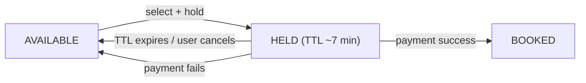

Browsing showtimes is a read problem — cache it and move on. The reason movie booking is a real design question is the seat map. When a blockbuster opens, hundreds of people are looking at the same theatre's seat grid, and two of them tap seat H12 within the same second. Exactly one can get it, the other needs a clean "sorry, taken," and neither should end up paying for a seat they didn't get.

That's the core: a **hold** on a seat while the user pays, a concurrency mechanism that makes "claim seat H12" atomic, and a state machine that frees the seat if the payment stalls or fails.

## What it has to do

- Search: city → cinema → movie → showtime; show the live seat map.
- Select seats, hold them, pay, get tickets.
- Never double-book a seat.
- Release held seats if the user abandons the flow.
- Survive a popular release: thousands of concurrent users on one show.

## Data model

- `City`, `Cinema`, `Screen` (auditorium), `Show` (a movie on a screen at a time).
- `Seat` — physical seat in a screen (`H12`, type = recliner/regular).
- `ShowSeat` — the bookable unit: one row per `(show, seat)`, with a `status` (`AVAILABLE`, `HELD`, `BOOKED`) and, when held, a `held_by` and `hold_expires_at`.
- `Booking` — a set of `ShowSeat`s, a user, a state, a payment reference.

The `ShowSeat` table is the contention point. Partition it by `show_id` so all the rows for one show live together and one hot show doesn't spread lock traffic across the whole cluster.

## The seat hold

When a user picks seats and proceeds to pay, the system tries to move those `ShowSeat` rows from `AVAILABLE` to `HELD` with a short expiry (5–10 minutes — long enough to pay, short enough not to sterilize inventory). If the payment completes, `HELD → BOOKED`. If it fails or the TTL lapses, back to `AVAILABLE`.

The TTL is enforced two ways: a lazy check (any read of a `HELD` row past its expiry treats it as `AVAILABLE`) plus a sweeper job that flips expired holds so the seat map is accurate for everyone browsing.

## Making the claim atomic

Two users, seat H12, same instant. Options:

- **Pessimistic lock** — `SELECT ... FOR UPDATE` the target `ShowSeat` rows inside a transaction, check they're all `AVAILABLE`, set them `HELD`, commit. The second transaction blocks, then sees `HELD` and fails cleanly. Simple and correct; holds a DB lock for the duration, which is fine because it's milliseconds.
- **Optimistic** — read the rows with a `version`; on hold, `UPDATE ... SET status='HELD', version=version+1 WHERE seat_id IN (...) AND status='AVAILABLE' AND version IN (...)`. If the affected row count is less than the number of seats requested, someone beat you — roll back the ones you did get, tell the user. No locks; a retry loop under contention.
- **Distributed lock** (Redis `SETNX` per seat) — works if the DB isn't the coordination point, but you now have two systems that can disagree; prefer a conditional DB update.

For "all or nothing" on a multi-seat selection (3 seats together or none), do the conditional update over all three and check the count — partial success rolls back.

## Payment

Hold → create a `Booking` in `PENDING_PAYMENT` → redirect to the payment gateway → on the gateway's **webhook** (not the browser redirect, which users close), confirm and move `HELD → BOOKED`, `Booking → CONFIRMED`. On failure/timeout, release the seats. Use an **idempotency key** (booking ID) on the payment call so a retried webhook doesn't double-charge, and reconcile against the gateway periodically for webhooks that never arrived. See [the payment ecosystem](/citadel/interview/payment-ecosystem).

## Read scale

Everything except the seat operations is cacheable:

- City/cinema/movie/showtime catalogue → cache + CDN, invalidated when a cinema updates its schedule.
- The seat map for a show → cache with a short TTL (a couple of seconds) so browsing users see near-live availability without every render hitting the `ShowSeat` table. The *hold* operation always goes to the database; only the *display* is cached.

## High-demand releases

- **Waiting room** — for a show expecting a stampede (first-day-first-show), gate entry to the seat-selection page with a queue, admitting users at a rate the `ShowSeat` partition can handle.
- **Rate-limit** hold attempts per user to stop scripts sniping seats.
- The `show_id` partition localizes the load; scale that partition's replicas for the event.

## The one idea to keep

Movie booking is a cached catalogue with one genuinely hard operation: claiming a seat under contention. Model each bookable seat as a row with an `AVAILABLE → HELD → BOOKED` state machine, where `HELD` carries a short TTL. Make the claim atomic with a single conditional `UPDATE ... WHERE status='AVAILABLE'` (or a `SELECT FOR UPDATE`), check the affected-row count for all-or-nothing selections, and release on payment failure or TTL. Confirm the booking from the payment webhook, idempotently, not from the browser redirect.
