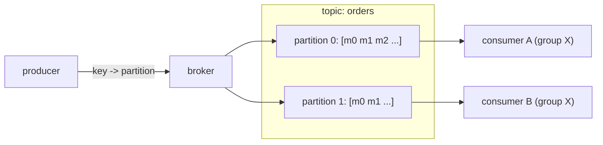

Two services need to talk without being online at the same time. Service A produces work — orders, events, log lines — faster than service B can consume it, or B is down for a deploy, or there are ten copies of B. A message queue sits between them: A appends, B reads at its own pace, and the queue holds the backlog.

A single-broker queue (one RabbitMQ node) is easy. The design problem is making it not lose messages when the broker's disk dies, and making it go faster than one machine's network card. The answer most modern systems reached — Kafka, Pulsar, Kinesis, Redpanda — is to stop thinking of it as a queue and start thinking of it as a **log**.

## What it has to do

- **Publish/subscribe** — producers append; one or more consumer groups read independently.
- **Durability** — an acknowledged message survives a broker crash.
- **Throughput** — millions of messages/sec, so no single-node bottleneck.
- **Ordering** — at least within a related group of messages (all events for one user).
- A **delivery guarantee** the consumer can reason about.
- **Retention / replay** — a new consumer, or a bug fix, can re-read old messages.

## The log model

A **topic** is split into **partitions**. Each partition is an append-only sequence of messages stored as a series of immutable segment files. A message's position in its partition is its **offset**, a monotonically increasing integer.

This one structure buys three things at once:

- **Append is O(1)** and sequential — the disk head never seeks, so a single partition can absorb hundreds of MB/s. Combined with the OS page cache and `sendfile` zero-copy from disk to socket, the broker barely touches the data.
- **Ordering** is guaranteed *within a partition* — messages come out in the order they went in.
- **Parallelism** comes from having many partitions — each is served independently, and each consumer in a group owns a disjoint subset.

Ordering and parallelism usually fight; partitioning resolves the fight by scoping ordering to the partition. You choose the scope: hash the **key** (`user_id`) to a partition, and every message for that user is ordered, while different users spread across partitions.

## Consumers pull, and track their own offset

Consumers **pull** batches rather than the broker pushing — the consumer controls its rate, and a slow consumer creates backpressure as lag, not as a broker memory blow-up.

Each consumer group stores, per partition, the offset of the next message to read. This is the whole difference from a traditional queue: the broker doesn't track per-message acknowledgements or delete on consumption. Messages stay until retention expires, and "where each reader is" is just an integer. That's why replay is trivial — reset the offset backward — and why ten consumer groups can read the same topic without interfering.

## Replication

Each partition has one **leader** broker and some **followers**. Producers and consumers talk only to the leader; followers pull from it to stay in sync. The set of followers currently caught up is the **in-sync replica** set (ISR).

The producer's `acks` setting is the durability knob:

- `acks=0` — fire and forget; fastest, loses messages on any hiccup.
- `acks=1` — leader has written it; lost if the leader dies before a follower copies it.
- `acks=all` — every ISR member has it; survives any single broker loss. This is the durable setting.

If the leader dies, a follower is promoted. **Unclean leader election** — promoting a follower that was *behind* — trades durability for availability and is off by default in serious deployments.

## Delivery semantics

- **At-most-once** — consumer commits its offset *before* processing. A crash mid-process skips the message. Rare choice.
- **At-least-once** — consumer processes, *then* commits the offset. A crash after processing but before committing means the message is redelivered. This is the common default, and it means **consumers must be idempotent** — processing the same message twice must be safe (upsert by a natural key, dedupe on a message ID).
- **Exactly-once** — the effect happens once even though delivery may repeat. It requires (a) an **idempotent producer** (the broker dedupes retries by producer ID + sequence number) and (b) **transactions** that atomically write the consumer's output *and* its offset commit to the log, so a consume-transform-produce chain either fully happens or doesn't. It only holds *within the queue's own system*; the moment your consumer writes to an external database, you're back to needing idempotency there.

## Retention and compaction

- **Time or size retention** — keep the last 7 days, or the last 1 TB per partition; older segments are deleted whole. Cheap because segments are immutable files.
- **Log compaction** — for a topic that represents keyed *state* (latest profile per user), keep only the most recent message per key. The topic becomes a durable changelog you can replay to rebuild a table — the basis of [change data capture](/citadel/interview/distributed-transactions) and event sourcing.

## Coordination

Brokers need agreement on partition leadership and cluster membership. Kafka historically used ZooKeeper for this; newer versions use **KRaft**, a built-in Raft implementation (see [consensus](/citadel/interview/consensus)). Consumer groups elect a **group coordinator** broker that assigns partitions to members and triggers a **rebalance** when a consumer joins or leaves.

## When a queue, not a log

The log model is worse at a few things. Per-message acknowledgement, priority queues, and low-latency point-to-point dispatch with immediate delete are what **RabbitMQ**, **NATS**, and **SQS** do well. If you need "route this one task to one worker, ack it, and forget it" rather than "stream millions of ordered events to many readers," a broker-queue is the simpler fit.

## The one idea to keep

A scalable message queue is a partitioned, replicated, append-only log. Partitions give you ordering (within a partition) and parallelism (across them) at the same time, which is why you pick the partition key carefully. Consumers pull and remember their own offset, so the broker stores nothing per-consumer and replay is free. Durability is the producer's `acks=all` plus replication; "exactly-once" is real but only inside the log's own boundary — cross that boundary and you still need idempotent consumers.
