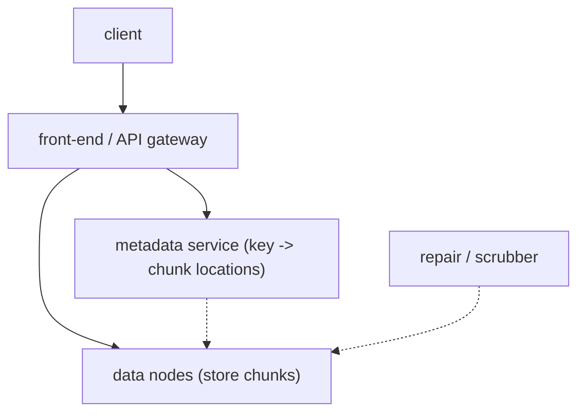

You upload a 4 GB video to a URL like `s3://my-bucket/videos/trailer.mp4` and, years later, it's still there — with a claimed durability of "eleven nines" (99.999999999%), meaning if you store ten million objects you'd expect to lose one every ten thousand years. It's served to millions of viewers, replicated across data centres, and priced at fractions of a cent per gigabyte-month.

Object storage looks like a filesystem — keys that contain slashes — but it isn't one. There are no real directories, no in-place edits, no file handles. That flatness is what lets it scale. The design is a **metadata plane** that knows where every object's bytes are, and a **data plane** of storage nodes that just hold chunks and don't know what they mean.

## What it has to do

- `PUT`, `GET`, `DELETE` by `(bucket, key)`; `LIST` with a prefix; **multipart upload** for large objects.
- Objects from a few bytes to several terabytes.
- **Durability** first (don't lose data), then availability, then latency.
- **Versioning** and lifecycle rules (expire, tier to cold storage).
- Strong read-after-write for new objects.

## Two planes

**Metadata service.** A strongly consistent, horizontally sharded key-value store mapping `(bucket, key, version) → { size, checksum, chunk list, placement }`. It's small per object (a few hundred bytes) but there are trillions of objects, so it's partitioned — usually by hashing the bucket+key — and each partition is replicated with a consensus protocol ([Raft](/citadel/interview/consensus)) for strong consistency. `LIST` with a prefix is a range scan over an ordered index of keys within a bucket.

**Data nodes.** Commodity servers full of disks. They store **chunks** — fixed-size pieces (say 4–16 MB) of object data — addressed by a content hash or an opaque chunk ID. They don't know which object a chunk belongs to; the metadata service does. This separation means you can scale storage by racking more data nodes without touching the metadata tier.

## Writing an object

1. Client `PUT`s to the front-end. For a large object it does a **multipart upload**: initiate, upload parts in parallel (each part independently retryable), then complete — the front-end assembles the part list.
2. The front-end splits the data into chunks, computes checksums, and writes each chunk to its target data nodes.
3. Once enough copies are durably on disk, the front-end writes the metadata entry (chunk list + placement) to the metadata service. **This write is the commit point** — the object exists exactly when its metadata row exists. That's how you get read-after-write consistency for new objects: the metadata store is strongly consistent, and until its row is committed, `GET` returns 404.
4. Orphaned chunks from a failed upload (bytes written, metadata never committed) are swept by a background GC that lists chunks with no referencing metadata.

## Placement and durability

Spread an object's chunks across many nodes, racks, and availability zones so no single failure domain holds two copies of the same data. Two schemes:

- **Replication** — store `N` full copies (typically 3), in different AZs. Simple, fast to read (any copy), fast to repair (copy from a peer). Costs `N×` the storage — 3× for 3 nodes-of-durability.
- **Erasure coding** — split data into `k` data shards, compute `m` parity shards (Reed–Solomon), store all `k + m` on different nodes. Any `k` of them reconstruct the object. A `(10, 4)` code survives 4 simultaneous losses at **1.4× storage overhead** instead of 3×. The cost is CPU to encode/decode and more network I/O on repair (you must read `k` shards to rebuild one). Big cold objects use erasure coding; small hot objects often use replication.

## Integrity and repair

Disks rot silently — bit flips, unreadable sectors, whole-drive death. Two mechanisms run continuously:

- **Scrubbing** — a background job reads every chunk, recomputes its checksum, and compares it to the stored value. A mismatch marks the chunk bad.
- **Re-replication** — when a chunk drops below its target copy count (a node died, a scrub failed a chunk), the system rebuilds the missing copy from the survivors and places it on a fresh node. Durability is a *rate* problem: you need to repair faster than new failures create gaps, which is why placement spreads chunks widely (more source nodes ⇒ faster parallel repair).

End-to-end checksums travel with the data: the client can send a checksum on `PUT`, the front-end verifies it, stores it, and `GET` verifies again on the way out.

## Deletes, versioning, lifecycle

- **Delete** removes the metadata row (or, with versioning on, adds a delete marker). Chunks aren't freed immediately — a background reference-counter GC frees a chunk once no metadata points at it, which also makes deletes fast and reversible within a window.
- **Versioning** keeps old metadata rows keyed by version ID; a `GET` without a version returns the latest non-deleted one.
- **Lifecycle rules** are cron over metadata: "objects under `logs/` older than 30 days → transition to cold tier (fewer copies, slower media) or delete."

## Access control

Every request is authenticated (signed with the caller's secret key — the classic AWS SigV4) and authorized against **bucket policies** and **IAM policies**. **Presigned URLs** let a service grant time-limited access to one object without sharing credentials — the URL carries a signature and an expiry.

## The one idea to keep

Object storage scales because it's flat: a metadata service maps keys to chunk locations, and a separate fleet of data nodes just holds chunks without knowing what they are, so you grow each tier independently. The object exists the instant its strongly consistent metadata row commits — that's your read-after-write guarantee. Durability isn't a one-time copy; it's replication or erasure coding plus a scrubber and a re-replicator that run forever, repairing faster than disks fail.
