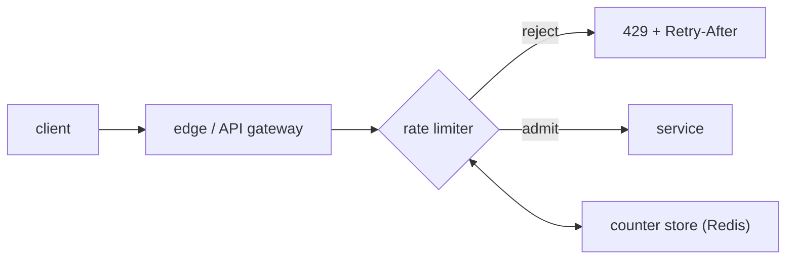

A rate limiter answers one question per request: *admit or reject?* Based on how many requests this client has sent recently. The [algorithms](/citadel/interview/rate-limiting) that define "recently" — token bucket, sliding window, leaky bucket — are a solved problem. This post is the system around them: where the limiter runs, how fifty independent gateway nodes agree on one client's count, and what happens when the thing holding the counts falls over.

## What it has to do

- Decide admit/reject in **well under a millisecond** — it's on every request's critical path.
- Enforce a limit **per client across the whole fleet**, not per node.
- Support multiple dimensions: per API key, per IP, per endpoint, per user tier.
- Degrade sensibly when its own dependencies fail.
- Tell the client why it was rejected and when to come back.

## Where it runs



- **Client SDK** — polite, saves a round trip, trivially bypassed. Useful as a first line, never the enforcement point.
- **API gateway / reverse proxy** — the usual home. It already terminates every request, knows the API key and route, and is horizontally scaled. Envoy, Kong, and NGINX all have rate-limit modules.
- **Dedicated service** — the gateway calls a rate-limit service over gRPC. One place to hold the logic and the counters; one more hop and a thing to scale. Envoy's `ratelimit` service is this.
- **In the service itself** — sees the most context (per-tenant quotas, per-operation cost) but every service reimplements it.

Most designs put a thin check at the gateway backed by a shared store.

## The fleet problem

Fifty gateway nodes, each seeing a slice of one client's traffic. If each enforces "100 req/min" locally, the client gets 5,000. The count has to be shared.

**Centralised counter (the common answer).** A Redis cluster holds the counters. Each node, per request, runs an atomic update — and it *must* be atomic, or two nodes read `99`, both increment, both admit, and you've overshot. Use a Lua script (Redis runs it atomically) that does the whole token-bucket refill-and-decrement in one round trip:

```lua
-- KEYS[1]=bucket key, ARGV: rate, burst, now, cost
local b = redis.call('HMGET', KEYS[1], 'tokens', 'ts')
local tokens = tonumber(b[1]) or tonumber(ARGV[2])
local ts     = tonumber(b[2]) or tonumber(ARGV[3])
tokens = math.min(tonumber(ARGV[2]), tokens + (ARGV[3] - ts) * ARGV[1])
local allowed = tokens >= tonumber(ARGV[4])
if allowed then tokens = tokens - tonumber(ARGV[4]) end
redis.call('HMSET', KEYS[1], 'tokens', tokens, 'ts', ARGV[3])
redis.call('EXPIRE', KEYS[1], 60)
return allowed and 1 or 0
```

One network hop per request (~0.2–0.5 ms to a local Redis), exact enforcement. The Redis cluster is now a dependency of every request, so it needs replicas and it needs a fallback (below). Shard counters by client key so no single Redis node is hot; a genuinely hot client can still hammer one shard — replicate that key or accept approximate limiting for it.

**Local buckets with async sync.** Each node keeps local counters and enforces `limit / N` locally, periodically broadcasting its counts (gossip, or a shared store) so nodes converge on the true total. No per-request network call — lowest latency — but enforcement is approximate and laggy: a client can briefly exceed the limit while counts propagate. Good when the limit is a soft guardrail, not a billing boundary.

**Cell-based.** Pin each client to one gateway node (consistent hashing at the load balancer). That node owns the client's counter entirely — local, exact, no shared store. The cost is that load balancing is now constrained by the limiter, and a node loss reshuffles counters (a brief window of lost state).

## Failure modes of the limiter itself

The counter store *will* be briefly unreachable. Decide, per API:

- **Fail open** — on a store error, admit the request. Protects availability; a store outage means no limiting, so a concurrent attack gets through. Default for most user-facing APIs.
- **Fail closed** — on a store error, reject. Protects the backend; a store outage becomes a full outage. Right for a fragile or expensive downstream.
- **Local fallback** — on a store error, fall back to a permissive local bucket. The usual compromise: keep limiting approximately, don't hard-fail.

Also: cache the "this key is currently over its limit" verdict locally for a second or two, so a client that's being rejected doesn't generate a Redis call per rejected request.

## Rules and configuration

Limits aren't one number. A rule is `(matcher, limit, window)` — e.g. `{ api_key: *, route: POST /messages } → 10/s`, `{ tier: free } → 1000/day`, `{ ip: * } → 100/min`. Rules are evaluated most-specific-first; a request can be subject to several (per-IP *and* per-key) and is rejected if any fails. Store rules in a config service the gateway hot-reloads, so limits change without a deploy.

## What the client gets back

- **`429 Too Many Requests`**, not `503`.
- **`Retry-After: 30`** — seconds until it's worth trying again.
- **`X-RateLimit-Limit` / `-Remaining` / `-Reset`** — so a well-written client self-throttles instead of retrying blindly.
- Never make the rejection expensive: no body parsing, no logging every rejection at INFO, no downstream call.

## The one idea to keep

The algorithm is the easy 10%. The design is: run a thin check at the gateway, back it with an atomic operation against a sharded Redis (a Lua script so refill-and-decrement is one indivisible step), and decide explicitly what "Redis is down" means — fail open for user APIs, fail closed for fragile backends, local fallback in between. Then hand the client a `429` with `Retry-After` and rate-limit headers so it backs off instead of amplifying the problem.
