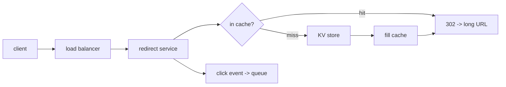

Someone pastes `https://example.com/articles/2026/03/a-very-long-headline?utm_source=newsletter&ref=twitter` and gets back `https://sho.rt/aX9k2p`. Later, thousands of people click `sho.rt/aX9k2p` and land on the original page. That's the whole product. It's also a clean example of a system that is overwhelmingly **read-heavy**, latency-sensitive, and simple enough to reason about end to end.

The design questions worth arguing about: how do you mint a short code that has never been used before, without a central bottleneck? What HTTP status do you redirect with, and what does that cost you? And how do you count clicks without slowing the redirect down?

## What it has to do

- **Shorten** a long URL to a short code, and store the mapping.
- **Redirect** `short → long` with very low latency.
- Handle a heavy read:write skew — call it **100:1** or worse. Reads are the redirects; writes are the shortenings.
- **Custom aliases** (`sho.rt/my-brand`) and **expiry** (link dies after a date or a click count).
- **Analytics** — click counts, referrers, geography — without blocking the redirect.

Ballpark the scale: 100M new URLs/month is ~40 writes/sec average, a few hundred at peak. At 100:1 that's a few thousand redirects/sec, tens of thousands at peak. Storage for 100M URLs/month over 5 years with ~500 bytes/record is ~3 TB — small. This system is not about storage volume; it's about read latency and key generation.

## The short code

The code is a string over a 62-character alphabet (`a–z`, `A–Z`, `0–9`). Six characters give `62⁶ ≈ 56.8 billion` codes; seven give 3.5 trillion. Pick a length from your projected lifetime volume plus headroom.

### Option A: hash the URL and truncate

`base62(md5(long_url))[:7]`. Deterministic — the same URL always yields the same code, which deduplicates for free. But truncated hashes **collide**, and as the table fills, collisions get frequent; each one needs a "try again with a salt" retry and a read to check. It also makes custom aliases awkward (they share the namespace).

### Option B: a counter, base62-encoded

Keep a global integer counter. Each new URL gets the next value; the code is that value in base62. No collisions by construction, and codes stay short because base62 is dense. The problem is the counter — a single row in a database is a write bottleneck and a single point of failure.

The fix is the [ticket-server / segment pattern](/citadel/system-design/unique-ids): each shortening service instance claims a **block** of the counter range (say 10,000 IDs) from the database in one write, then serves that block from memory, coming back only when it's nearly exhausted. Database writes drop by four orders of magnitude, instances generate codes with zero coordination, and a crashed instance just wastes its remaining block. Codes from different instances interleave in time, which is fine — nobody expects short codes to be sortable.

> Sequential counters make codes **guessable** — `aX9k2p` today, `aX9k2q` tomorrow — which lets someone enumerate every link. If that matters, run the counter value through a reversible permutation (a Feistel network over the ID space, or multiply by a large coprime mod `62⁷`) before base62-encoding. You keep uniqueness and lose the visible ordering.

### Custom aliases

A custom alias is just a write to the mapping table with a caller-supplied key. Check it isn't taken (a `INSERT ... IF NOT EXISTS` or a unique constraint), and reserve a disjoint slice of the code space for generated codes so the two never collide (e.g. generated codes are always exactly 7 chars, customs are ≤ 6 or ≥ 8).

## Storage

A key-value store keyed by short code: `code → { long_url, created_at, expires_at, owner_id }`. The access pattern is a single-key point lookup, no range scans, no joins — so DynamoDB, Cassandra, or even a partitioned SQL table all work. Partition by the short code itself; it's high-cardinality and uniformly distributed (especially after the permutation), so shards fill evenly.

## The redirect path

A request for `sho.rt/aX9k2p`:

Almost every read should be a **cache hit**. Link popularity is heavily skewed — a tiny fraction of codes get the vast majority of traffic — so an LRU cache (Redis, or a CDN) holding the hot set absorbs 95%+ of redirects. Cache-aside: on a miss, read the store, populate the cache with a TTL, then redirect.

### 301 vs 302

- **301 Moved Permanently** — browsers and proxies cache it, so subsequent clicks skip your server entirely. Great for your load, but you **lose the click** for analytics, and you can never repoint or expire that link for anyone who cached it.
- **302 Found** (or 307) — not cached; every click comes back to you. You keep analytics and control at the cost of serving every redirect.

Most shorteners use **302** because analytics and revocability are the product. If you don't care about per-click data, 301 is a huge load reduction.

## Analytics off the hot path

The redirect must not wait on a database write. On each redirect, the service emits a lightweight event — `{ code, timestamp, ip, referrer, user_agent }` — to a message queue (Kafka) and returns the redirect immediately. Downstream consumers do the real work:

- a stream aggregator maintains per-code counters (total clicks, clicks/day) in a fast store;
- a batch job rolls raw events into referrer/geo/device breakdowns;
- the raw events land in object storage for ad-hoc queries.

If a link has a **click-count expiry**, that's the one case you can't fully defer — but you can approximate: let the stream consumer flip an `expired` flag when the count crosses the threshold, accepting that a few extra clicks slip through in the seconds before the flag propagates to the cache.

## Deleting and expiring

A TTL on the storage row handles date expiry. For the cache, set the cache TTL shorter than any link's remaining life, or publish an invalidation on delete. Expired-then-requested codes should return `404` (or a branded "link expired" page), and you can front the store with a [Bloom filter](/citadel/data-structures/bloom-filters) of valid codes to answer "definitely never existed" without a store lookup — the same guard used against [cache penetration](/citadel/interview/cache-pitfalls).

## The one idea to keep

A URL shortener is a distributed hash table with an HTTP front door, so the design is dominated by two choices. Generate codes from a counter handed out in blocks — no collisions, no central bottleneck — and permute the counter first if guessable codes are a problem. Then redirect with a 302 and shove the click event onto a queue, so analytics and revocability cost you nothing on the path that has to be fast. Everything else is a cache in front of a key-value store.
