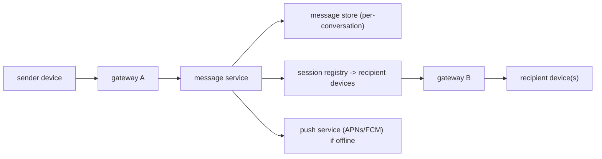

Send a message; it appears on your friend's phone in under a second, on their laptop too, and it's still there when they open a third device tomorrow. If they were offline, they get it on reconnect — once, in order. That's the spec, and none of it is hard in isolation. Doing all of it, for a billion users, with servers that restart and networks that drop, is the design.

The pieces: a **connection layer** that keeps a persistent socket open per device and knows which server holds it, a **message service** that assigns each message a position in its conversation, and **sync state** — per-device cursors that make "what did I miss" a simple query.

## What it has to do

- 1:1 and group messages; delivery and read receipts; typing indicators.
- Presence (online / last seen).
- Multi-device: every device of a user stays consistent.
- Offline delivery: messages queue and deliver on reconnect, exactly once, in order.
- Media (images, video) — sent by reference, not inline.
- Optionally end-to-end encryption.

## The connection layer

Clients hold a long-lived connection — **WebSocket** (or MQTT, which WhatsApp uses for its lower overhead on flaky mobile networks) — to a **gateway** server. Each gateway holds hundreds of thousands to a few million connections (tuned kernels, epoll, minimal per-connection memory).

A **session registry** maps `user_id → [ (device_id, gateway_node) ]`, kept in a fast store (Redis) and updated on connect/disconnect. To deliver a message to a user, the message service looks up their devices, finds which gateway holds each, and forwards the message there; the gateway writes it to the socket.

Load balancing these connections needs care — you can't freely move an open socket, so it's often least-connections with long drain times on deploy.

## Sending a message

1. Sender's device sends `{ conversation_id, client_msg_id, body }` over its socket. `client_msg_id` is a UUID the client generates — used to dedupe and to correlate the ack.
2. Message service **persists** it: append to the conversation's message store, assigning a **monotonic per-conversation sequence number** (`seq`). Persistence is the commit point — after this the message is guaranteed.
3. Service acks the sender (with the assigned `seq` and server timestamp) and **fans out**: to each recipient device's gateway if connected, or to the push service (APNs/FCM) if not.
4. Recipient device receives it, orders it by `seq`, dedupes by `client_msg_id`, renders it, and sends a **delivered** receipt; when the user views it, a **read** receipt.

The per-conversation `seq` is what makes ordering and dedup trivial on the client: sort by `seq`, ignore any `seq` already seen. It also drives sync.

## Storage

- **1:1 and small groups** — store one copy of the message per conversation (a row in a wide-column store, partition key = `conversation_id`, clustering key = `seq`). Each participant's client pulls from the shared conversation.
- **Large groups / channels** — a shared log per channel; members read from it at their own cursor. Fan-out-on-write (a copy per member's inbox) doesn't scale for big groups — this is the [feed](/citadel/system-design/news-feed) trade-off again.
- **Retention** — configurable; disappearing messages get a TTL.

## Offline delivery and multi-device sync

Each device stores a **cursor**: the highest `seq` it has received, per conversation. On (re)connect, the device sends its cursors; the server streams every message with a higher `seq` from each conversation. That's the entire "catch up on what I missed" mechanism — no separate offline queue to manage, because the message store *is* the queue and the cursor is the pointer.

Delivery is **at-least-once** (the server may resend after a missed ack), and the client's `seq` + `client_msg_id` dedup makes the *effect* exactly-once. A second device is just a new cursor starting at 0 (or at its account-join point).

Read receipts and per-device read state also sync via cursors: "user X's read cursor in this conversation is `seq` 412."

## Presence

A device sends a heartbeat every ~30 s; the gateway updates a `user → last_seen` entry with a short TTL. Online = TTL not expired. Broadcasting presence changes to every contact is expensive for users with large contact lists — so publish presence lazily (only to conversations the user currently has open) and let a "last seen" query pull it on demand.

Typing indicators are ephemeral events sent directly through the gateway, never persisted.

## Media

Upload the file to [object storage](/citadel/system-design/object-storage) first, get back a URL, then send a message whose body is that reference plus a thumbnail. The chat path never carries blob bytes. Recipients fetch the media through a CDN.

## End-to-end encryption

With E2EE (the Signal protocol — X3DH for the initial key agreement, Double Ratchet for forward secrecy), the server routes ciphertext and never sees plaintext. Consequences: the server can't do content search, server-side spam filtering, or push-notification previews; group messaging needs a key distributed to each member (sender-keys); and multi-device means each device is a separate cryptographic identity that must be provisioned. The message service, sequencing, and sync machinery are unchanged — they operate on opaque blobs.

## The one idea to keep

A chat system is persistent connections plus a sequence number. Gateways hold millions of sockets and a registry says which gateway has which device. The message service persists each message with a per-conversation `seq` — that single integer gives clients ordering and dedup for free, and turns "what did I miss on this device" into "send me everything past my cursor." Delivery is at-least-once; the client's `seq`/`client_msg_id` bookkeeping makes it look exactly-once.
