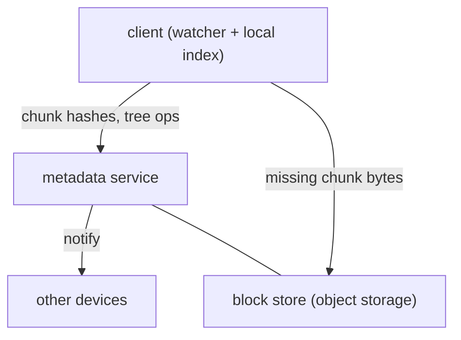

You edit a file on your laptop; seconds later it's identical on your phone and your desktop. Two people edit different files in a shared folder; both changes land everywhere without clobbering each other. Your internet drops mid-upload; it resumes, not restarts.

The trick that makes this efficient is that a file sync service doesn't sync *files*. It splits every file into **chunks**, addresses each chunk by the hash of its contents, and syncs the list of chunk hashes. Change one paragraph and only the chunks covering that paragraph are new; everything else is already stored, often already on the other device. This is distinct from [Google Docs](/citadel/system-design/google-docs), which syncs *edits* to a live document — file sync moves whole file versions, efficiently.

## What it has to do

- Keep a set of folders byte-identical across a user's devices and the cloud.
- Sync only what changed, resume interrupted transfers, work offline then reconcile.
- Version history; restore a previous version.
- Sharing with permissions.
- Deduplicate storage — identical content stored once.

## Chunking and content addressing

Split each file into chunks and identify each by `SHA-256(chunk)`. Two options for where the boundaries fall:

- **Fixed-size** (e.g. 4 MB). Simple. But inserting one byte at the start of a file shifts every subsequent boundary, so every chunk hash changes — no dedup benefit for edits that change length.
- **Content-defined** (a rolling hash — Rabin fingerprint — declares a boundary wherever the hash has a certain pattern). Boundaries move *with the content*, so inserting a byte only affects the one chunk it lands in. This is what makes delta sync work for edits, not just appends.

A file is then represented by an ordered list of chunk hashes (plus a file hash over that list). Storage is **content-addressed**: the block store maps `chunk_hash → bytes`, so identical chunks — across versions, across files, across *users* — are stored once. (Cross-user dedup has a privacy nuance: it can leak "someone already has this file"; some services dedup only within an account.)

## The two services

- **Metadata service** — the source of truth for the namespace: the folder tree, each file's current version and its chunk list, version history, sharing ACLs, and per-device sync cursors. Strongly consistent (a file has one current version), sharded by user or by namespace. Small records, huge count.
- **Block store** — [object storage](/citadel/system-design/object-storage) keyed by chunk hash. Dumb: put a chunk, get a chunk. Replicated/erasure-coded for durability; garbage-collects chunks no version references.

Splitting them means a sync is mostly metadata chatter (cheap, frequent) with block transfers only for genuinely new content.

## The client

- A **file-system watcher** notices local changes. On a change, the client re-chunks the file, computes the new chunk list, and diffs it against its **local index** (its last-known state).
- It sends the metadata service the tree operation ("file X now has version N with these chunk hashes") and uploads any chunks the server reports it doesn't already have.
- It receives notifications (long-poll or a push connection) when the metadata service records a change from another device, then downloads the metadata delta and any missing chunks.
- **Resumable transfers** — chunks are the unit; an interrupted upload resumes at the next un-acked chunk. Large files are just many chunk PUTs.

## Sync protocol

Each device has a **cursor** (a version number / logical clock per namespace). To sync: send your cursor, get back the list of tree changes since then, apply them, fetch missing chunks, advance your cursor. Same pattern as [chat sync](/citadel/system-design/chat-system) — the server keeps an ordered change log and the client replays from where it left off.

## Conflicts

Two devices edit the same file while one is offline. On reconciliation, the metadata service sees a new version branching from a parent that's no longer current. Resolution is usually **keep both**: the later-arriving version becomes `filename (conflicted copy from Device 2).ext`, and the user sorts it out. Directory operations (a rename racing an edit) need care — model the tree as nodes with stable IDs so a rename is a metadata op that doesn't invalidate in-flight chunk uploads.

There's no automatic content merge — that's [OT/CRDT](/citadel/system-design/google-docs) territory and only works for structured documents.

## Versioning and sharing

- **Versions** — each save is a new immutable version (a new chunk list) in the metadata history; old chunks stick around until pruned by retention policy. Restore = point `current` at an old version.
- **Sharing** — a shared folder is a namespace with an ACL; collaborators' clients sync it like their own. Permission checks happen at the metadata service on every tree op.

## The one idea to keep

A file sync service syncs chunk hashes, not files. Content-defined chunking means an edit only produces new chunks where the bytes actually changed, and content-addressed storage means identical chunks are stored once. A strongly consistent metadata service owns the tree and the version history; a dumb content-addressed block store owns the bytes; the client watches the filesystem, diffs against a local index, and replays a change log from its cursor — with "keep both as a conflicted copy" standing in for the content merge it can't do.
