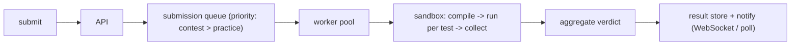

A user submits a function. The system compiles it, runs it against a set of hidden test cases, and returns a verdict — Accepted, Wrong Answer, Time Limit Exceeded, Runtime Error — with timing, in a few seconds. During a contest, tens of thousands of people do this at once.

Two hard parts. The code is **untrusted** — it might try to read `/etc/passwd`, open a network connection to exfiltrate the test cases, allocate all the RAM, or spawn a thousand threads. And judging has to be **fair** — the same solution gets the same verdict regardless of which worker ran it or how loaded the box was.

## What it has to do

- Accept submissions in many languages; compile and run against hidden tests.
- Verdicts: `AC`, `WA`, `TLE`, `MLE`, `RE`, `CE`, plus per-test timing.
- Isolate every submission from the host and from every other submission.
- Deterministic-ish time limits despite shared hardware.
- Scale for contest spikes; keep practice submissions flowing during a contest.

## The flow

1. API validates and writes the submission (code, problem, language) to storage, enqueues a job.
2. A worker pulls the job, spins up a sandbox, compiles, runs each test case, collects stdout/stderr/exit/timing.
3. Aggregate: first failing test decides the verdict (or run all for partial scoring). Store the result; push to the user's open socket or let their client poll.

The queue decouples spike from capacity — a contest submission burst becomes queue depth, and workers autoscale on it. Contest jobs jump ahead of practice jobs via a priority queue.

## The sandbox

This is the security core. Layered defence:

- **Isolation primitive** — a container (namespaces + cgroups), or better a lightweight VM (**Firecracker** microVM, **gVisor** user-space kernel). A microVM gives a real kernel boundary; a plain container shares the host kernel and needs seccomp to be safe. Per-language base images, prebuilt.
- **No network** — the sandbox has no network namespace, or an empty one. The hidden test cases must never leave the box.
- **Read-only filesystem** — the code dir is writable and small; everything else is read-only; a tmpfs with a size cap for scratch.
- **Resource limits** (cgroups + rlimits):
  - CPU time — hard cap; exceed ⇒ `TLE`.
  - Memory — hard cap; exceed ⇒ `MLE` (the OOM killer or an rlimit).
  - Processes / threads (`pids` cgroup) — cap low; defeats fork bombs.
  - Wall-clock timeout — a backstop above the CPU limit for sleeping/blocked code.
  - Output size — cap stdout; a program printing gigabytes shouldn't fill a disk.
  - File descriptors, stack size.
- **seccomp-bpf** — allowlist the syscalls a solution could legitimately need; block `socket`, `ptrace`, `mount`, `clone` with dangerous flags, etc.
- **Drop privileges** — run as an unprivileged, per-submission user; no capabilities.
- **Fresh sandbox per submission** — never reuse; tear down completely after.

`isolate` (from IOI) and `nsjail` are the standard building blocks that bundle most of this.

## Fair time limits

Wall-clock time depends on how busy the host is, so two runs of the same code differ. Mitigations:

- **Measure CPU time**, not wall time, for the limit — but CPU time still varies with cache state and CPU model.
- **Pin one submission per core** during judging (or one per worker), so it isn't contending.
- **Homogeneous judge hardware** — same CPU model across the fleet.
- **Relative limits** — set the limit as a multiple (e.g. 3×) of a reference solution's measured time on the same hardware, rather than a fixed number of milliseconds, so the limit tracks the machine.
- For extreme determinism, count **instructions** (via `perf` or a CPU emulator) instead of time — used by a few judges, slower to run.

## Judging modes

- **Exact match** — compare stdout to expected output, token- or line-wise (with trailing-whitespace tolerance).
- **Special judge (checker)** — problems with multiple valid answers (any shortest path, any valid construction) ship a checker program that validates the output; the judge runs it.
- **Interactive** — the solution talks to a judge program over stdin/stdout in a loop (guessing games, adaptive problems); the sandbox wires the two together with pipes and a combined limit.

## Storage and contest features

- **Submissions** and **verdicts** in a database; source code and large outputs in object storage.
- **Test data** in object storage, pulled to workers and cached locally (it's reused across every submission to a problem).
- **Contest** adds: a real-time [leaderboard](/citadel/system-design/leaderboard), rejudge (re-run all submissions after a data fix), and plagiarism detection (token-normalized similarity, e.g. MOSS) run offline.

## Abuse to expect

Solutions that fork-bomb, allocate infinitely, `sleep(1000000)`, print forever, try to read test files from a well-known path, attempt sandbox escapes, or (during a rented-worker era) mine cryptocurrency. Every one of these is contained by a resource limit or a syscall filter above — which is why the sandbox is defence *in depth*, not a single wall.

## The one idea to keep

An online judge is a submission queue feeding a pool of workers, each of which runs one untrusted program in a throwaway sandbox with hard limits on CPU, memory, processes, output, and syscalls — a microVM or gVisor for a real kernel boundary, no network so the hidden tests can't escape. Fairness comes from homogeneous hardware, one submission per core, and time limits expressed relative to a reference solution rather than as absolute milliseconds.
