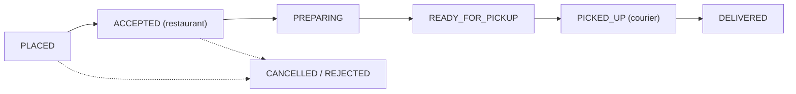

Three parties, one order. The customer wants food and a believable ETA. The restaurant wants a clean queue of tickets it can actually cook. The courier wants efficient routes and predictable earnings. A delivery platform coordinates all three in real time, and the order is on a clock the whole way — a 40-minute promise that a slow kitchen or a missing courier blows.

Structurally it borrows from [ride-sharing](/citadel/system-design/ride-sharing) (courier matching, live tracking) and adds a kitchen: the courier can't be dispatched too early (food gets cold waiting) or too late (courier waits at the counter). This post is the order lifecycle, the dispatch decision, and the ETA.

## What it has to do

- Customer: browse restaurants (by location), see menus, order, pay, track, rate.
- Restaurant: receive/accept orders, mark prep progress, adjust menu availability.
- Courier: get assigned, navigate to pickup then drop-off, batch multiple orders.
- Keep an ETA that's honest, and update it when reality diverges.

## Discovery

The restaurant list is a [proximity query](/citadel/system-design/proximity-service): restaurants that deliver to the customer's location (a geo-index lookup, filtered by each restaurant's delivery radius), then ranked by distance, rating, prep speed, and promotions. Menus are a heavily cached read — a menu service behind a CDN, invalidated when a restaurant edits items or marks something sold out. This part is a normal read-heavy catalogue; the interesting parts start at checkout.

## The order state machine

Every transition emits an event that: notifies the customer, updates the tracking view, and feeds the dispatch and ETA services. The order is persisted in a store partitioned by order ID; the state field and its history are the source of truth. A **saga** coordinates order creation across payment, inventory (is the item still available?), and restaurant acceptance — if the restaurant rejects or times out, the payment pre-auth is released and the customer is told, with compensating steps rather than a distributed transaction.

## Dispatch: when and to whom

The timing decision is the crux. Assign a courier so they arrive at the restaurant right about when the food is ready:

`dispatch_time ≈ order_ready_estimate − courier_travel_time_to_restaurant`

- Too early: courier idles at the counter (bad for their earnings, bad for supply).
- Too late: food sits under a heat lamp getting worse; ETA slips.

So dispatch is driven by the **prep-time estimate**, which itself is a model (per restaurant, per item, per current kitchen load). As `PREPARING` progresses and `READY_FOR_PICKUP` fires, the estimate sharpens and dispatch can adjust.

**Who** gets it: query available couriers near the restaurant, rank by combined pickup + drop-off ETA, direction of travel, current load, and rating. On decline, reassign fast. **Batching** — assigning one courier two orders from the same or nearby restaurants going to nearby destinations — raises courier efficiency and lowers cost, at the risk of the second customer's food waiting; a batching model decides when the routes are compatible enough.

## Live tracking and ETA

Courier phones stream location (every few seconds) → gateway → pub/sub → customer app, snapped to roads by map matching. The customer sees the courier move; the restaurant sees "courier 4 min away."

The ETA shown to the customer is a sum of uncertain pieces:

`ETA = time_to_accept + prep_time + courier_wait_at_restaurant + drive_time_to_customer + handoff`

Each term is its own estimate (prep time from a kitchen-load model, drive time from a routing engine with live traffic). Recompute on every meaningful event — restaurant accepts, prep progresses, courier assigned, courier picks up — and only *show* a changed ETA if it moved by more than a threshold, so the number doesn't flicker. Being honest ("running late") beats a stale optimistic number.

## Payments and settlement

- **Customer** — pre-authorize at checkout (covers item total + delivery fee + tip + surge), capture on delivery. Idempotency key = order ID.
- **Restaurant payout** — order subtotal minus the platform commission, on a batch schedule.
- **Courier earnings** — per-delivery base + distance + time + tip + any surge/quest bonus, credited on `DELIVERED`.
- **Surge / busy pricing** — a delivery-fee multiplier per area when demand outstrips courier supply, quoted before the customer confirms.

## Scale and failure

- **Partition by city / region** — discovery, dispatch, and pricing for an area are local.
- **Write pressure** is courier location pings (same firehose pattern as ride-sharing: stream → in-memory geo index, down-sample for durability) and order events.
- **No couriers available** — widen the search, offer the customer a longer ETA or pickup, and back-pressure new orders in that area rather than accepting orders that can't be delivered.
- **Restaurant offline / not responding** — auto-cancel after a timeout, refund the pre-auth, surface alternatives.

## The one idea to keep

A food delivery system is an order state machine with a courier-matching loop bolted to it, and the thing that ties them together is the prep-time estimate: dispatch a courier so they reach the kitchen just as the food is ready — early wastes their time, late wastes the food. The customer's ETA is a running sum of independent guesses (accept time, prep time, wait, drive time); recompute it on every state change and only redraw it when it moves enough to matter.
