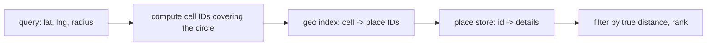

"Show me restaurants within 2 km" sounds like a `WHERE` clause. And it is one — `WHERE lat BETWEEN ? AND ? AND lng BETWEEN ? AND ?` — right up until you have a hundred million places and thousands of queries a second, at which point a two-dimensional range scan on every request is too slow.

The fix in every geospatial system is the same trick: convert a 2D coordinate into a **1D key** such that points near each other in the world get keys near each other in sort order. Then "nearby" becomes a handful of prefix or range lookups on an ordinary index, which you can shard like any other key. The three standard encodings differ in how they draw the grid.

## What it has to do

- Given `(lat, lng, radius)` — or a viewport — return matching places.
- Add / update / remove places.
- Handle skew: Manhattan has thousands of places per square km, the desert has none.
- Low latency; places change rarely, so the index can be mostly static.

## Why the naive query struggles

A B-tree index on `lat` and a separate one on `lng` each only narrow one dimension; the database intersects two wide ranges. A composite `(lat, lng)` index orders by `lat` first, so a query still scans a whole latitude band. PostGIS and friends use an **R-tree** (bounding boxes nested in bigger bounding boxes) which does handle 2D well — but R-trees are harder to shard across machines and to keep balanced under churn. The grid encodings below trade a little precision for a key that's just a string or an integer.

## Geohash

Recursively bisect the world: is the point in the east or west half? North or south? Each yes/no is a bit; interleave the longitude and latitude bits and Base32-encode the result. `dr5ru` is a ~5×5 km cell in Manhattan; `dr5ru7` refines it to ~1 km; every extra character multiplies precision by ~4–8×.

The key property: **a shared prefix means spatial proximity**. All places in cell `dr5ru` share that prefix, so they're a contiguous range in a sorted index — one range scan.

To search a radius: compute the geohash cell whose size roughly matches the radius, then query **that cell plus its 8 neighbours** (a place near a cell edge could be in an adjacent cell), and filter the results by true distance.

- **Simple** — it's just a string; any key-value store or SQL index works; shard by prefix.
- **The boundary problem** — two points 10 m apart on opposite sides of a cell boundary have completely different geohashes. Querying the 8 neighbours fixes it for search but you still over-fetch.
- **Fixed cell sizes** — precision jumps in discrete steps; a query radius rarely matches a cell size cleanly.

## Quadtree

A tree where each node covers a square region and, when it holds more than a threshold of points, splits into four children. Dense areas subdivide deeply; empty areas stay a single big node. This **adapts to density** — no wasted cells over the ocean, fine resolution downtown.

A search descends to the nodes overlapping the query circle and collects their points. It's typically held in memory and rebuilt or incrementally updated as places change. Uber's early dispatch used quadtrees. The cost versus geohash is that it's a tree structure to maintain and distribute rather than a flat sortable key.

## Google S2 (and Uber H3)

**S2** projects the sphere onto the six faces of a cube, then recursively subdivides each face into four, and numbers the cells along a **Hilbert curve** — a space-filling curve that visits nearby cells consecutively, so an S2 cell ID is a 64-bit integer with the same "close in number ⇒ close in space" property as a geohash, but with near-uniform cell *area* (geohash cells distort badly near the poles) and no abrupt precision steps (any level of the hierarchy is available). A region query becomes a small set of integer ranges (a **cell covering**).

**H3** (Uber) is the hexagonal cousin: hexagons tile more uniformly than squares (every neighbour is the same distance, no diagonal special case), which is why it's popular for spatial aggregation and routing grids.

## Serving

- **Geo index** — `cell → list of place IDs`, in Redis (`GEOADD`/`GEOSEARCH` do this natively), Elasticsearch geo queries, or a plain table indexed by cell string. Shard by cell.
- **Place store** — `place_id → { name, category, rating, hours, coords }`, cached.
- **Ranking** — distance is one signal; blend with rating, popularity, sponsored placement, then paginate.
- **Updates** — a place moving cells is a delete-from-old-cell + insert-into-new-cell. Because places change rarely, much of the index can be a periodically rebuilt static artifact with a small live overlay.

## The one idea to keep

A proximity service turns a 2D coordinate into a 1D key whose sort order preserves nearness, so "within radius" becomes a few range or prefix lookups on a normal, shardable index instead of a 2D scan. Geohash is the simplest (a Base32 string, shard by prefix, but query the 8 neighbours to cover cell boundaries); quadtrees adapt cell size to density; S2 and H3 give near-uniform cells and any-level precision via a space-filling curve. Then filter the candidates by true distance and rank.
