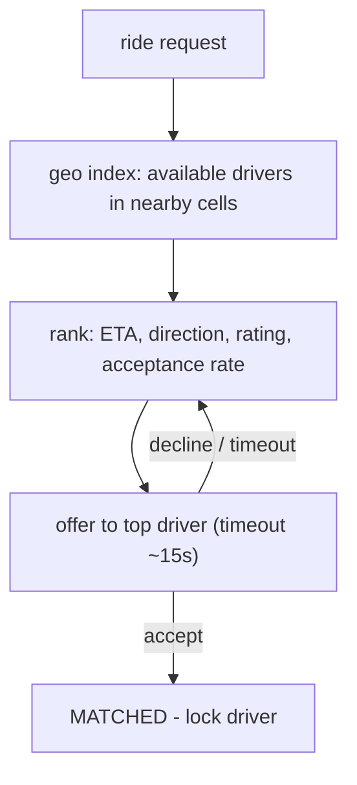

A rider taps "request ride." Within a few seconds a nearby driver's phone buzzes with an offer; they accept; the rider watches a car icon crawl toward them on a map. Under that is a system absorbing millions of GPS pings per second from drivers, keeping a spatial index of available drivers fresh enough to match against, and running an assignment loop that has to find a driver before the rider loses patience.

Three subsystems: **location ingestion** (write-heavy, lossy-tolerant), **matching** (a search over a geo index plus a ranking), and the **trip lifecycle** (a state machine pushed to two apps over persistent connections). The [proximity-service](/citadel/system-design/proximity-service) geo-indexing is a building block here; this post is the rest.

## What it has to do

- Rider: request, get matched, track the car, complete, pay, rate.
- Driver: go online/offline, receive and accept/decline offers, navigate.
- Match in seconds; keep the driver's location fresh on the rider's screen.
- Handle surges (New Year's Eve), sparse areas (no drivers), and declines (reassign fast).

## Location ingestion

Drivers' phones send a GPS ping every 3–5 seconds. At scale that's millions of writes per second, and it is the highest-volume thing in the system.

Do **not** write each ping to the primary database. The pipeline:

1. Pings hit a lightweight gateway (holding the driver's persistent connection) and go onto a stream (Kafka) partitioned by driver ID or region.
2. A consumer updates an **in-memory geo index** — a sharded structure (per-region [geohash/S2](/citadel/system-design/proximity-service) buckets) of `available driver → (location, updated_at)`. This is the only thing matching reads.
3. Down-sample for durability: persist a driver's location every ~30 s (for trip reconstruction, analytics, disputes), not every ping.
4. Entries carry a TTL; a driver who stops pinging (dead battery, tunnel) ages out of the index in ~15 s so they're never matched.

The index is deliberately a few seconds stale. That's fine — a driver 200 m away is still 200 m away three seconds later.

## Matching

- **Candidates** — query the geo index for available drivers in the cells covering a radius around the rider (expand the radius if too few).
- **Rank** — not just nearest-by-straight-line. Score by estimated **time** to reach the rider (road-network ETA, not haversine), the driver's heading (a driver already pointed the right way is better), rating, recent acceptance rate, and fairness (spread work).
- **Offer** — send to the top driver with a short accept window. On decline or timeout, drop to the next candidate. The driver is **soft-locked** during an outstanding offer so two riders aren't offered the same car.
- **Batching** — in a dense area, matching one request at a time is greedy and suboptimal. Collect requests over a short window (a few seconds) and solve the assignment as a batch (a min-cost bipartite matching), which cuts total wait time and pickup distance. Pooled rides extend this to grouping compatible requests onto one car.

## Trip lifecycle

A state machine, with each transition emitting events that update both apps and downstream systems:

`REQUESTED → MATCHED → DRIVER_ARRIVING → IN_PROGRESS → COMPLETED` (plus `CANCELLED` from several states).

The rider and driver apps hold **persistent connections** (WebSocket or gRPC streams) to a gateway; a **connection registry** maps user → which gateway node holds their socket, so an event for a trip can be routed to both parties. Location updates during a trip flow driver → gateway → pub/sub → rider, so the rider sees the car move.

## ETA and routing

The map is a graph of road segments with time-varying weights (live traffic). Shortest path on a continent-sized graph needs preprocessing — **contraction hierarchies** or **ALT landmarks** turn a query into milliseconds. ETA blends the routed travel time with historical patterns for that road at that hour and a live-traffic multiplier. **Map matching** snaps noisy GPS points to the most likely road path before computing anything.

## Pricing and surge

Fare = base + per-km + per-minute, times a **surge multiplier** computed per geo cell as a function of the local demand/supply ratio, updated every minute. The multiplier is quoted to the rider *before* they confirm and locked for that trip. Fare calculation must be **idempotent** — recomputing it (on a retry, or a dispute) yields the same number from the same trip data.

## Payments

Pre-authorize the card at request time; capture on completion. Every payment call carries an **idempotency key** (the trip ID) so a network retry doesn't double-charge. Driver payout is a separate ledger entry; the platform's cut is computed from the fare. See [the payment ecosystem](/citadel/interview/payment-ecosystem).

## Scale and reliability

- **Shard by geography** — a region's drivers, riders, matching, and surge are handled by that region's cluster. Cross-region trips (airport runs) are the edge case to handle explicitly.
- **Degrade gracefully** — no drivers in range: widen the search, then tell the rider "none available" rather than spinning. Matching service down: queue requests briefly, don't drop them.
- **Hot cells** — a stadium letting out is a single cell with thousands of requests; batch matching and surge both help, plus proactively positioning drivers there.

## The one idea to keep

Ride-sharing is three systems. Location pings are a firehose you funnel through a stream into an in-memory geo index that's intentionally a few seconds stale and TTLs out silent drivers. Matching queries that index for nearby available drivers, ranks them by ETA and heading (not straight-line distance), and offers with a short timeout, soft-locking the driver so nobody double-books. The trip itself is a state machine pushed to both apps over persistent connections, with idempotent fares and pre-authorized payments so retries never double-charge.
