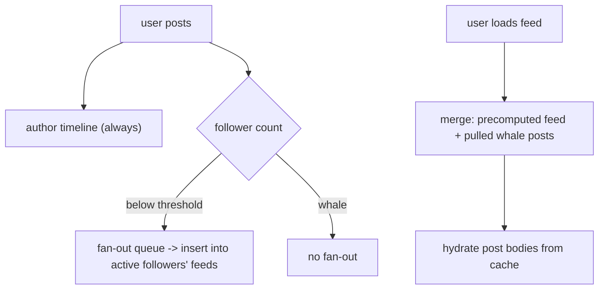

You follow 500 accounts. You open the app and expect a feed — the recent posts from those 500, ordered, in under a second. Multiply by a hundred million users, each following a different set, each of those sets posting continuously, and the question becomes: when do you actually build each person's feed?

There are exactly two moments to choose from. Build it when a post is created (**fan-out on write**, "push"), or build it when the feed is requested (**fan-out on read**, "pull"). The two have mirror-image costs, and the interesting engineering is the hybrid that large systems land on.

## What it has to do

- Show a user recent posts from accounts they follow, ranked (chronological or scored).
- Feed load in ~1 second; the write path (posting) can be slower.
- Read:write ratio is enormous — people scroll far more than they post.
- Handle the follower-count skew: most accounts have hundreds of followers, a few have tens of millions.

## Fan-out on write (push)

When a user posts, immediately insert the post's ID into the precomputed feed of **every follower**. Feeds are stored as a per-user list (a capped list in Redis, or a wide-column row) of post IDs.

- **Read is trivial and fast** — the feed is already assembled; fetch the top `n` IDs and hydrate them (look up post bodies, author info) from a cache.
- **Write is expensive and skewed.** A post by someone with 50M followers triggers 50M list insertions. That's a burst of work, much of it wasted on followers who won't open the app today, and it makes posting slow or requires a big async fan-out pipeline.
- **Wasted storage** — every follower's feed holds a copy of every post ID, including for dormant accounts.

## Fan-out on read (pull)

Store nothing precomputed. When a user requests their feed, look up who they follow, fetch each of those accounts' recent posts, merge them by time, and return the top `n`.

- **Write is trivial** — a post is one insert into the author's own timeline.
- **Read is expensive** — a `k`-way merge across 500 sources on every feed load, every scroll. For an active user this is a lot of repeated work.
- **No wasted work** — you only build feeds people actually ask for.

## The hybrid

Neither extreme is acceptable at scale, so:

- **Push for normal accounts.** When an account with a manageable follower count posts, fan out to followers' feeds.
- **Pull for the whales.** Accounts above a follower threshold (celebrities, big brands) do *not* fan out. Their posts sit only in their own timeline.
- **Merge at read time.** When a user loads their feed, take their precomputed (pushed) feed and merge in the recent posts of the handful of whales they follow, fetched on the fly.

So the read does a small merge (precomputed list + a few pulled timelines) instead of a 500-way one, and the write avoids the 50M-insertion explosion.

Two more refinements:

- **Active-user filtering.** On push, skip followers who haven't opened the app in `N` days. When a dormant user returns, backfill their feed with a pull. This cuts fan-out volume dramatically — the long tail of dead accounts stops costing anything.
- **Fan-out is async.** The post write returns as soon as it's in the author's timeline and enqueued; a worker pool drains the fan-out queue. A viral post's fan-out can take seconds to fully propagate, and that's fine.

## Ranking

Chronological is the simple case — merge by timestamp. A **ranked** feed (Twitter's "For You", Instagram, Facebook) adds a scoring stage:

1. **Candidate generation** — gather more posts than you'll show (from follows, plus recommended accounts, plus recent engagement) — a few thousand.
2. **Feature extraction** — recency, author affinity, post type, predicted engagement, plus negative signals.
3. **Scoring** — a model ranks the candidates; the top `n` become the feed.
4. **Re-ranking** — diversity rules (not five posts from one author), integrity filters, ads insertion.

The pushed feed then stores candidate IDs; scoring happens at read time (or is precomputed for active users on a schedule).

## Storage and hydration

- **Feed store** — per-user list of post IDs (not bodies), capped at a few hundred entries, in a fast store (Redis, or a Cassandra row).
- **Post store** — the canonical posts, keyed by ID, heavily cached.
- **Hydration** — a feed read fetches ~30 IDs from the feed store, then multi-gets the bodies + author data from cache. Deleted or blocked posts are filtered here.
- **Graph store** — the follower/following edges, sharded by user, used by fan-out and by pull.

## The one idea to keep

A news feed is precomputed at write time or assembled at read time, and the choice is really per-account: push a post to its followers' feeds unless the author has too many followers, in which case leave it in their timeline and merge it in when a follower reads. Skip dormant followers on push and backfill them on return. That hybrid keeps the read a small merge and the write a bounded amount of work, and a ranking model sits on top turning "recent posts from follows" into "posts you'll engage with."
