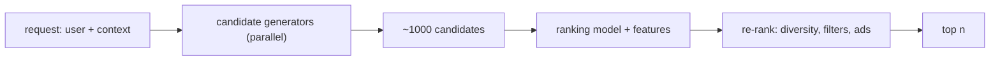

A user opens the app and expects a screen of things they'll probably like — videos, products, songs, people to follow. The catalogue has millions of items. Running a good ranking model over all of them, for this user, right now, is far too expensive to do per request.

The universal fix is **two stages**. First, **candidate generation**: several cheap retrieval methods each nominate a few hundred items, for a combined pool of maybe a thousand. Then **ranking**: a heavier model scores just those thousand and picks the top few dozen. Everything else — feature stores, exploration, handling users with no history — hangs off that skeleton.

## What it has to do

- Return `n` ranked items per request in tens of milliseconds.
- Optimize a real objective: watch time, click-through, purchases, retention — often several at once.
- Stay fresh — new items and new user actions should matter within minutes.
- Not collapse into a filter bubble; keep some diversity and discovery.
- Do something reasonable for a brand-new user or item (**cold start**).

## Stage 1: candidate generation

Each generator is a fast lookup, not a model evaluation. Common ones, run in parallel and unioned:

- **Collaborative filtering.** "Users who liked what you liked also liked X." Item–item: precompute, for each item, its most co-engaged items (offline, from the user–item interaction matrix); at request time, look up candidates from the user's recent items. Cheap and strong.
- **Two-tower embeddings + ANN.** Train a model that maps users and items into the same vector space so that a user's vector is close to items they'd engage with. Precompute all item vectors, index them in an [approximate-nearest-neighbour](/citadel/tech/vector-search) store (HNSW). At request time, compute the user vector and fetch its nearest items — a millisecond lookup over millions of items.
- **Content-based.** Items sharing attributes (genre, creator, tags) with the user's history.
- **Trending / fresh.** Globally or regionally popular recent items — covers cold-start users and injects novelty.
- **Graph / co-visitation.** "People who viewed this session also viewed…"

Each generator caps its output (~a few hundred), and the union (with dedup) is the candidate set. Missing the right item here means it can never be shown — recall at this stage is the ceiling on quality.

## Stage 2: ranking

Now score the ~1,000 candidates with a real model — gradient-boosted trees, or a deep network (a two-tower ranker, or a transformer over the user's history). Features per (user, item, context):

- **User** — long-term preferences, demographics, activity level.
- **Item** — age, popularity, quality signals, creator.
- **Context** — time of day, device, what they just watched, session length.
- **Cross** — has this user engaged with this item's creator / category before.

The model predicts one or more probabilities (P(click), P(long watch), P(purchase)); a business rule combines them into a single score. Then a **re-ranking** pass applies constraints the model doesn't: don't show five items from one creator, respect integrity/safety filters, insert ads at fixed slots, boost or demote per policy.

## The feature store

Ranking needs features at request time with single-digit-millisecond latency, and the *same* features at training time computed as they were *at the moment of the historical event* (no leakage from the future). That's a **feature store**: an offline pipeline computes features into a warehouse for training, and materializes the latest values into a low-latency online store (Redis, DynamoDB) for serving. Point-in-time correctness — joining training labels to feature values as of the event timestamp — is the subtle, bug-prone part.

## The feedback loop and its biases

The system's own output shapes its next training data, which creates biases you have to correct for:

- **Position bias** — items shown at the top get clicked more regardless of relevance. Train with position as a feature (and drop it at serving), or use inverse-propensity weighting.
- **Popularity bias** — popular items get recommended, get more engagement, get more recommended. Counteract with diversity terms and by up-weighting long-tail engagement.
- **Exploration** — the model only learns about items it shows. Reserve a slice of traffic for exploration: ε-greedy (show random candidates occasionally), or contextual bandits (Thompson sampling) that balance "show what we're confident about" against "show what we're uncertain about."
- **Delayed labels** — a "purchase" or "watched to the end" signal arrives minutes or hours later; training pipelines must wait for the attribution window.

## Cold start

- **New user** — no history, so lean on trending/popular candidates, any onboarding signals (picked interests), and demographic priors, then adapt fast as the first few interactions arrive.
- **New item** — no engagement data, so the two-tower model relies on its content features; give new items a temporary exploration boost so the system can learn whether they're good.

## Evaluation

- **Offline** — replay historical data, measure ranking metrics (NDCG, recall@k, AUC). Cheap, directional, but doesn't capture the feedback loop.
- **Online A/B test** — the real measure. Ship a variant to a fraction of users, compare the actual objective (watch time, retention) plus **guardrail metrics** (are you tanking diversity, or session length, or a minority segment's experience?).

## The one idea to keep

You can't score a million items per user per request, so recommenders are two stages: a set of cheap generators (co-engagement lookups, embedding nearest-neighbours, trending) that together nominate ~1,000 candidates, then one real model that ranks just those. A feature store serves the ranking features with point-in-time-correct history, and because the system trains on its own outputs, you actively correct for position and popularity bias and carve out traffic for exploration.
