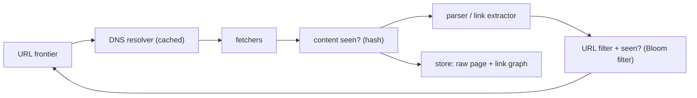

A crawler starts with a handful of seed URLs, fetches them, extracts the links, and repeats — a breadth-first walk of the web. The idea fits in a paragraph. Doing it at billions of pages without getting your IP banned, without wasting half your bandwidth on duplicate content, and without a single misconfigured site trapping the crawler in an infinite loop is where the design lives.

The heart of it is the **URL frontier**: the queue of URLs still to fetch. It has to serve up high-value pages first *and* never send two requests to the same server within a few seconds. Those goals pull in opposite directions, and resolving them is most of the work.

## What it has to do

- Fetch pages, extract links, keep going — at a target rate (pages/sec).
- **Politeness** — respect `robots.txt` and don't overload any host.
- **Freshness** — re-crawl pages roughly as often as they change.
- **Deduplication** — don't fetch the same page twice, and detect near-duplicate content.
- **Robustness** — survive spider traps, malformed pages, slow servers, and crawler restarts.
- **Extensibility** — new content types, new extractors.

## The pipeline

## The URL frontier

Two concerns, implemented as two layers of queues (the Mercator design):

- **Front queues — priority.** URLs are bucketed by a priority score (domain authority, update frequency, depth from seed, freshness need). A biased selector pulls more often from high-priority buckets.
- **Back queues — politeness.** Each back queue holds URLs for exactly one host. A worker takes a URL from a back queue, fetches it, then is told the earliest time it may hit that host again (a fixed delay, or `Crawl-delay` from `robots.txt`, or adaptive from the server's response time). A min-heap of `(next-allowed-time, host)` schedules which back queue is eligible next.

So the front queues decide *what's worth crawling* and the back queues enforce *one request per host at a time, spaced out*. A router maps each URL to a back queue by host, creating queues as new hosts appear.

## Politeness in detail

- **`robots.txt`** — fetch and cache it per host (with its own TTL); honour `Disallow` and `Crawl-delay`.
- **Per-host concurrency = 1**, with a delay between requests (often a few seconds, or a multiple of the last response time so slow servers get more slack).
- **Identify yourself** — a `User-Agent` with a contact URL, so an annoyed webmaster emails you instead of blocking you.
- **Distributed politeness** — if crawler nodes are partitioned by host (hash the hostname to a node), then all requests to a host come from one node and politeness is local state. Partitioning by host also localises the `robots.txt` cache and the per-host queue.

## Deduplication

- **URL dedup.** Before enqueuing, canonicalize (lowercase host, remove default ports, sort or strip tracking query params, resolve `.`/`..`, drop fragments) and check a **seen-URL set**. At billions of URLs this is a [Bloom filter](/citadel/data-structures/bloom-filters) in memory backed by a disk store — "definitely new" ⇒ enqueue; "probably seen" ⇒ skip (accepting the rare false positive drops a genuinely new page). See also [deduplicating URLs at scale](/citadel/system-design/dedupe-urls).
- **Content dedup.** Different URLs often serve identical or near-identical pages (session IDs in the URL, print versions, mirrors). Hash the normalized content; an exact hash catches identical pages. For *near*-duplicates, compute a **SimHash** (a locality-sensitive fingerprint where similar documents get fingerprints within a small Hamming distance) and skip pages within a threshold of one already stored.

## Traps and hazards

- **Spider traps** — infinite calendars (`/events/2027/01`, `/2027/02`, …), faceted-search link explosions, session IDs generating a new URL per visit. Defences: cap crawl depth, cap URLs per host, cap path length, and detect low-information-gain subtrees (many pages, near-identical content) and stop descending.
- **Large / non-HTML responses** — enforce a max page size; check `Content-Type` before downloading the body.
- **Slow servers** — aggressive timeouts; a slow host shouldn't stall a fetcher.
- **Malicious content** — sandbox the parser; don't execute anything.

## Freshness / re-crawl

Pages change at wildly different rates. Estimate each page's change frequency from observed history (did the content hash change between the last two crawls, and how long apart?), and schedule the next crawl accordingly — a news homepage every few minutes, a static doc every few weeks. Sitemaps and HTTP `Last-Modified` / `ETag` headers give hints; a conditional `GET` (`If-Modified-Since`) returns `304` and costs almost nothing when nothing changed.

## Storage and scale

- **Raw pages** → object storage, keyed by content hash.
- **Link graph** → a store of `(from, to)` edges, feeding ranking and the frontier's priority scoring.
- **Metadata** (last-crawled, change-rate estimate, HTTP status history) → a key-value store keyed by URL hash.
- **Distribution** — partition by hostname across crawler nodes; each node runs the full pipeline for its hosts, with a shared (or gossiped) view of the global seen-set. Checkpoint the frontier so a node restart resumes rather than re-crawls.

## The one idea to keep

A crawler is a BFS of the web whose queue has to satisfy two clashing goals at once, so it's built as two queue layers: front queues order URLs by how much you want the page, back queues hold one host each and a heap schedules them so no server is hit twice in quick succession. Around that queue sit a Bloom-filtered seen-set for URL dedup, a SimHash check for near-duplicate content, and depth/host/path caps so one misconfigured site can't trap you forever.
