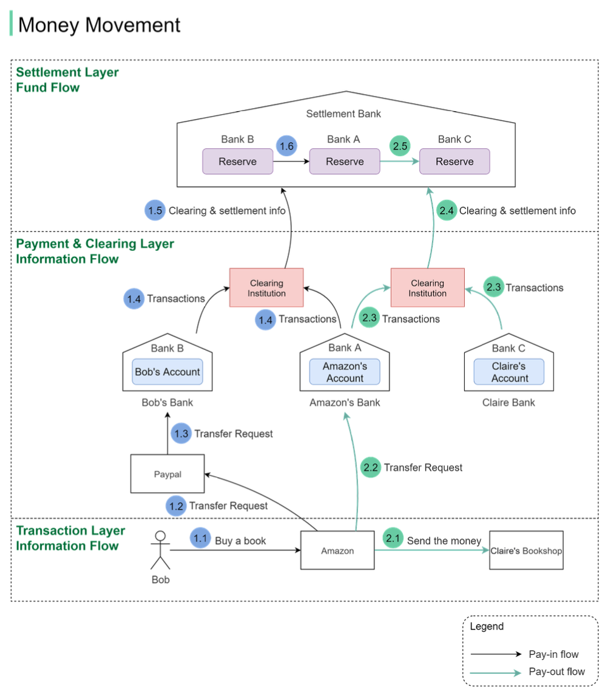
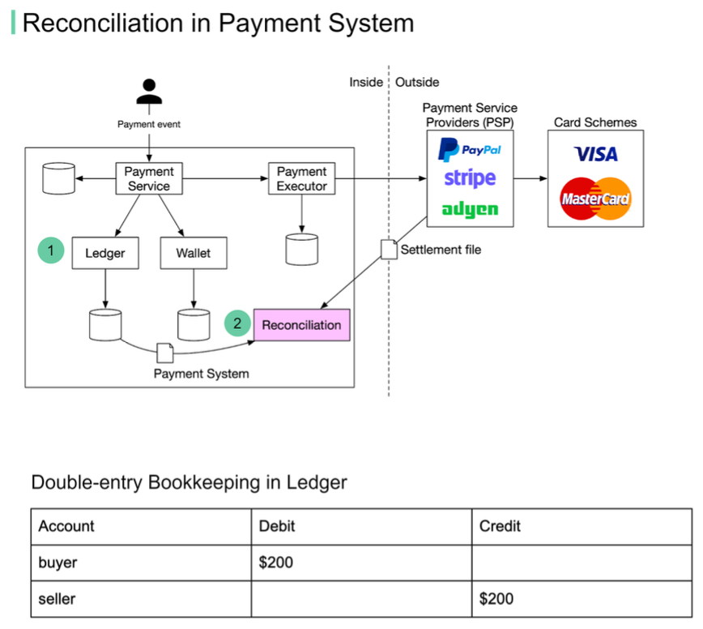

Hey everyone, and welcome back! We click "Pay Now," tap our cards, or scan a QR code countless times a day. From my desk here in Bengaluru, ordering a meal online or paying a bill feels almost instantaneous. But behind that seamless tap or click is an incredibly complex ballet of systems ensuring money (or at least the promise of it) moves correctly and that, at the end of the day, everything balances out.

Today, let's pull back the curtain on the fascinating world of **money movement** in digital payments, touching upon crucial concepts like clearing, settlement, and the unsung, often painful, hero of financial integrity: **reconciliation**.

## The Journey of Your Rupee (or Dollar!): Understanding Money Movement

When you make a payment, especially in a multi-party system like an e-commerce platform, it's not as simple as money teleporting from your account to the seller's. There are distinct phases and a crucial separation to understand.

### Information Flow vs. Fund Flow - They're Not the Same!

One of the first things I learned that truly clicked about payments is the difference between the **information flow** and the **fund flow**.

* **Information Flow:** This is what you often perceive as the "payment." Your account balance seems to decrease, and the merchant gets a notification of payment almost instantly. This flow consists of messages and instructions about the payment.
* **Fund Flow:** This is the *actual* movement of money between financial institutions (banks). This often happens later, typically in batched processes, and is invisible to the end-user during the transaction.

This separation is fundamental to how large-scale payment systems operate.

### Clearing and Settlement: The Backbone of Payments

Two critical processes underpin the fund flow:

1. **Clearing:**

   * Before money actually moves, the system needs to figure out who owes whom and how much. This is **clearing**.
   * It involves transmitting, reconciling, and confirming payment orders or transfer instructions.
   * A key part of clearing is often **netting**. If, over a day, Bank A owes Bank B ₹10,000 and Bank B owes Bank A ₹50,000, the clearing process determines that the net position is Bank B needs to pay Bank A ₹40,000. This reduces the number of actual settlements required.
2. **Settlement:**

   * This is where the real money changes hands. **Settlement** is the actual transfer of funds to discharge the monetary obligations calculated during the clearing phase.
   * This typically happens between financial institutions, often involving reserve accounts held at a central or settlement bank.

### Illustrative Example: Buying from an E-commerce Platform

Let's imagine Bob buys a book from Claire's shop hosted on a large e-commerce platform, using a Payment Service Provider (PSP) like PayPal for the transaction:

* **Pay-in Flow (Bob paying the E-commerce Platform):**

  1. Bob clicks "buy." The e-commerce platform issues a transfer request to the PSP (e.g., PayPal).
  2. The PSP facilitates the transfer of money from Bob's funding source (e.g., his debit card linked to Bank B) to the e-commerce platform's account with its bank (Bank A).
  3. Both Bank A (platform's bank) and Bank B (Bob's bank) send their transaction statements to a **clearing institution**. This institution performs netting.
  4. The clearing institution then sends clearing and settlement information to a **settlement bank** (like a central bank). The actual money movement happens between the reserve accounts of Bank A and Bank B held at this settlement bank.
* **Pay-out Flow (E-commerce Platform paying Seller Claire):**

  1. The platform informs Claire she will be paid.
  2. The platform instructs its bank (Bank A) to transfer funds to Claire's bank (Bank C). Initially, both banks just record these transactions; no real money has moved between them yet just for this instruction.
  3. Bank A and Bank C send their transaction statements to the clearing institution.
  4. The clearing institution sends clearing and settlement information to the settlement bank. Money is then transferred from Bank A's reserve to Bank C's reserve at the settlement bank.

Notice the layers: the **Transaction Layer** where purchases happen, the **Payment and Clearing Layer** for instructions and netting, and the **Settlement Layer** where actual funds move.

## The Unsung Hero: Reconciliation - Making Sure It All Adds Up

This separation of information and fund flows, the involvement of multiple parties (customer, merchant, PSP, banks, clearing houses), and the batched nature of settlement mean that discrepancies can and do arise. This is where **reconciliation** becomes absolutely critical, though it's often one of the most painful processes in a payment system.

* **What is Reconciliation?**
  It's the process of comparing records from different systems to ensure all amounts match and identify any discrepancies. For example, your e-commerce platform's order record of ₹200 should match the PSP's transaction record for ₹200, which should also align with your internal ledger's debit and credit entries (double-entry bookkeeping).
* **Why is it so important (and often painful)?**
  Because fund flows are often asynchronous to information flows, reconciliation is vital for data consistency. Even if you aim for exactly-once semantics in your system (more on that later), the multitude of external systems means reconciliation is still a necessary safety net to catch issues.

### Common Reconciliation Nightmares (and How We Try to Tame Them)

Based on system design discussions, here are some recurring challenges:

1. **Problem: Data Normalization**

   * Different systems often have different data formats. Timestamps might be `2025/05/22` in one system and `May 22, 2025` in another. Currency codes, transaction ID formats, etc., can all vary.
   * **Solution:** Implement a transformation layer to convert data from various sources into a standardized format before comparison.
2. **Problem: Massive Data Volumes**

   * Reconciling millions of transactions daily is a huge computational task.
   * **Solution:** Employ big data processing techniques. For near real-time needs, streaming platforms like Apache Flink are used; for end-of-day batch reconciliation, systems like Apache Hadoop can be suitable.
3. **Problem: Cut-off Time Issues**

   * Imagine your daily cut-off is midnight. A transaction might be recorded at 23:59:55 in your internal system but appear as 00:00:30 (i.e., the next day) in an external PSP's report. This will cause a break in today's reconciliation.
   * **Solution:** The reconciliation system needs logic to categorize these as "temporary breaks" or "timing differences" and attempt to match them against the subsequent day's records from the external system.
4. **Problem: Foreign Exchange (Forex) Complexities**

   * When payments cross currencies (e.g., a customer in India paying in INR for a product priced in USD), multiple currency exchange layers are introduced. The transaction might be received by a PSP in one currency, exchanged to the PSP's standard operational currency, and then potentially exchanged *again* when the funds are paid out to a bank account in yet another currency. Each exchange is a point where rates, fees, and timings can cause discrepancies that need meticulous reconciliation. Different payment providers also handle this differently.
5. **Problem: Payment Providers as Multi-Step Intermediaries**

   * A single customer purchase via a PSP like PayPal doesn't just trigger two events (debit customer, credit merchant internally). It triggers the initial transaction events, and then, often days later, another set of debit/credit events when the PSP transfers the accumulated funds to the merchant's actual bank account. All these stages need to be traceable and reconcilable.

A typical reconciliation flow might involve tracking an order ID from the shop, which is carried over to the payment provider. The payment provider creates its own internal ID, which is ideally used when you get the payout to your bank, and this should all link back to your invoicing system to close the loop for accounting.

## Ensuring Payment Reliability: The Role of Idempotency

With all these moving parts and network communications, errors and retries are inevitable. A critical problem to avoid is a **double charge**. The goal is to achieve **exactly-once** execution for a payment order. This is often achieved by combining two guarantees:

1. **At-least-once processing:** Using retry mechanisms to ensure an operation eventually succeeds despite transient network errors or timeouts.
2. **At-most-once processing:** Using **idempotency checks** to ensure that if the same operation is received multiple times, it's only processed effectively once.

**Idempotency keys** are crucial here. Typically, the client application generates a unique key (e.g., a UUID) for each payment request and includes it in the HTTP header (e.g., `<idempotency-key: key_value>`). The server then uses this key to detect and dismiss duplicate requests, ensuring the payment isn't processed multiple times.

## Key Takeaways

* "Simple" online payments involve a complex choreography of information flows and separate, often delayed, fund flows involving clearing and settlement processes.
* **Reconciliation** is a vital, albeit challenging, process to ensure data consistency and financial integrity across all participating systems.
* Managing issues like data normalization, massive volumes, cut-off timing differences, and Forex complexities are key to successful reconciliation.
* Designing for **idempotency** is crucial for payment reliability to prevent issues like accidental double charges during retries.

The next time you make an online payment, spare a thought for the intricate systems and diligent reconciliation processes working behind the scenes to ensure your money (and the information about it) gets where it needs to go, accurately and reliably!
