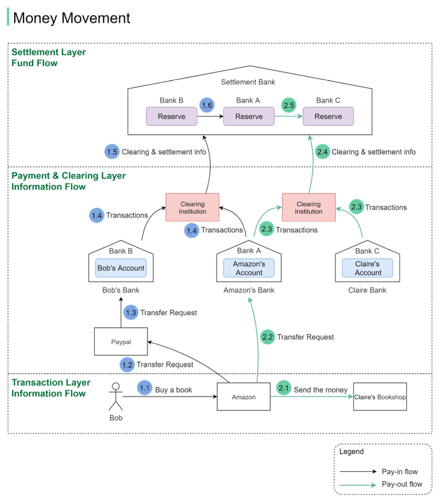
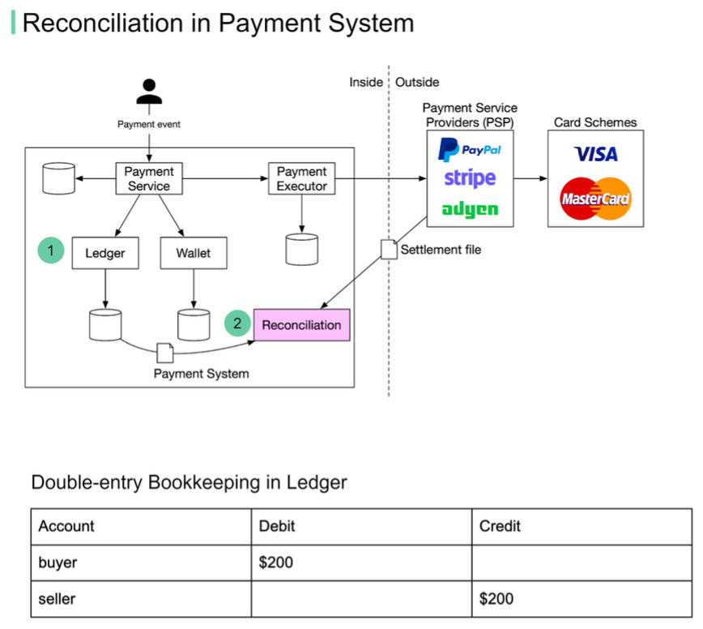

When you pay online, the money does not teleport from your account to the seller's. Two flows run at different speeds, and confusing them is where payment bugs live.

- **Information flow** — the messages: your balance appears to drop, the merchant is notified "paid". Near-instant.
- **Fund flow** — the actual transfer of money between banks. Usually batched, later, invisible to you.

## Clearing and settlement

**Clearing** works out who owes whom, before any money moves — transmitting, reconciling, and confirming payment instructions. Its core is **netting**: if over a day Bank A owes Bank B ₹10,000 and Bank B owes Bank A ₹50,000, clearing reduces that to one obligation, ₹40,000 from B to A. Fewer actual transfers.

**Settlement** is the real transfer that discharges those netted obligations, between financial institutions, typically across reserve accounts held at a central or settlement bank.

### A worked example

Bob buys a book from Claire's shop on an e-commerce platform, paying through a PSP like PayPal.

**Pay-in (Bob → platform).** Bob clicks buy; the platform issues a transfer request to the PSP; the PSP moves money from Bob's card (Bank B) to the platform's account (Bank A). Bank A and Bank B send their statements to a **clearing institution**, which nets, then passes clearing and settlement instructions to a **settlement bank**, where the reserve accounts of Bank A and Bank B actually move.

**Pay-out (platform → Claire).** The platform instructs Bank A to pay Claire's Bank C. The two banks first just record the instruction — no money moves yet — then send statements to the clearing institution, and settlement between reserve accounts follows.

The layers: a **transaction layer** (the purchase), a **payment and clearing layer** (instructions and netting), a **settlement layer** (funds move).

## Reconciliation

Because information and fund flows are asynchronous, span many parties, and settle in batches, records drift apart. **Reconciliation** compares records across systems to confirm they match: the platform's ₹200 order, the PSP's ₹200 transaction, and the ledger's debit and credit entries should all agree. It's usually the most painful process in a payment system.

Recurring problems and how they're handled:

1. **Data normalization.** Systems disagree on formats — `2025/05/22` versus `May 22, 2025`, different currency codes and ID schemes. Run everything through a transformation layer into one canonical format before comparing.
2. **Volume.** Millions of transactions a day is a big compute job. Stream processing (Apache Flink) for near-real-time, batch (Apache Hadoop) for end-of-day.
3. **Cut-off timing.** A transaction at 23:59:55 in your system may land at 00:00:30 in the PSP's report — a break today. The reconciler must tag these as timing differences and match them against tomorrow's external records.
4. **Foreign exchange.** A cross-currency payment is exchanged possibly twice — into the PSP's operating currency, then into the payout currency — and each exchange has its own rate, fee, and timing that can cause a mismatch.
5. **Multi-step intermediaries.** One purchase through a PSP triggers the initial events and then, days later, a second set of debit/credit events when the PSP sweeps accumulated funds to the merchant's bank. Every stage has to be traceable.

The thread that ties it together: the shop's order ID is carried to the PSP, which creates its own internal ID, which should appear on the bank payout and link back to invoicing — one identifier traceable end to end.

## Idempotency

With retries inevitable across flaky networks, the danger is a **double charge**. The goal is **exactly-once** processing, built from two guarantees:

- **At-least-once** — retry until the operation succeeds despite transient failures.
- **At-most-once** — an **idempotency check** so a repeated request is applied only once.

The mechanism is an **idempotency key**: the client generates a unique key (a UUID) per payment request and sends it in a header (`idempotency-key: <value>`). The server records processed keys and silently drops duplicates. See [designing for exactly-once and retries](/citadel/interview/data-systems).

## The takeaway

The instant feel of a payment is the information flow; correctness lives in the fund flow and in reconciliation catching what the batching and the intermediaries knocked out of alignment. [Card payments](/citadel/system-design/visa) and [SWIFT transfers](/citadel/system-design/swift-payment) are the same pattern with different players; [the payment ecosystem](/citadel/interview/payment-ecosystem) is the wider map.
