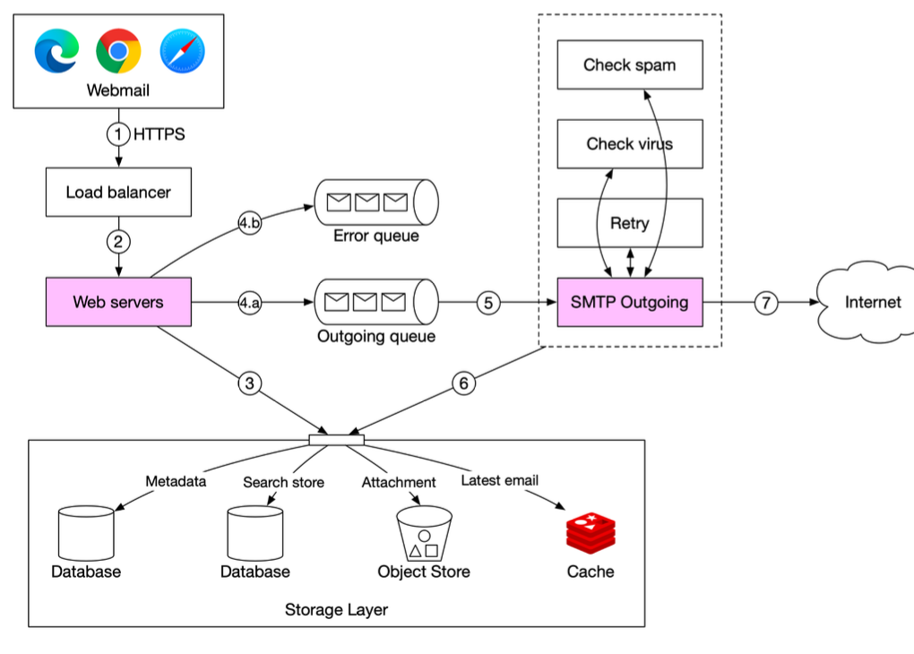
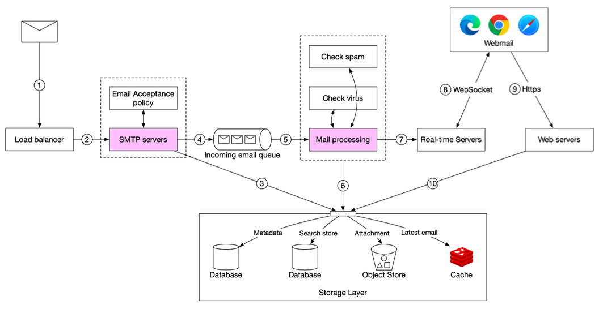
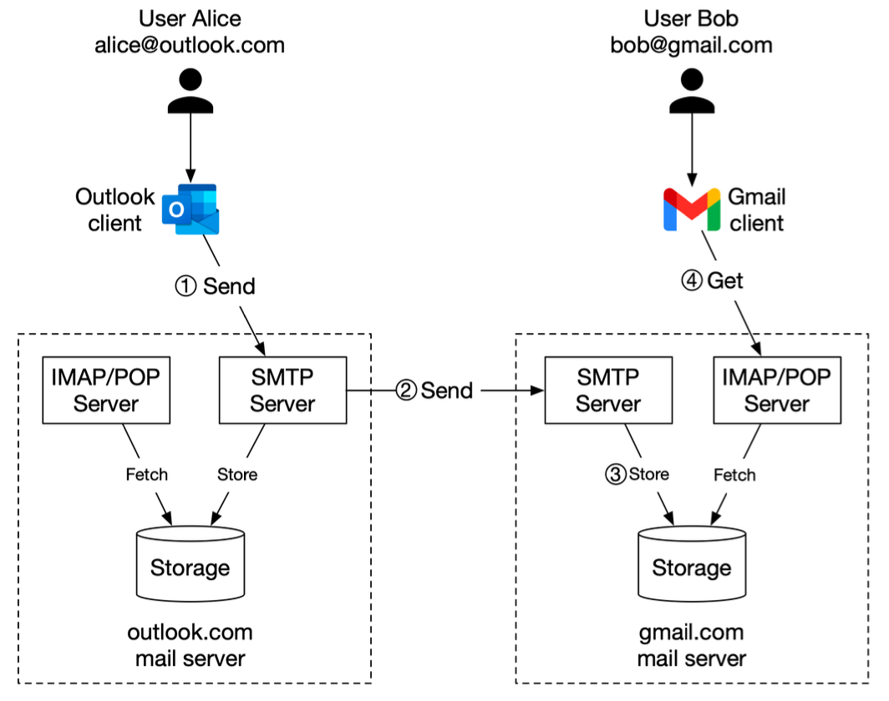

Hey everyone, and welcome back! Email. It's one of the oldest and still one of the most ubiquitous forms of digital communication. We send and receive countless emails every day, often without a second thought. But have you ever paused to consider the intricate journey an email undertakes from the moment you click "Send" to when it lands in someone's inbox, potentially on the other side of the world?

Despite its age, email architecture is a fascinating example of a resilient, distributed system involving multiple protocols, servers, queues, and processing steps. Let's unravel this everyday magic!

## The Basics: Core Email Protocols

Before we trace an email's path, let's quickly touch on the main languages (protocols) emails speak:

* **SMTP (Simple Mail Transfer Protocol):** This is the workhorse for *sending* emails. It's used to transfer electronic mail from an email client to a mail server, and then between mail servers en route to the recipient's mail server.
* **POP3 (Post Office Protocol version 3) & IMAP (Internet Message Access Protocol):** These protocols are used by email clients (like Outlook, Thunderbird, or your phone's mail app) to *retrieve* emails from a mail server.
    * **POP3** typically downloads emails to your device and often deletes them from the server.
    * **IMAP** generally synchronizes your emails with the server, meaning changes on one device are reflected everywhere, and emails are kept on the server.

## The Journey of Sending an Email: From "Compose" to the Recipient's Mail Server

Let's follow an email as it leaves your outbox, based on a typical sending flow.

1.  **Composition & Initial Send (Client to Sender's Mail Server):**
    * You compose your email in a webmail interface (like Gmail or Outlook.com) or a desktop/mobile client.
    * When you hit "send," your client sends the email data. If it's webmail, the request first goes to a load balancer.
    * The load balancer, after checks like rate limiting, routes your request to one of the sender's web servers.

2.  **Sender's Web Server Processing:**
    * The web server performs initial basic email validation, such as checking for size limits.
    * **Intra-Domain Check:** An interesting optimization occurs here. The server checks if the recipient's email domain is the same as the sender's (e.g., `userA@example.com` sending to `userB@example.com`). If it is, the email might not need to go through the full external sending machinery. Instead, the email data can be inserted directly into internal storage, cache, and object stores, making it immediately available for the recipient (`userB`) to fetch via their client (e.g., using RESTful APIs if it's webmail, or IMAP/POP).

3.  **Queuing for Reliability (Message Queues):**
    * If the email is destined for an external domain and passes basic validation, the email data is typically passed to an **outgoing message queue**. If validation fails, it might go to an error queue.
    * Message queues are critical components. They decouple the web servers (which handle your initial "send" click) from the SMTP workers that do the actual sending. This allows for **asynchronous mail processing**, meaning the web server can quickly confirm your email is "sent" (queued) while the heavy lifting happens in the background. Queues also enable independent scaling of SMTP workers and act as a buffer during traffic surges.

4.  **SMTP Outgoing Workers Take Over:**
    * Dedicated SMTP outgoing worker services pull email events (containing all necessary metadata) from this outgoing queue.
    * These workers might perform further checks, such as more intensive spam and virus scanning.
    * A copy of the outgoing email is often stored in the sender's "Sent Items" folder, which resides in a persistent storage layer.

5.  **Reaching the Recipient's Mail Server:**
    * The SMTP outgoing workers perform a DNS lookup (specifically for MX - Mail Exchange - records) to find the IP address of the recipient's mail server.
    * Using SMTP, they then transmit the email to that recipient mail server over the internet.
    * It's important to monitor the size of the outgoing queue. If recipient servers are unavailable, robust systems implement retry strategies (like exponential backoff). If the queue grows too large, it might indicate a need to scale up the number of SMTP consumer workers.

## The Journey of Receiving an Email: From Server to Your Inbox

Now, let's see what happens on the other side when an email arrives at the recipient's mail system.

1.  **Arrival at Recipient's Mail System (Recipient's SMTP Server):**
    * Incoming emails from other mail servers first arrive at an SMTP load balancer for the recipient's domain.

2.  **Initial Handling & Filtering:**
    * The load balancer distributes this incoming SMTP traffic among a fleet of SMTP servers.
    * At this SMTP-connection level, email acceptance policies can be applied. For example, emails from known spam sources or those addressed to invalid recipients might be rejected ("bounced") immediately to avoid unnecessary processing.

3.  **Attachment Handling:**
    * If an email contains very large attachments, these might be offloaded to a dedicated attachment store (like AWS S3) to prevent them from clogging up message queues and mail stores.

4.  **Queuing Incoming Mail:**
    * Accepted emails are then typically placed into an **incoming email queue**. Similar to the sending side, this decouples the mail processing workers from the SMTP servers that receive mail and acts as a buffer for incoming email surges.

5.  **Mail Processing Workers:**
    * These workers pick up emails from the incoming queue.
    * This is where a lot of heavy lifting happens: comprehensive spam filtering, virus scanning, execution of user-defined mail rules (e.g., "move all emails from X to folder Y"), etc..

6.  **Storage:**
    * If an email successfully passes all these checks and processing steps, it's ready to be stored for the recipient.
    * It's typically stored in multiple places: the primary mail storage system, a cache for quick access to recent emails, and potentially an object data store for long-term archival or for storing large email components.

7.  **Delivery to User (Real-time vs. Offline):**
    * **If the recipient is currently online** and has an active client (e.g., webmail open, mobile app running): The email arrival can be pushed to real-time servers. These servers often use technologies like WebSockets to maintain persistent connections with active clients, enabling instant notifications and email appearance.
    * **If the recipient is offline (or for standard fetching via clients):** The email remains in the storage layer. When the user comes online or their email client (desktop or mobile) checks for new mail, it connects to the mail system's web servers (e.g., via RESTful APIs for webmail) or dedicated IMAP/POP servers. These servers then pull the new emails from the storage layer and deliver them to the client.

## A Simplified Inter-Server View (Example: Outlook to Gmail)

To tie it all together at a higher level, consider Alice sending an email from her Outlook client to Bob who uses Gmail:
1.  Alice composes and sends her email. Her Outlook client transmits it to an Outlook mail server using SMTP.
2.  The Outlook mail server performs a DNS query (for MX records) to find the address of Gmail's SMTP server. It then transfers the email to Gmail's SMTP server, again using SMTP.
3.  The Gmail server receives the email, processes it (spam checks, etc.), and stores it, making it available for Bob.
4.  When Bob logs into his Gmail client (web or app), his client fetches new emails from Gmail's servers, typically using IMAP or POP3 protocols.

## Key Takeaways

* Email systems are complex, distributed architectures involving multiple specialized servers, queues, and storage layers for both sending and receiving.
* **SMTP** is the fundamental protocol for sending emails between servers.
* **IMAP/POP3** are primarily used by clients to retrieve emails from servers.
* **Message queues** play a vital role in decoupling components, ensuring reliability, and enabling asynchronous processing.
* Extensive **processing and filtering** (validation, spam/virus checks) occur at various stages on both the sending and receiving ends.
* **Real-time delivery** to active clients is often achieved using technologies like WebSockets.

The humble email, a technology that has been around for decades, continues to be a critical communication tool, supported by a surprisingly sophisticated and robust infrastructure that often goes unnoticed!
