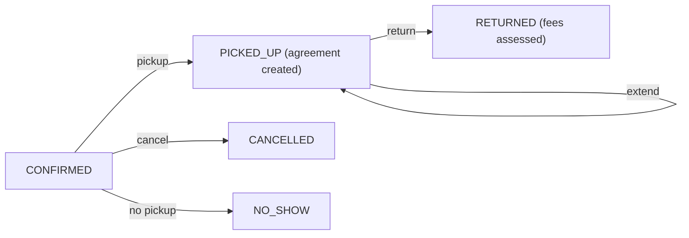

Rent a car: pick a store and dates, see what's available, reserve, pick it up, drop it off, pay. The core is the same interval logic as [hotel booking](/citadel/system-design/hotel-booking) and the [meeting scheduler](/citadel/system-design/meeting-scheduler) — a vehicle is available for `[from, to)` only if no existing reservation overlaps that range. Around it sit a fleet spread across locations, a reservation lifecycle, and a pricing strategy.

## Scope

- Search by store, vehicle type (economy / SUV / luxury), and date range.
- Reserve, pick up, return, extend, cancel.
- Late fees and damage assessment on return.
- Fleet across multiple stores.
- Out of scope: insurance underwriting, telematics, loyalty (mention them).

## Model

```java
enum VehicleType { ECONOMY, COMPACT, SUV, LUXURY, VAN }
enum VehicleStatus { AVAILABLE, RESERVED, RENTED, MAINTENANCE }
enum ReservationStatus { CONFIRMED, PICKED_UP, RETURNED, CANCELLED, NO_SHOW }

class Vehicle {
    final String vin;
    final VehicleType type;
    String store;                 // home store
    VehicleStatus status;
    int odometer;
}

record DateRange(LocalDate from, LocalDate to) {
    boolean overlaps(DateRange o) { return from.isBefore(o.to) && o.from.isBefore(to); }
}

class Reservation {
    final String id;
    final Vehicle vehicle;        // assigned at reservation time
    final Customer customer;
    final String pickupStore, dropStore;
    DateRange range;
    ReservationStatus status;
    Money quote;                  // priced at reservation
    RentalAgreement agreement;    // created at pickup
}
```

Two modelling choices worth stating:

- **Assign a specific vehicle at reservation**, or reserve a *type* and assign at pickup? Assigning a type is more flexible for the operator (any economy car satisfies the booking) and keeps availability as a per-type count, like hotels. Assigning a specific VIN is simpler to reason about and needed if customers pick an exact car. Pick one; type-level is the common answer.
- Availability is **per (store, type, day)**, computed from reservations, not a stored flag — a flag drifts.

## Availability and reservation

```java
class RentalService {
    boolean isAvailable(String store, VehicleType type, DateRange range, int qty) {
        int fleet = fleetCount(store, type);
        int reserved = reservations.stream()
            .filter(r -> r.pickupStore.equals(store) && r.vehicle.type == type)
            .filter(r -> r.status == CONFIRMED || r.status == PICKED_UP)
            .filter(r -> r.range.overlaps(range))
            .mapToInt(x -> 1).sum();
        return fleet - reserved >= qty;
    }

    synchronized Reservation reserve(Customer c, String store, VehicleType type,
                                     DateRange range, PricingStrategy pricing) {
        if (!isAvailable(store, type, range, 1)) throw new NoVehicleException(store, type, range);
        Vehicle v = pickVehicle(store, type, range);          // any free one of the type
        Money quote = pricing.price(type, range, c);
        Reservation r = new Reservation(newId(), v, c, store, store, range, CONFIRMED, quote, null);
        v.status = VehicleStatus.RESERVED;
        reservations.add(r);
        return r;
    }
}
```

`reserve` is `synchronized` (or the availability check + insert is a conditional DB write) so the last car of a type isn't handed to two customers for overlapping ranges — the same race as every booking system.

## Reservation lifecycle



- **Pickup** — verify licence and payment hold, create a `RentalAgreement` (odometer out, fuel level, condition photos), set vehicle `RENTED`.
- **Return** — record odometer in and fuel; compute charges: base quote + late fee (per the pricing strategy) + mileage overage + refuelling + damage. Set vehicle `AVAILABLE` (or `MAINTENANCE` if damaged), reservation `RETURNED`.
- **Extend** — only if no later reservation overlaps the new end date; re-price the added days.

## Pricing as a strategy

```java
interface PricingStrategy {
    Money price(VehicleType type, DateRange range, Customer c);
    Money lateFee(DateRange booked, LocalDate actualReturn, VehicleType type);
}
```

`StandardPricing` (daily rate per type × days), `SeasonalPricing` (rate table by date), `LoyaltyPricing` (discount by tier), plus add-ons (GPS, child seat, insurance) as line items. Late fee is often a higher per-day rate plus a flat penalty.

## One-way rentals and fleet balancing

`dropStore != pickupStore` is allowed with a one-way fee. It also unbalances the fleet — cars accumulate at popular drop-off cities. A background process (or a manual ops task) flags imbalances and schedules transfers; a car `in transit` between stores is unavailable at both.

## Concurrency

- Reservation creation: lock per `(store, type)` or use a conditional insert.
- Pickup/return mutate one vehicle and one reservation — lock per vehicle.
- Availability queries are reads; a short cache is fine since bookings change it infrequently.

## Extensions

- **Corporate accounts** — negotiated rates (a `PricingStrategy`), billing to the company.
- **Waitlist** — queue a request when a type is unavailable, notify on cancellation.
- **Damage workflow** — a `DamageReport` entity, hold on the customer's card, dispute handling.
- **Telematics** — real odometer/fuel/location from the car instead of manual entry at return.

## The one idea to keep

A car is inventory over time, so availability is "no confirmed or picked-up reservation overlaps this date range" — computed from reservations, never a stored flag. Reserve at the type level (any economy car satisfies the booking) with the availability-check-plus-insert guarded so two customers don't get the last one. The reservation runs a `CONFIRMED → PICKED_UP → RETURNED` state machine, an agreement captures the car's condition at pickup, and pricing (including late fees) is a swappable strategy.
