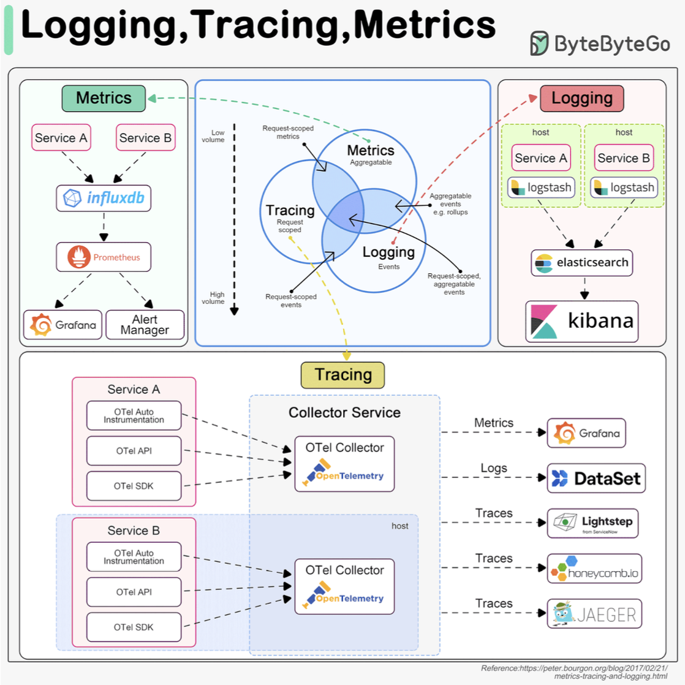
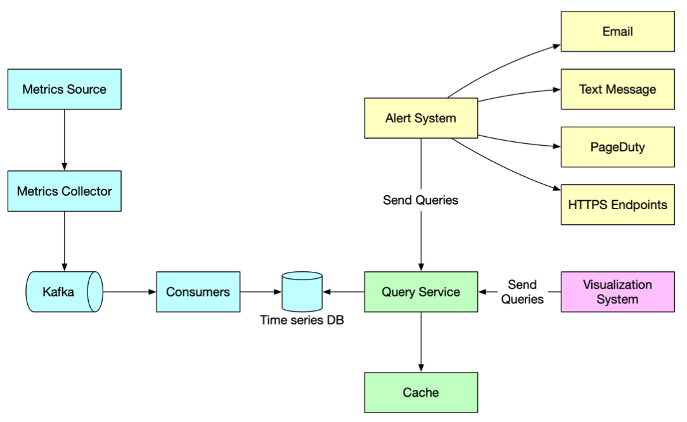

Hey everyone, and welcome back to the blog! Imagine driving a high-performance car without a dashboard – no speedometer, no fuel gauge, no warning lights. Sounds pretty reckless, right? In the world of software, running complex applications without a robust **metrics, monitoring, and alerting system** is just as precarious. These systems are our digital dashboards, giving us the critical visibility needed to keep our applications healthy, performant, and reliable.

Here in Bengaluru, surrounded by a vibrant tech ecosystem, the demand for resilient and high-performing systems is immense. Whether it's a fast-growing startup or a large enterprise, knowing what's happening "under the hood" in real-time isn't a luxury; it's a necessity. A well-designed metrics monitoring and alerting system plays a key role in providing this clear visibility into the health of the infrastructure to ensure high availability and reliability. Let's explore how such systems are typically designed.

## The Foundation: Why Observability Matters

Before diving into the "how," it's important to understand the "why." Modern applications, especially those built on microservices or distributed architectures, are complex. Things can and do go wrong. Observability gives us the ability to ask arbitrary questions about our system's behavior without having to know in advance what we'll need to ask. It's about understanding the internal state of a system by examining its outputs.

## The Three Pillars of Observability: Metrics, Logs, and Traces

A comprehensive observability strategy usually rests on three pillars:

1.  **Metrics:**
    * These are numerical, aggregatable data points representing the health and performance of a system over time. Think of things like Queries Per Second (QPS), API response latency, CPU utilization, error rates, or available memory. They are typically stored in specialized Time-Series Databases (TSDBs).

2.  **Logging:**
    * Logs are detailed, timestamped records of discrete events that have occurred within the system. This could be an incoming user request, an error encountered, a user login attempt, or a database query execution.
    * Logs generally represent the highest volume of observability data.
    * They are often analyzed using tools like the ELK stack (Elasticsearch, Logstash, Kibana). Having a standardized logging format across services is crucial for effective searching and analysis.

3.  **Tracing (Distributed Tracing):**
    * Tracing focuses on tracking a single request or transaction as it propagates through all the different services in a distributed system. For example, a user request might flow through an API gateway, a load balancer, Service A, Service B, and finally a database.
    * Traces help visualize this entire journey, making it easier to identify performance bottlenecks and understand inter-service dependencies.
    * Frameworks like OpenTelemetry aim to unify the collection and management of metrics, logs, and traces.

While all three are important, today we'll focus primarily on the architecture of a robust **metrics monitoring and alerting system**.

## Architecting a Metrics Monitoring and Alerting System: A Deep Dive

Let's break down the typical components and flow of such a system, often depicted in system design diagrams.

### 1. Metrics Sources

This is where our data originates. Metrics can come from a multitude of places:
* Application servers (e.g., request rates, error counts, processing times).
* SQL databases and NoSQL stores (e.g., query latency, connection counts, replication lag).
* Message queues (e.g., queue depth, message throughput).
* Load balancers (e.g., active connections, request distribution).
* Operating systems (e.g., CPU usage, memory, disk I/O, network statistics).
* Custom application-specific business metrics.

### 2. Metrics Collection: Gathering the Signals

Once sources are identified, we need to collect the metrics. There are two primary models for this:

* **Pull Model (e.g., used by Prometheus):**
    * A dedicated **metrics collector** periodically "pulls" or "scrapes" metrics from target services.
    * Services typically expose their metrics on a specific HTTP endpoint (e.g., `/metrics`) in a defined format, often with the help of a client library integrated into the service.
    * **Service Discovery:** In dynamic environments (like Kubernetes or auto-scaled groups), where service instances come and go, the metrics collector needs to know which endpoints to scrape. This is achieved through integration with service discovery mechanisms (e.g., Kubernetes API, Consul, Zookeeper). The service discovery component provides the collector with configuration rules like pulling intervals, IP addresses, and timeout parameters.
* **Push Model:**
    * In this model, services actively "push" their metrics to a central collector or aggregator. This can be simpler for ephemeral jobs or services behind restrictive firewalls.

The metrics collector's job is to gather this raw data.

### 3. Data Transmission & Buffering (The Role of Kafka)

After collection, especially in large-scale systems, raw metrics data is often sent to a distributed messaging platform like **Apache Kafka**.
* **Benefits of using Kafka here:**
    * It acts as a highly reliable and scalable buffer for the potentially massive stream of incoming metrics data. This protects downstream systems from being overwhelmed.
    * It decouples the data collection services (which might be numerous and varied) from the data processing and storage services. This allows each part of the pipeline to scale independently and evolve without directly impacting others.

### 4. Data Processing (Making Sense of the Data)

Raw metrics often need to be processed before they are stored or used for alerting.
* **Consumers** or **streaming processing services** (such as Apache Storm, Apache Flink, or Apache Spark) read the metrics data from Kafka.
* These services can perform various real-time operations:
    * **Aggregation:** Calculating sums, averages, percentiles over time windows.
    * **Transformation:** Converting units, enriching data with metadata.
    * **Filtering:** Removing noisy or irrelevant data.
    * **Anomaly Detection:** Identifying unusual patterns that might indicate problems.

### 5. Data Storage (Time-Series Databases - TSDBs)

The processed (or sometimes raw, if processed later) metrics are then pushed into specialized databases designed for time-series data: **Time-Series Databases (TSDBs)**.

* **Why TSDBs are crucial for metrics:**
    * Metrics are inherently time-series: a sequence of data points indexed in time order.
    * TSDBs are highly optimized for the typical access patterns of metrics data: very high write loads (ingesting constant streams of data) and analytical queries (e.g., "what was the average CPU usage for service X over the last hour, grouped by region?").
    * They significantly outperform general-purpose relational databases (like MySQL) or even some general NoSQL stores (like Cassandra) for this specific task due to specialized storage engines, compression techniques, and query capabilities.
    * TSDBs often provide custom query interfaces tailored for time-series analysis and maintain efficient indexes on labels (or tags) for fast lookups and aggregations. A key performance tip is to ensure that labels/tags have low cardinality (a small set of possible values).
* **Popular TSDB Examples:** InfluxDB and Prometheus (which includes its own efficient TSDB) are among the most popular open-source options, designed to store large volumes of time-series data and perform real-time analysis. Other examples include OpenTSDB (which is Hadoop/HBase based, making it potentially complex to manage ), and cloud offerings like Amazon Timestream. For instance, a benchmark for InfluxDB showed it capable of handling over 250,000 writes per second on relatively modest hardware (8 cores, 32GB RAM).

### 6. Query Service

A **query service** or API layer allows visualization tools and alerting systems to retrieve metrics data from the TSDB. This might be a thin wrapper around the TSDB's native query language or a more standardized API endpoint.

### 7. Visualization System

This is where the metrics data comes to life for humans!
* Engineers and operators use **visualization systems** like Grafana to create dashboards that display metrics in various forms like graphs, charts, and heatmaps.
* These dashboards provide at-a-glance insights into system health, performance trends, and potential issues.

### 8. Alerting System

Monitoring without alerting is like having a smoke detector with no alarm.
* The **alerting system** constantly evaluates incoming metrics against predefined rules or thresholds. These rules are often configured in a system like Prometheus, which then uses its Alertmanager component.
* When a metric breaches a defined condition (e.g., "CPU utilization on web servers > 90% for the last 5 minutes" or "API error rate > 5%"), an alert is triggered.
* These alerts are then dispatched to various destinations to notify the relevant teams or individuals, such as email, SMS, Slack channels, PagerDuty, or other incident management tools, prompting investigation and action.

## Key Takeaways

* A comprehensive metrics, monitoring, and alerting system is vital for maintaining the health, reliability, and performance of modern applications.
* It's a key part of a broader **observability** strategy, which also includes logging and tracing.
* The architecture typically involves collecting metrics from diverse sources, buffering and processing them (often using tools like Kafka and stream processors), storing them in specialized Time-Series Databases, and then enabling visualization and automated alerting.
* Choosing the right tools for each stage (e.g., pull vs. push collection, specific TSDBs) depends on factors like scale, complexity, and specific analytical needs.

Building such a system is an investment, but the ability to quickly detect, diagnose, and resolve issues—often before users are significantly impacted—is invaluable.
