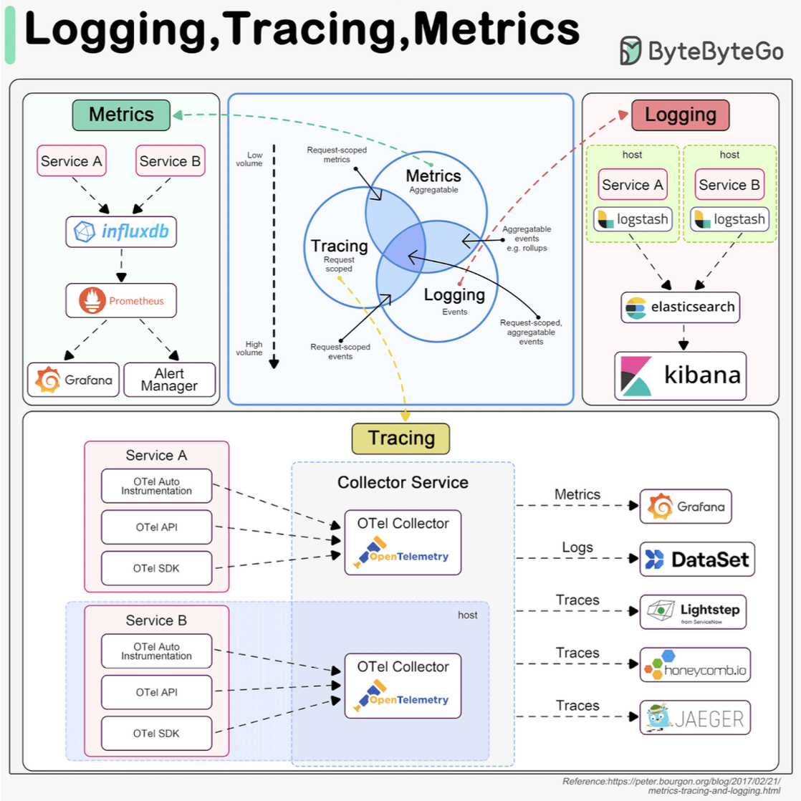
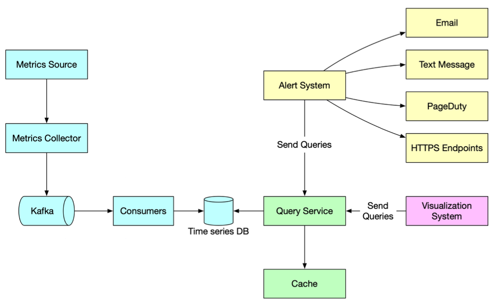

Running a distributed system without metrics is flying blind: you learn about problems from users. A metrics pipeline gives you numerical signals over time — request rate, latency, error rate, CPU — collected, stored, charted, and watched by rules that fire when something crosses a line.

## The three pillars

- **Metrics** — numerical, aggregatable points over time: QPS, API latency, CPU, error rate, free memory. Stored in a time-series database.
- **Logs** — timestamped records of discrete events (a request, an error, a login). The highest-volume signal, usually searched with the ELK stack (Elasticsearch, Logstash, Kibana); a standardized format across services is what makes them useful.
- **Traces** — one request followed through every service it touches (gateway → load balancer → service A → service B → database), exposing bottlenecks and dependencies. OpenTelemetry aims to unify all three.

This post is about the metrics pipeline.

## Sources and collection

Metrics come from application servers, SQL and NoSQL databases (query latency, replication lag), message queues (queue depth), load balancers, operating systems (CPU, disk I/O), and custom business counters.

Two collection models:

- **Pull (Prometheus).** A collector periodically scrapes each service's `/metrics` HTTP endpoint, exposed by a client library. In dynamic environments where instances come and go, the collector learns what to scrape from **service discovery** (the Kubernetes API, Consul, Zookeeper), which supplies the target list plus scrape intervals and timeouts.
- **Push.** Services send metrics to a central collector. Simpler for short-lived jobs and services behind restrictive firewalls.

## Buffer, process, store

**Kafka** sits between collection and storage as a reliable, scalable buffer: it absorbs the metrics firehose so downstream systems aren't overrun, and it decouples the many collectors from the processing and storage tiers so each scales independently. See [data pipelines](/citadel/interview/data-pipelining).

**Stream processors** (Flink, Spark, Storm) read from Kafka and do real-time aggregation (sums, averages, percentiles over time windows), unit transformation and enrichment, filtering of noise, and anomaly detection.

**Time-series databases** store the result. Metrics are time-indexed sequences with a punishing write rate and analytical read patterns ("average CPU for service X over the last hour, by region"). Purpose-built engines — InfluxDB, Prometheus's own TSDB, OpenTSDB (on Hadoop/HBase), Amazon Timestream — beat MySQL or Cassandra here through specialised storage, compression, and label indexes. Keep label cardinality low: a label with millions of possible values wrecks performance. An InfluxDB benchmark handled over 250,000 writes per second on 8 cores and 32 GB of RAM.

## Query, visualize, alert

A **query service** wraps the TSDB so dashboards and alerting can read it. **Grafana** and similar tools build the dashboards — graphs, heatmaps — for at-a-glance health.

The **alerting system** continuously evaluates metrics against rules (in Prometheus, via Alertmanager). When a condition holds — "CPU on web servers above 90% for 5 minutes", "API error rate above 5%" — it fires and routes to email, Slack, PagerDuty, or an incident tool. A monitoring system with no alerting is a smoke detector with no alarm.

## The takeaway

The pipeline is a funnel: many noisy sources, buffered through Kafka, aggregated down to storable series, kept in a database built for the write pattern, and finally reduced to a handful of threshold rules that are the only part a human sees at 3 a.m. The [heartbeat check](/citadel/interview/heartbeat-mechanism) is the smallest version of the same idea.
