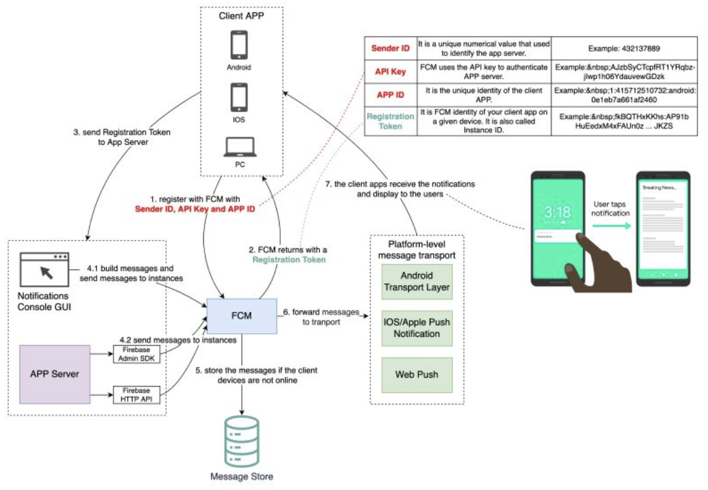

Hey everyone, and welcome back to the blog! Pings, dings, banners, badges – notifications are the ever-present digital taps on our shoulders, keeping us updated, engaged, and sometimes, admittedly, a little overwhelmed. Whether it's a new message on Slack, a friend's update on social media, a news alert, or a reminder from a to-do app, these seemingly simple alerts are a crucial part of modern application design.

Here in a bustling tech hub like Bengaluru, where a myriad of apps compete for our attention, a well-designed notification system can be the difference between a user who stays engaged and one who silences your app forever. But what goes into building a system that can deliver the right message, to the right person, on the right device, at the right time, and at massive scale? Let's explore the intricate design behind these essential communicators.

## What is a Notification System? The Digital Tap on the Shoulder

A **notification system** is a mechanism designed to proactively inform users about events, updates, messages, or other information relevant to them, without requiring them to actively open an application and check for such information. The goal is to deliver timely and pertinent alerts that enhance user experience and engagement.

Notifications come in various forms:

* **Push Notifications:** Alerts sent by a backend server to a user's mobile device (via services like APNS or FCM) or web browser, even when the app isn't actively in use.
* **In-App Notifications:** Messages or alerts displayed within the application itself while the user is using it.
* **Email Notifications:** Updates sent to a user's email address.
* **SMS Alerts:** Text messages sent to a user's phone number.

Today, we'll focus primarily on the architecture and logic behind real-time/push notification systems.

## The Brains Behind the Ping: Deciding *When* to Notify

Before a notification is even sent, a complex decision-making process often takes place. Sending too many or irrelevant notifications leads to "notification fatigue" and users disabling them. the logic for deciding whether to send a notification, like in Slack, can be a great example of why a seemingly simple feature may take much longer to develop than many people think. When we have a great design, users may not notice the complexity because it feels like the feature is just working as intended.

Consider the factors that might go into such a decision flowchart:

* **User's Global Notification Preferences:** Has the user muted all notifications from this app?
* **Specific Channel/Topic Preferences:** Has the user muted this specific chat channel or topic?
* **Do Not Disturb (DND) Settings:** Is the user currently in a DND period? Are there any DND overrides for urgent messages?
* **Type of Event:** Is it a direct message (often higher priority), a group mention (`@channel`, `@everyone`), a specific keyword highlight, or a general update?
* **User's Current Activity/Presence:** Is the user already active in the app on their desktop? If so, a mobile push might be redundant or delayed.
* **Content of the Message:** Does it contain specific keywords the user has asked to be notified about?
* **Subscription Status:** Is the user subscribed to updates for this specific item or thread?

The aim is always to strike a balance: deliver valuable and timely information without being intrusive.

### Main Components & Actors:

* **Client App:** The user's application (mobile or web browser) that will ultimately display the notification.
* **Application Backend/Server:** Your application's server-side logic that identifies an event requiring a notification.
* **Notification Service:** A dedicated (often microservice-based) system responsible for composing, managing, and dispatching notifications.
* **Push Notification Service (PNS):** These are platform-specific services provided by the operating system vendors:
  * **APNS (Apple Push Notification Service):** For delivering notifications to iOS, macOS, and tvOS devices.
  * **FCM (Firebase Cloud Messaging):** Google's solution for delivering notifications to Android, iOS, and web applications.
  * (Others include WNS for Windows, and various SMS Gateways for text message alerts).
* **Database:** Stores essential information like device tokens, user notification preferences, and sometimes a history of sent notifications.
* **Message Queue (e.g., Kafka, RabbitMQ, SQS):** Often used to decouple the application backend from the notification service. It acts as a buffer, allowing the backend to quickly offload notification requests, especially during peak loads.
* **Worker Pool:** A set of services that consume notification requests from the message queue, construct the platform-specific payloads, and send them to the appropriate PNS.

### Typical Workflow (Mobile Push Notification):

1. **Device Registration (One-Time Setup per Install/Device):**

   * The client app on the user's device, upon first launch or when push permissions are granted, registers with the OS's Push Notification Service (APNS or FCM).
   * The PNS authenticates the app and returns a unique **device token** to the client app. This token is the "address" for sending push notifications to that specific app instance on that specific device.
   * The client app then sends this device token to your application backend.
   * Your application backend securely stores this device token, usually associating it with the user ID and their notification preferences in a database.
2. **Event Trigger & Notification Request:**

   * An event occurs within your application backend that warrants sending a notification to a user (e.g., a new direct message arrives, an important update is published, or a background task like video transcoding completes).
   * Your application backend (or a specific microservice) determines the target user(s) and the content of the notification. It then sends a push notification request to your central **Notification Service**. This is often done by publishing a message to a dedicated message queue.
3. **Notification Service Processing:**

   * The Notification Service (often implemented as a set of worker services consuming from the message queue) picks up the notification request.
   * **Message Composition:** It constructs the platform-specific notification payloads. For instance, the payload structure for APNS is different from that for FCM. This stage might involve:
     * Fetching the user's language preferences for localization.
     * Retrieving the specific device token(s) for the target user(s) from the database.
     * Adding custom data, sound alerts, badge counts, or deep links (which direct the user to a specific part of the app when the notification is tapped).
   * **Dispatching to PNS:** The Notification Service sends the composed notification payload and the target device token(s) to the appropriate Push Notification Service (APNS for iOS devices, FCM for Android devices).
4. **Delivery by PNS:**

   * The PNS (APNS or FCM) takes over from here. These are massive, globally distributed systems run by Apple and Google.
   * They are responsible for maintaining persistent connections with devices (when possible) and delivering the notification payload to the user's specific device over the internet. The exact mechanism varies (e.g., APNS uses a persistent IP connection).
5. **User Interaction:**

   * The user's device operating system receives the push notification from the PNS.
   * The OS then displays the notification to the user according to their settings (e.g., as a banner, on the lock screen, in the notification center, with a sound).
   * If the user taps on the notification, the client app is typically opened, and it can then handle any associated deep link or data payload to take the user to the relevant content.

### Real-time In-App Notifications

For users who are currently active *within* your application, you might want even more instantaneous updates or notifications. In such cases, technologies like **WebSockets** can be used to maintain a persistent, bi-directional connection between the client and a real-time server. This allows your backend to push updates or in-app notifications directly to the active client without going through the platform PNS.

## Key Design Considerations for Notification Systems

Building a robust and scalable notification system involves several critical design considerations:

* **Scalability:** The system must be able to handle a potentially massive number of registered devices and send a high volume of notifications, especially during peak times or for broadcast messages. This requires scalable components like the API Gateway, Notification Service, Worker Pools, and Message Queues.
* **Reliability:** While the PNSs (APNS/FCM) provide a good level of delivery effort, they don't always guarantee delivery (e.g., if a device is offline for an extended period). Your system should:
  * Handle feedback from PNSs (e.g., for unregistered or invalid device tokens, so they can be removed from your database).
  * Use message queues with persistence and retry mechanisms for sending requests to the Notification Service and from the Notification Service to the PNS.
* **Latency:** Notifications, especially transactional ones, should be delivered quickly to be relevant and useful. This involves optimizing each step of the pipeline.
* **Security:**
  * Protecting user data and device tokens is paramount.
  * Secure communication (HTTPS/TLS) should be used throughout the system.
  * Prevent notification spam or spoofing. Authenticate requests to send notifications.
* **Personalization & User Preferences:** As discussed, allowing users fine-grained control over what notifications they receive is crucial for a good user experience.
* **Throttling & Batching:** To avoid overwhelming users with too many notifications in a short period, or to manage load on external services (like PNSs or SMS gateways), implement throttling and batching strategies.
* **Analytics & Monitoring:** Track key metrics like notification delivery rates, open rates, error rates, and processing latencies to understand system performance and user engagement.

## Key Takeaways

* Notification systems are vital for modern application engagement, but their design involves complex decision logic for *when* to notify and a robust distributed architecture for *how* to deliver.
* Push notifications typically involve client app registration with platform PNS (APNS/FCM), device token management, a dedicated Notification Service (often using message queues and workers), and interaction with the PNS for final delivery.
* Key considerations include scalability to handle millions of devices, reliability of delivery, low latency, security of user data and tokens, and respecting user preferences to avoid "notification fatigue."
* The seemingly simple "ping" on your phone is the result of a sophisticated, multi-stage, distributed system working seamlessly behind the scenes.

Building a great notification system is as much about smart engineering as it is about understanding user psychology and respecting their attention.
