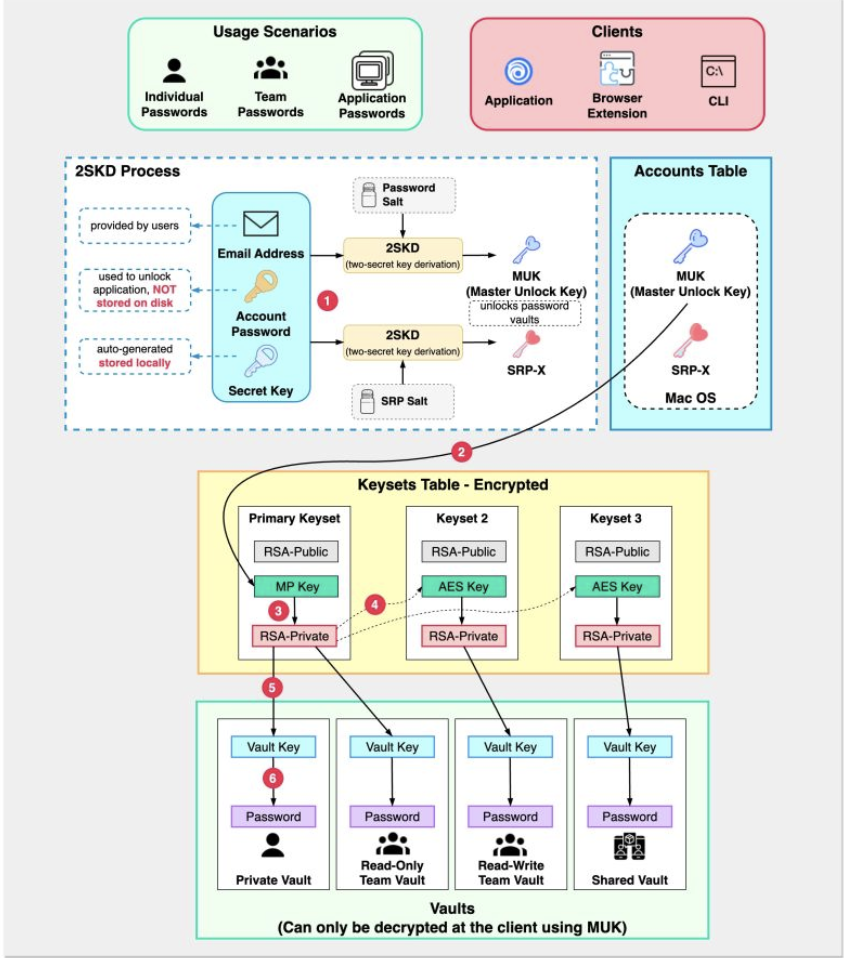

Hey everyone, and welcome back to the blog! In our hyper-digital lives, we're juggling an ever-increasing number of online accounts. Each one demands a password, and the old advice of "use a different, strong password for every site" is solid gold. But let's be honest, who can actually remember dozens of complex, unique passwords? This often leads to the dangerous habits of reusing passwords or picking weak, easy-to-guess ones – a recipe for digital disaster.

This is where **Password Managers** come to the rescue! These tools are designed to securely store all your diverse passwords, allowing you to use strong, unique credentials for every service, all while only needing to remember one crucial "master password." But how do they keep this treasure trove of your most sensitive data safe? Let's explore the underlying architecture and security principles that make password managers work.

## Why Use a Password Manager? The Case for Centralized Security

Before diving into the "how," let's quickly recap the "why":

* **Combats Password Reuse:** The biggest security sin! A password manager makes it easy to have a unique, strong password for every single account.
* **Generates Strong Passwords:** Most come with built-in generators for creating complex, random passwords that are hard to crack.
* **Convenience:** Autofill features in browsers and apps save you from typing long passwords.
* **Secure Storage:** They offer a much more secure place to store credentials than a sticky note or a plain text file.
* **Beyond Passwords:** Many can also store secure notes, credit card details, software licenses, etc.

## Core Architecture: How Password Managers Work (Conceptual Overview)

While specific implementations vary between providers (like 1Password, Bitwarden, LastPass, Dashlane, etc.), most reputable password managers are built around a core set of security principles and components:

### 1. The Vault: Your Encrypted Safe Deposit Box
The **vault** is the heart of a password manager. It's an encrypted database or file that stores all your sensitive information – usernames, passwords, secure notes, credit card details, etc. The key point is that this vault should always be stored in an encrypted state, both locally on your devices and if it's synced to the cloud.

### 2. The Master Password: Your One Key to Rule Them All
This is the **single, strong, unique password that *you* create and remember**. It's the key that unlocks your encrypted vault.
* **Crucial Principle:** The password manager service provider (the company whose software you're using) **should never store your actual master password** on their servers. They should not be able to access it or recover it for you if you forget it (though some offer account recovery options that don't involve them knowing the master password).

### 3. Client-Side Encryption/Decryption: The Zero-Knowledge Ideal
This is a cornerstone of modern password manager security.
* **Encryption on Your Device:** When you add a new password or any data to your vault, it is **encrypted directly on your device** (your computer, phone, or tablet) *before* it is ever sent to the password manager's servers for backup or synchronization. The encryption key used for this process is typically derived from your master password using a strong key derivation function (like PBKDF2 or Argon2).
* **Decryption on Your Device:** Similarly, when you need to access your stored passwords, the encrypted vault is fetched from the server (or local storage), and decryption happens **only on your device** after you successfully enter your master password to re-derive the encryption key.
* **Zero-Knowledge (Ideally):** This client-side encryption model means that the password manager provider theoretically has "zero knowledge" of your actual stored passwords or your master password. They only ever see and store an encrypted blob of data.

### 4. Server-Side Storage (The Encrypted Blob & Account Auth)
* **Encrypted Vault Storage:** The password manager's servers store your encrypted vault. This allows for backup (so you don't lose your data if a device fails) and synchronization across your multiple devices.
* **Account Authentication:** While your *vault* is encrypted with a key derived from your master password, your *account* with the password manager service (to log in, manage billing, sync devices) also needs authentication. For this, the server will store a cryptographically hashed version of your master password (or a value derived from it), but this hash is for *account login*, not for decrypting the vault.

### 5. Synchronization
The encrypted vault data is synced across all your registered devices. When you make a change on one device, the encrypted update is sent to the server and then pushed down to your other devices, where it can be decrypted locally using your master password.

## Security Deep Dive: Protecting Your Digital Keys

Given the sensitivity of the data they hold, password managers employ multiple layers of security.

### Securing the Master Password (for Account Authentication on the Server)
Even though the server doesn't store the master password itself to decrypt the vault, it needs to verify it for you to log into your password manager account. This is where secure password storage techniques, similar to those used by any secure website, come into play:
* **No Plain Text:** Absolutely never stored in plain text.
* **Strong Cryptographic Hashing:** The master password (or a derived key) is hashed using strong, slow hashing algorithms. OWASP recommends algorithms like **Argon2** (their #1 choice), **scrypt**, **bcrypt**, or **PBKDF2**. These are designed to be computationally intensive, making brute-force attacks much slower. Algorithms like MD5 or SHA-1 are **not recommended** for password hashing as they are too fast and susceptible to precomputation attacks.
* **Salting:** A unique, random **salt** is generated for each user and combined with their master password before hashing: `hash(master_password + salt)`. The salt (which is not secret) is stored alongside the hash in the database. Salting ensures that even if two users have the same master password, their stored hashes will be different, rendering rainbow table attacks (precomputed hash lookups) ineffective against the master password hashes.
* **Peppering (Optional but Recommended):** Some systems might also add a server-side secret value, known as a **pepper**, to the password and salt before hashing: `hash(master_password + salt + pepper)`. The pepper must be kept secret and ideally stored separately from the database (e.g., in a secure configuration file or a hardware security module). This adds another layer of defense if the database itself is compromised.

### Protecting the Vault Data (Client-Side Encryption)
* **Key Derivation:** Your master password is put through a **Key Derivation Function (KDF)** like PBKDF2 or Argon2. KDFs are designed to be slow and resource-intensive, making it very difficult to brute-force the master password even if an attacker obtains a copy of your encrypted vault. The output of the KDF is the actual encryption key for your vault.
* **Strong Encryption:** The vault data itself is encrypted using strong, industry-standard symmetric encryption algorithms like **AES-256** (Advanced Encryption Standard with 256-bit keys).

### Two-Factor Authentication (2FA) for Your Password Manager Account
This is a CRITICAL layer of security for your password manager account itself.
* Even if an attacker somehow manages to obtain the hash of your master password and crack it, 2FA can prevent them from logging into your password manager account to access your encrypted vault or manage your account settings.
* Most reputable password managers offer various 2FA options, including authenticator apps (TOTP), hardware security keys (U2F/FIDO2), or biometrics.

### Other Security Measures
* **Rate Limiting:** Implemented on the password manager's login servers to slow down brute-force attempts against master passwords.
* **Secure Communication:** All communication between the client applications and the password manager's servers must be encrypted using HTTPS/TLS.
* **Regular Security Audits:** Reputable password manager providers often undergo independent, third-party security audits of their systems and code to identify and fix potential vulnerabilities.
* **Secure Code Development Practices:** Following secure software development lifecycle (SSDLC) practices.

## Additional Features and Considerations

Modern password managers offer more than just password storage:
* **Password Generation:** Tools to create strong, unique, random passwords.
* **Browser Integration:** Extensions for browsers that automatically fill login credentials.
* **Security Breach Alerts:** Some services monitor known data breaches and can alert you if any of your stored credentials have been compromised.
* **Storage for Secure Notes, Credit Cards, Identities.**
* **Emergency Access / Legacy Contacts:** Features that allow trusted individuals to access your vault in case of an emergency.
* **Open Source vs. Proprietary:** Some password managers (like Bitwarden) are open source, allowing for community review of their code, while others are proprietary.
* **Local-only vs. Cloud-sync:** Some password managers offer options to store the vault only locally, without cloud synchronization, for users with specific privacy or security preferences.

## Key Takeaways

* Password managers are essential tools for maintaining strong, unique passwords across all your online accounts, significantly enhancing your personal cybersecurity.
* The core security relies on a strong **master password** that *you alone* know and **client-side encryption** where your vault data is encrypted and decrypted only on your devices.
* Password manager services should never store your master password in a recoverable format; they store a salted (and possibly peppered) hash for account authentication.
* Enabling **Two-Factor Authentication (2FA)** on your password manager account itself is a critical security measure.
* Look for password managers that use strong encryption (AES-256), robust key derivation functions (Argon2, PBKDF2), and undergo regular security audits.

Choosing a reputable password manager and using it wisely—starting with a strong, unique master password and enabling 2FA—is one of the most impactful steps you can take to protect your digital life.
