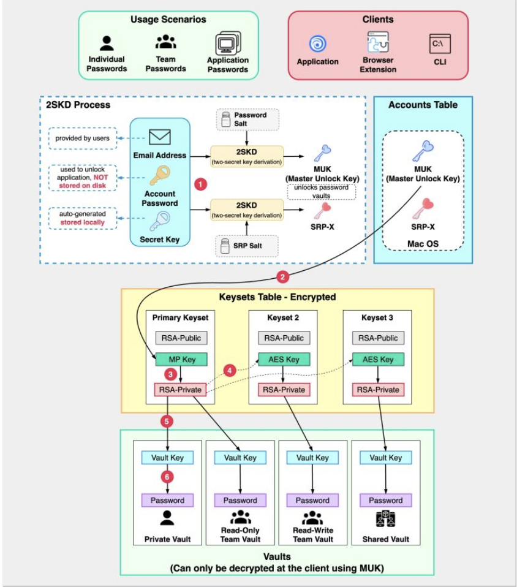

The security advice — a long, unique password for every site — is impossible to follow by memory, so people reuse passwords instead. A password manager makes the advice practical: it generates and stores strong unique credentials, and you remember exactly one master password. The design question is how it holds hundreds of secrets safely, including on its own servers. The answer is that the servers never see the secrets in the clear.

## The pieces

**The vault** is an encrypted database holding your usernames, passwords, secure notes, and card details. It is stored encrypted everywhere — on your devices and in the cloud.

**The master password** is the one secret you create and remember. It unlocks the vault. A reputable provider **never stores it** in a form they could use or recover; forget it and, barring a recovery mechanism that doesn't reveal it, the vault is gone.

**Client-side encryption** is the core idea. When you add an entry, it's encrypted **on your device** before it's ever sent for sync or backup. The encryption key is derived from your master password through a **key derivation function** (PBKDF2 or Argon2). Decryption also happens only on your device, after you re-enter the master password to re-derive the key. The provider therefore has **zero knowledge**: they store an opaque blob and never see your passwords or your master password.

**Server-side storage** keeps that encrypted vault for backup and multi-device sync. Your *account* with the service still needs a login — for that, the server stores a **hash** of the master password (or a value derived from it). This hash is for account login only; it cannot decrypt the vault.

**Sync** moves encrypted deltas: a change on one device goes up as ciphertext and back down to the others, where each decrypts locally.

## Protecting the master password (account login)

The login hash is stored like any careful site would:

- **Never plaintext.**
- **A slow hash** — Argon2 (OWASP's first choice), scrypt, bcrypt, or PBKDF2. These are deliberately expensive, so brute force is slow. MD5 and SHA-1 are unsuitable: too fast, and vulnerable to precomputation.
- **A per-user salt.** A unique random salt is concatenated before hashing — `hash(master_password + salt)` — and stored alongside the hash. It isn't secret; its job is to make two identical passwords hash differently, which kills rainbow-table lookups. See [salting](/citadel/interview/salting).
- **An optional pepper.** A server-side secret added before hashing — `hash(master_password + salt + pepper)` — kept outside the database (a config file or an HSM), so a database dump alone still can't crack the hashes.

## Protecting the vault (the encryption key)

- **A slow KDF.** The master password goes through PBKDF2 or Argon2 to produce the vault key. Because the KDF is slow, an attacker who steals your encrypted vault still can't cheaply guess the master password against it.
- **Strong symmetric encryption.** The vault itself is encrypted with AES-256.

## The other layers

- **2FA on the password-manager account** — the critical extra lock. Even if someone cracks the login hash, [a second factor](/citadel/system-design/2fa) (TOTP, a FIDO2 key, biometrics) stops them signing in.
- **Rate limiting** on login, **HTTPS/TLS** for all client-server traffic, independent third-party audits, and a secure development lifecycle.
- **Extras** — password generation, browser autofill, breach-alert monitoring, storage for notes and cards, emergency/legacy access. Some managers are open source (Bitwarden) for public code review; some offer local-only vaults with no cloud sync.

## The takeaway

The whole model rests on one move: derive the encryption key from the master password *on the client*, so the server only ever handles ciphertext. That's what "zero knowledge" means here, and it's why the strength of your master password and having 2FA on the account matter more than which vendor you pick. For the broader picture of guarding secrets like these, see [protecting sensitive data](/citadel/system-design/sensitive-data).
