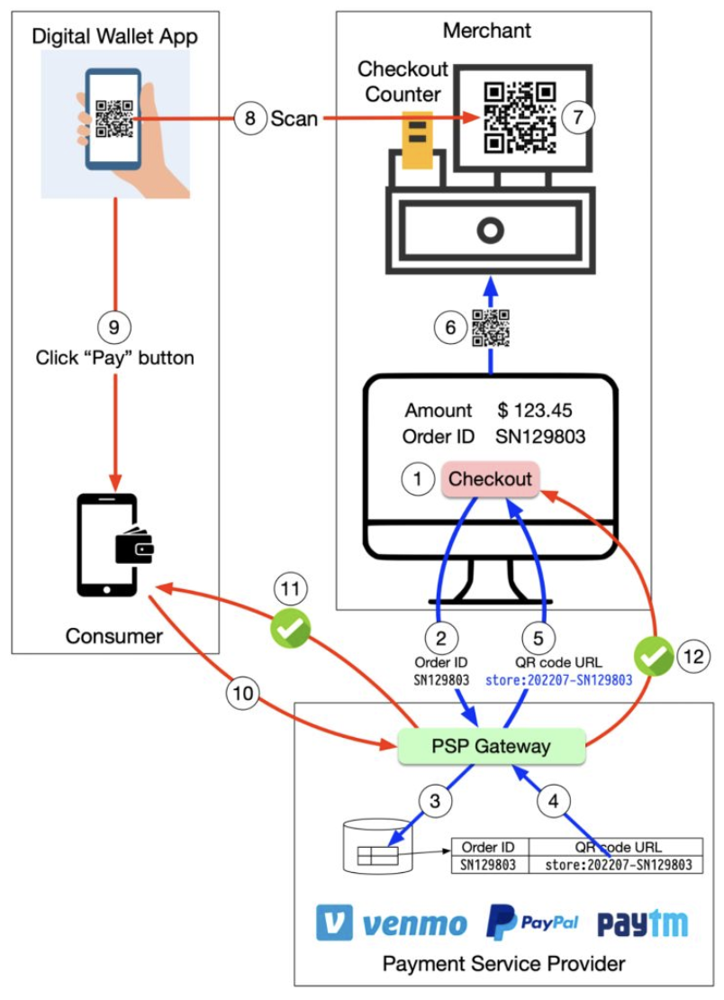

Hey everyone, and welcome back to the blog! If you're anything like me, living in a digitally-savvy world, you've probably noticed a seismic shift in how we make everyday payments. Gone are the days of always fumbling for cash or even swiping a card for every little transaction. Now, a quick scan of a QR code with our smartphone often does the trick, whether we're buying chai from a street vendor, paying for groceries, or settling a bill at a restaurant.

This **Scan-to-Pay** method, powered by QR (Quick Response) codes, has exploded in popularity, particularly across Asia, and is steadily gaining traction in the US and Europe. It's fast, convenient, and often very low-cost for merchants. But what exactly happens in those few seconds between scanning a code and getting that "Payment Successful!" notification? Let's demystify the journey of a scan-to-pay transaction.

## What is Scan-to-Pay? The QR Code Revolution in Payments

**Scan-to-Pay** is a digital payment method where customers use their smartphones to scan a QR code to initiate and complete a transaction. Conversely, in some systems, the merchant might scan a QR code generated on the customer's phone. It's a form of contactless payment that leverages the ubiquity of smartphones and the simplicity of QR codes to create a seamless payment experience.

Its rapid adoption is driven by several factors:
* **Convenience:** No need to carry physical cards or exact cash.
* **Speed:** Transactions are often completed in seconds.
* **Low Cost for Merchants:** QR code-based payments, especially those leveraging systems like India's UPI, can have significantly lower transaction fees for merchants compared to traditional card payments.
* **Contactless:** Hygienic and preferred in many post-pandemic scenarios.

## The Cast of Characters: Key Players in a Scan-to-Pay Transaction

A typical scan-to-pay transaction involves several key players working in concert:

* **Customer:** The individual initiating the payment using their smartphone and a compatible payment application (e.g., a UPI-enabled app, a digital wallet app).
* **Merchant:** The business or individual receiving the payment. They either display a QR code or have a device to scan a customer's QR code.
* **Payment Service Provider (PSP):** An entity that facilitates the transaction between the customer and the merchant. Examples include well-known digital wallets like PayPal or Venmo, and in India, platforms like Paytm, PhonePe, Google Pay, which are all deeply integrated with the UPI network.
* **Customer's Bank / Funding Source:** The bank account, linked credit/debit card, or digital wallet balance from which the customer's funds are debited.
* **Merchant's Bank:** The bank account where the merchant receives the credited funds.

## Decoding the Scan: Two Main Types of QR Code Payments

There are primarily two ways QR codes are used in scan-to-pay systems:

### 1. Merchant-Presented QR Code (MPM): You Scan, They Receive
This is perhaps the most common type you see, especially with smaller businesses.
* **How it Works:**
    1.  The **merchant displays a QR code**. This code can be:
        * **Static QR Code:** A printed QR code that usually just contains the merchant's identifier (e.g., their UPI VPA - Virtual Payment Address, or merchant ID). When a customer scans this, they typically need to **enter the payment amount** in their payment app.
        * **Dynamic QR Code:** Generated by the merchant's POS system or app for each specific transaction. This code usually embeds both the merchant's identifier and the **exact transaction amount**. When the customer scans it, the amount is often pre-filled.
    2.  The **customer uses their payment app** on their smartphone to scan the merchant's QR code.
    3.  The customer's app, now knowing who to pay (and how much, if dynamic), communicates with their Payment Service Provider (PSP) to authorize and initiate the payment. This is often a "push" payment, where the customer actively sends funds.
    4.  The PSP processes the transaction, which usually involves interacting with the customer's bank (to debit) and the merchant's bank (to credit), often through underlying payment networks like UPI in India.
    5.  Real-time confirmation is then sent to both the merchant (e.g., a sound alert on their device, an update on their POS) and the customer's app.
* **Prevalence:** Very popular due to its low setup cost for merchants. A simple printed static QR code is often all that's needed for small vendors. Dynamic QR codes are common in more integrated retail environments.

### 2. Customer-Presented QR Code (CPM): They Scan, You Pay
In this model, the roles are reversed for QR code generation and scanning.
* **How it Works:**
    1.  The **customer generates a unique QR code** on their payment app screen. This QR code often represents a one-time payment token or their authenticated payment identity.
    2.  The **merchant uses a scanner** (which could be a handheld device or integrated into their Point of Sale - POS - system) to scan the QR code displayed on the customer's phone.
    3.  The merchant's POS system then uses the information from the scanned QR code to initiate the payment request through *their* PSP. This might pull a pre-authorized amount (if the QR contains transaction details) or prompt the customer for final approval on their device.
    4.  The PSP processes the transaction, interacting with the relevant banks and payment networks.
    5.  Confirmation is sent to both the merchant's POS and the customer's app.
* **Prevalence:** Often seen in larger retail environments, supermarkets, transit systems, or automated vending machines where the merchant side has more sophisticated POS scanning equipment.

## The General Flow: From Scan to Success (Simplified)

Regardless of whether it's MPM or CPM, the underlying flow shares common steps:

1.  **Scan & Initiate:** Either the customer scans the merchant's QR code, or the merchant scans the customer's QR code. This action typically launches the relevant payment app or process.
2.  **App to PSP Communication:** The initiating payment app (customer's app in MPM, or merchant's POS system in CPM) sends the transaction details (amount, payee/payer information derived from the QR code) to its respective Payment Service Provider (PSP).
3.  **Authorization & Debit:** The PSP network facilitates communication with the customer's bank or digital wallet to obtain authorization for the payment and to debit the funds from the customer's account.
4.  **Credit to Merchant:** The PSP network then facilitates the crediting of funds to the merchant's bank account.
5.  **Confirmations:** Real-time success or failure confirmations are sent back to both the customer's app and the merchant's system.

It's important to remember that while the transaction appears instantaneous to the user and merchant, the actual final movement of funds between different banks (the **settlement**) often happens later through **clearing and settlement** processes, typically in batched operations. The scan-to-pay interaction primarily deals with the authorization and information flow to make the payment *seem* instant.

## The UPI Magic in India: A Scan-to-Pay Superpower 🇮🇳

Here in India, **UPI (Unified Payments Interface)** has made scan-to-pay an integral part of daily life. From the smallest street-side tea stall to large retail chains, UPI QR codes are ubiquitous.
* **Push Payments:** UPI largely operates on a "push" payment model, where the customer initiates the payment from their bank account via a UPI-enabled app after scanning a QR code.
* **Interoperability:** A key strength of UPI is its interoperability. A customer using any UPI app (like Google Pay, PhonePe, Paytm, or their bank's app) can scan a QR code presented by a merchant using any other UPI-compliant app or service.
* **Static & Dynamic QRs:** Both merchant-presented static QR codes (containing a VPA) and dynamic QR codes (for specific amounts) are widely used. Customers can even generate their own QR codes in some apps for P2P payments.

The simplicity, speed, and low cost of UPI-based scan-to-pay have driven its phenomenal adoption across the country.

## "Everything Around It": Security, Convenience, and the Future

* **Security:** Scan-to-pay systems employ several security measures. QR codes themselves often don't contain raw sensitive account details but rather tokenized information or identifiers. The actual payment processing happens through secure channels established by payment apps and PSPs, using encryption and authentication (like UPI PINs).
* **Convenience:** The benefits are clear: it's contactless, generally very fast, and removes the need to carry multiple physical cards or exact cash.
* **Low Cost:** For merchants, especially in UPI-driven ecosystems, the transaction fees associated with QR code payments can be significantly lower than traditional card processing fees.
* **Future Trends:** We can expect to see even greater global adoption, deeper integration with loyalty programs and value-added services, further enhancements in security features, and perhaps more innovative uses of QR codes in areas like unattended retail or transit.

## Key Takeaways

* **Scan-to-Pay** leverages QR codes to enable fast, convenient, and often low-cost digital payments using smartphones.
* The two main models are **Merchant-Presented QR Codes (MPM)**, where the customer scans the merchant's code, and **Customer-Presented QR Codes (CPM)**, where the merchant scans the customer's code.
* Key players include the customer, merchant, Payment Service Providers (PSPs), and the respective banks, all interacting through payment networks (like UPI in India).
* While the user experience is near real-time, the underlying fund settlement between banks often occurs through batched clearing processes.
* The success of systems like UPI in India demonstrates the immense potential and user acceptance of scan-to-pay methods.

The humble QR code has truly revolutionized how we think about and make payments, making digital transactions more accessible and efficient than ever before.
