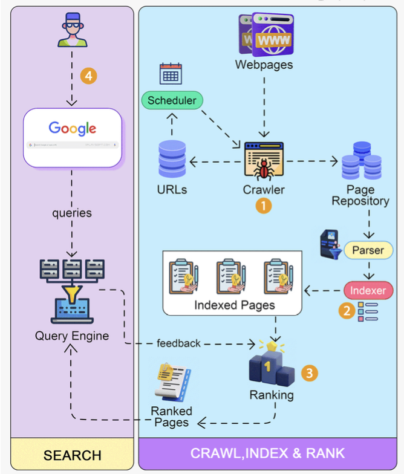

Hey everyone, and welcome back to the blog! In our daily lives, search engines like Google, Bing, or DuckDuckGo are indispensable tools. They are our primary gateways to the vast ocean of information on the World Wide Web. We type a few words into a simple search box, hit Enter, and milliseconds later, we get a remarkably relevant list of results.

But have you ever paused to consider the sheer scale and complexity of the machinery working tirelessly behind that seemingly simple interface? How does a search engine discover billions of web pages, understand their content, and then almost instantly find the most relevant ones for your specific query? Today, let's embark on a journey to explore the high-level architecture and key components that power a modern web search engine.

## The Mission: Finding Needles in a Cosmic Haystack
The core goal of a web search engine is deceptively simple: to index the content of the internet and provide users with a ranked list of web pages that are most relevant to their search queries, as quickly as possible.
However, the "internet" consists of billions, if not trillions, of documents, constantly changing, appearing, and disappearing. This makes the task a monumental feat of engineering, involving:
* **Discovering** and fetching web content.
* **Storing** and processing this massive amount of data.
* **Understanding** the content and the user's query.
* **Ranking** results by relevance and quality.
* Doing all of this at incredible **speed and scale**.

## Core Components of a Search Engine Architecture

While specific implementations vary, a typical web search engine architecture involves several key components:

### 1. The Web Crawler (Spider or Bot): Exploring the Web ️
The journey begins with discovering what's out there.
* **Purpose:** The web crawler (also known as a spider or bot) is responsible for systematically Browse the World Wide Web to discover and download web pages.
* **How it Works:**
    1.  **Seed URLs:** The process usually starts with an initial list of "seed URLs" – known, reputable websites.
    2.  **Fetching:** The crawler fetches the content of these pages.
    3.  **Link Extraction:** It then parses these pages to extract all the hyperlinks pointing to other pages.
    4.  **Crawl Frontier:** Newly discovered URLs are added to a "crawl frontier," which is essentially a prioritized queue of URLs that the crawler needs to visit next.
    5.  **Politeness Policies:** Crawlers must be "good citizens" of the web. They follow **politeness policies** to avoid overwhelming web servers. This includes:
        * Respecting the `robots.txt` file on websites (which provides instructions to web crawlers about which parts of the site should not be accessed).
        * Implementing crawl delays between requests to the same server.
    6.  **URL Deduplication:** A critical challenge at this stage is avoiding re-crawling the same content. The web is full of duplicate URLs (e.g., `http` vs. `https`, `www.` vs. non-`www.`, URLs with session IDs or tracking parameters that point to the same content). To handle this at Google scale, crawlers employ:
        * **URL Canonicalization:** Normalizing URLs into a standard, canonical form before processing.
        * **Probabilistic Data Structures:** Using space-efficient structures like **Bloom Filters** to quickly check if a canonicalized URL has likely been seen and processed before. If a Bloom filter says a URL is "definitely not seen," it's added to the frontier. If it says "probably seen," further checks or skipping might occur.
* **Output:** The crawler outputs a stream of downloaded web pages (HTML, PDFs, images, etc.) that are then passed to the Indexer.

### 2. The Indexer: Organizing the Information Once pages are crawled, their content needs to be processed and organized for fast searching. This is the job of the Indexer.
* **Purpose:** To parse the content of crawled web pages and build a data structure (the index) that allows for efficient searching based on keywords.
* **Key Steps in the Indexing Pipeline:**
    1.  **Document Parsing:** The Indexer takes the raw HTML (or other document formats) and extracts the actual textual content, important metadata (like titles, headings, meta tags), links, and information about the document's structure.
    2.  **Tokenization:** The extracted text is broken down into individual words or "tokens."
    3.  **Stop Word Removal:** Common, low-information words like "the," "is," "a," "an," "of" are often removed as they don't usually contribute much to search relevance and would bloat the index.
    4.  **Stemming/Lemmatization:** Words are reduced to their root or base form. For example, "running," "runs," and "ran" might all be reduced to the stem "run." This helps match queries with documents even if they use different forms of the same word.
    5.  **Building the Inverted Index:** This is the absolute heart of a search engine's index.
        * An **Inverted Index** is a data structure that maps each unique term (word/token) found across all documents to a list of documents in which that term appears.
        * This list (often called a "postings list") might also store additional information, such as the frequency of the term in each document, the positions of the term within the document (for phrase searches), and other metadata.
        * Technologies like Apache Lucene (which powers popular search platforms like Elasticsearch and Solr) are renowned for their efficient implementation of inverted indexes.
* **Storage:**
    * **Document Database/Repository:** Stores the actual content of the crawled and processed web pages, allowing the search engine to retrieve snippets or full pages for display.
    * **Index Database/Files:** Stores the massive inverted index and any other supporting index structures (e.g., forward index, link graphs).

### 3. The Query Engine (Searcher): Answering User Queries This is the component that interacts directly with the user.
* **Purpose:** To take a user's search query, find the most relevant documents from the index, rank them appropriately, and return a set of results to the user.
* **How it Works:**
    1.  **User Input & Query Parsing:** The user types their query into the search box. The search engine's web server receives this query.
    2.  The query is parsed to understand the user's intent. This involves identifying keywords, applying spelling corrections, handling operators (like AND, OR, NOT, quotes for exact phrases), and potentially expanding the query with synonyms or related terms.
    3.  **Querying the Inverted Index:** The processed query terms are used to look up the inverted index. This step rapidly retrieves a list of documents that contain one or more of the query terms.
    4.  **Ranking Documents (The Secret Sauce!):** Simply finding documents that contain the query terms is easy; the real challenge is **ranking** them by relevance and quality. This is where search engines differentiate themselves. Ranking algorithms are complex and constantly evolving, but they typically consider a multitude of factors:
        * **Term Statistics:**
            * **Term Frequency (TF):** How often do the query terms appear in a document?
            * **Inverse Document Frequency (IDF):** How rare or common are the query terms across the entire document collection? (TF-IDF is a common score combining these).
        * **Link Analysis (e.g., PageRank):** Algorithms like Google's original PageRank analyze the link structure of the web. Pages that are linked to by many other important pages are considered more authoritative.
        * **Content Quality & Freshness:** Is the content well-written, comprehensive, and up-to-date?
        * **User Context:** Location, search history, language preferences, and device type can influence results.
        * **Page Load Speed & Mobile-Friendliness.**
        * **And hundreds of other signals!** Modern search engines heavily use **Machine Learning** models to train and refine their ranking algorithms.
    5.  **Generating Results & Snippets:** The Query Engine takes the top-ranked documents, generates descriptive snippets for each (often by extracting relevant portions of the document text around the query terms), and formats the results page (Search Engine Results Page - SERP) to be sent back to the user's browser.

## "Everything Around It": Supporting Systems & Considerations

Building a production-grade search engine involves much more than just these three core components:
* **Massive Scalability & Distribution:** All components—crawlers, indexers, query engines, and data stores—must be designed to operate at an immense scale, distributed across thousands of servers in multiple data centers.
* **Fault Tolerance & Reliability:** The system must be resilient to hardware failures and other issues.
* **Data Freshness:** The web is constantly changing. Search engines need sophisticated mechanisms to re-crawl and re-index pages to keep their information as up-to-date as possible.
* **Anti-Spam & Anti-Abuse:** Constant efforts are needed to detect and penalize web spam, link farms, cloaking, and other "black hat" SEO techniques used to manipulate search rankings.
* **Personalization:** Tailoring search results and experiences based on individual user history, preferences, and context.
* **Specialized Searches:** Search engines often have specialized systems for image search, video search, news search, academic paper search, product search, etc., each with its own unique indexing and ranking challenges.
* **User Interface (UI):** The seemingly simple search box and results page are highly optimized UI/UX components designed for speed and usability.
* **Analytics & Experimentation:** Continuous A/B testing and analysis of user behavior are used to refine algorithms and improve result quality.

## Key Takeaways

* Modern web search engines are among the most complex distributed systems ever built, tackling the challenge of organizing and providing access to the world's information.
* The core architecture typically involves a **Web Crawler** to discover and fetch content, an **Indexer** to process pages and build an efficient **Inverted Index**, and a **Query Engine** to match user queries against the index and rank results.
* **URL canonicalization** and **Bloom Filters** are crucial for efficient crawling by avoiding duplicate content.
* **Ranking algorithms** (using signals like TF-IDF, PageRank, and increasingly, machine learning) are the secret sauce that determines the relevance and order of search results.
* Scalability, fault tolerance, data freshness, and spam detection are continuous, critical challenges.

The next time you type a query into that familiar search box, take a moment to appreciate the incredible engineering symphony playing out behind the scenes to bring you those results in a fraction of a second!
