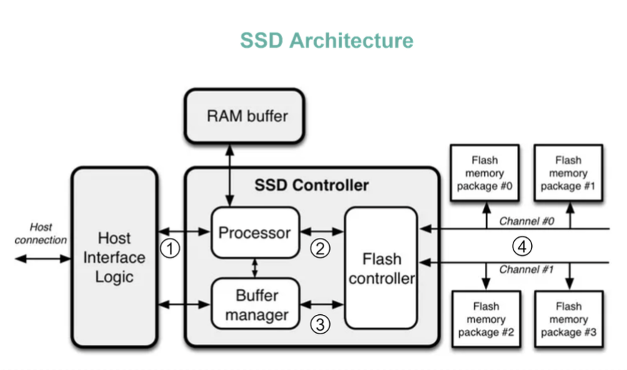

Hey tech explorers and speed enthusiasts! Remember the days of waiting patiently (or impatiently!) for your computer to boot up or for a large file to load from a clunky, noisy hard drive? Then came the Solid-State Drive (SSD), and suddenly, everything felt incredibly zippy! SSDs have revolutionized storage performance, but what exactly makes them so much faster than their traditional Hard Disk Drive (HDD) counterparts?

It's not magic, but rather clever engineering and a fundamental shift in how data is stored and accessed. Let's pop the hood on SSDs and discover the secrets to their impressive speed.

## What is an SSD (Solid-State Drive)? Beyond Spinning Platters

At its core, an SSD is a **flash-memory based data storage device**. Think of it like a very large, very fast USB drive.

* **How data is stored:** Bits of data are stored in special memory cells, which are made of floating-gate transistors.
* **The Key Characteristic:** Unlike HDDs that rely on spinning magnetic platters and moving read/write heads, **SSDs are made entirely of electronic components; there are no moving or mechanical parts**. This is a game-changer.
* **Speed Advantage:** This solid-state nature translates directly into speed. An SSD reads up to **10 times faster** and writes up to **20 times faster** than a traditional hard disk drive. For tasks like reading data for your operating system or applications, this means a latency of around 100 microseconds for SSDs, compared to much longer for HDDs.

## Under the Hood: The Architecture of an SSD

While the user sees a simple storage drive, an SSD is a sophisticated piece of hardware with several key components working in concert, as illustrated in diagram:

1. **Host Connection Interface (e.g., SATA or PCIe):** This is how the SSD communicates with the rest of the computer. Commands from your computer's operating system come through this host interface.
2. **SSD Controller (The "Brain"):** This is arguably the most critical part of an SSD. It's a powerful embedded processor responsible for managing the drive's operations. It typically includes:
   * **Processor:** This takes the commands received from the host interface (e.g., "read this block," "write this data") and passes them on to the flash controller.
   * **RAM Buffer (Cache):** SSDs have embedded RAM, which is used for various purposes, including caching frequently accessed data and, crucially, storing mapping information (which we'll discuss soon).
   * **Buffer Manager:** Manages the RAM buffer.
   * **Flash Controller:** Directly manages the NAND flash memory chips.
3. **Flash Memory Packages:** These are the chips where your data is actually stored. They are typically organized in "gangs" and accessed over multiple parallel channels to increase bandwidth.

## The Magic of Speed: How SSDs Achieve High Performance

So, how do these components enable such a leap in performance over HDDs?

### 1. Parallelism is Key

One of the most significant advantages of SSDs is their ability to perform operations in parallel.

* The **SSD controller operates multiple FLASH particles (NAND flash memory chips) in parallel**, which greatly improves the underlying data transfer bandwidth.
* When your operating system needs to write multiple pages of data, the SSD controller can distribute these writes across several flash chips simultaneously and write them in parallel. This is in stark contrast to an HDD, which typically has a single read/write head (or very few) that can only access one track on one platter at a time.

### 2. Flexible Logical-to-Physical Mapping (Flash Translation Layer - FTL)

Your operating system thinks of storage in terms of a contiguous sequence of Logical Block Addresses (LBAs). However, the physical storage on NAND flash chips is organized into pages and blocks with complex characteristics (e.g., blocks must be erased before they can be rewritten).

* The SSD controller employs a sophisticated system, often called the **Flash Translation Layer (FTL)**, to manage the mapping between the logical addresses seen by the OS and the physical locations on the flash chips.
* When the host OS issues a command to write data to a specific HOST Page (logical address), the SSD controller finds an available Physical Page on one of its flash chips to write the data to. This mapping (logical address -> physical address) is then recorded, often in the RAM buffer.
* The next time the host OS wants to read that HOST Page, the SSD controller uses this stored mapping to instantly know which physical page on which flash chip contains the required data and retrieves it. This dynamic mapping also helps with wear leveling (distributing writes evenly to prolong the life of the flash cells) and garbage collection.

### 3. No Moving Parts = No Seek Time or Rotational Latency

This is perhaps the most intuitive reason for SSD speed. HDDs have:

* **Seek Time:** The time it takes for the read/write head to move to the correct track on the spinning platter.
* **Rotational Latency:** The time it takes for the desired sector on the track to rotate under the read/write head.

These mechanical delays are significant contributors to HDD latency. **SSDs, having no moving parts, eliminate both seek time and rotational latency entirely.** Data access is electronic, making it almost instantaneous compared to the physical movements required in an HDD.

## SSD vs. HDD: A Quick Summary of Differences

| Feature                     | SSD (Solid-State Drive)                    | HDD (Hard Disk Drive)                        |
| :-------------------------- | :----------------------------------------- | :------------------------------------------- |
| **Speed**             | Much faster (10-20x or more for some ops)  | Slower                                       |
| **Mechanics**         | Electronic (flash memory)                  | Mechanical (spinning platters, moving heads) |
| **Durability**        | Generally more resistant to physical shock | More susceptible to physical shock           |
| **Noise**             | Silent                                     | Audible (spinning, head movement)            |
| **Cost per GB**       | Historically higher, now more affordable   | Lower                                        |
| **Power Consumption** | Generally lower                            | Generally higher                             |
| **Boot Time**         | Significantly faster                       | Slower                                       |
| **Fragmentation**     | Less of an issue due to FTL                | Can impact performance significantly         |

## Key Takeaways

* SSDs deliver a massive performance boost over traditional HDDs primarily because they are **electronic devices with no moving parts**, eliminating mechanical latencies.
* Their architecture, featuring a sophisticated **SSD controller** and **parallel access to multiple flash memory chips**, allows for high bandwidth and fast data operations.
* The **Flash Translation Layer (FTL)** plays a crucial role by managing the complex mapping between logical addresses (seen by the OS) and physical flash memory locations, enabling efficient writes and reads.

The shift from HDDs to SSDs has been one ofthe most impactful hardware upgrades for everyday computing performance, making our systems feel snappier and more responsive. If you're interested in diving even deeper into the intricacies, a resource like "Coding for SSDs" by Emmanuel Goossaert is highly recommended.
