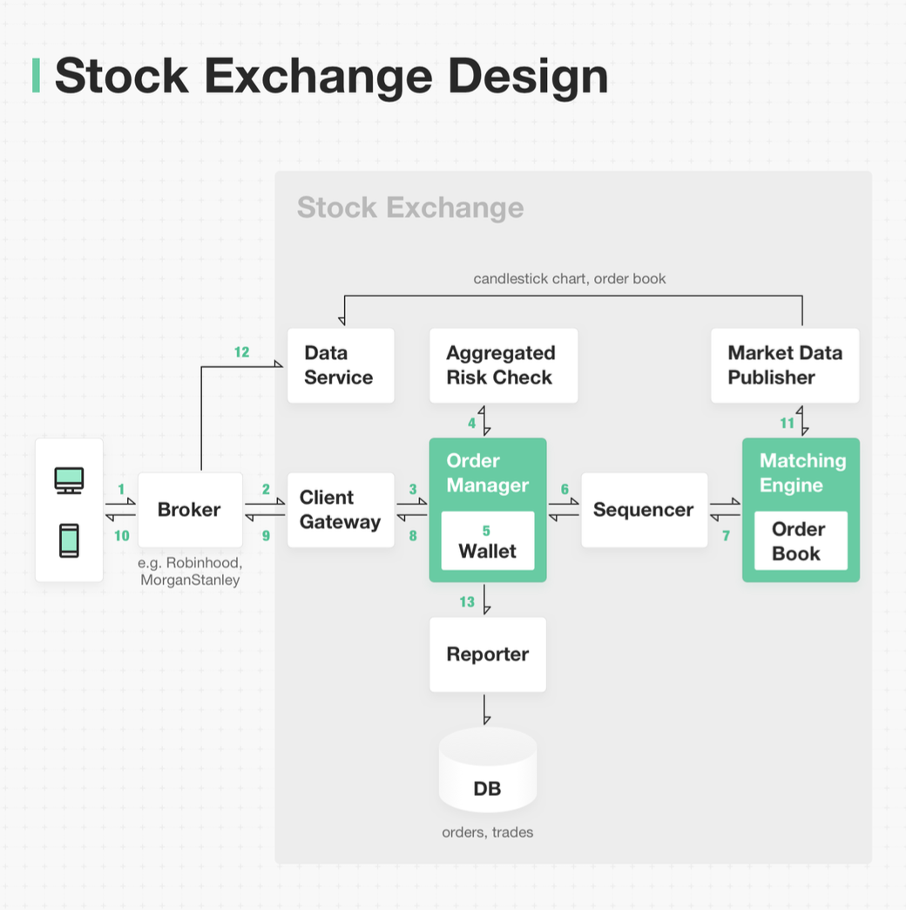

Hey everyone, and welcome back to the blog! Here in Bengaluru, a city buzzing with tech and finance, the stock market is a frequent topic of conversation. We see those ticker symbols flashing, prices changing in an instant, and fortunes potentially made or lost in moments. The sheer speed and volume of transactions on a modern stock exchange like the NSE or BSE, or global giants like the NYSE, can seem like organized chaos. But beneath that flurry of activity lies an incredibly precise, high-performance, and resilient system design.

Today, let's take a peek behind the scenes of a modern electronic stock exchange. It's a world where microseconds matter, and the design principles are pushed to their absolute limits. While most web applications are okay with hundreds of milliseconds of latency, a stock exchange requires microsecond-level latency!

## The Big Picture: Core Functions of a Stock Exchange

Before diving into components, what does a stock exchange fundamentally do?
* **Order Ingestion & Validation:** Securely receive buy and sell orders from brokers.
* **Matching Orders:** The core function – pairing buy orders with sell orders based on price and time priority.
* **Trade Execution & Confirmation:** Finalizing matched trades and reporting them back.
* **Market Data Dissemination:** Providing real-time price quotes, order book depth, and trade information to the market.
* **Clearing and Settlement:** While our focus here is on the trading part, the exchange also facilitates the post-trade processes of clearing (who owes what to whom) and settlement (actual transfer of securities and funds), though these are often handled by separate entities like clearing corporations.

## Anatomy of a Modern Stock Exchange System

Let's walk through the typical lifecycle of an order, based on common stock exchange designs.

### 1. Client & Broker Interaction

* **The Spark:** It all starts when a client (an individual investor or institution) decides to buy or sell a stock and places an order via their broker's application (web or mobile).
* **Broker's Role:** The broker, acting as an intermediary, then transmits this order to the stock exchange.

### 2. The Exchange Gateway: First Point of Contact

* The order first arrives at the **Exchange Client Gateway**. This is the exchange's front door for incoming orders.
* **Crucial Checks:** The gateway performs several vital functions:
    * **Validation:** Is the order correctly formatted? Does it contain all necessary information (stock symbol, quantity, price, order type)?
    * **Rate Limiting:** To prevent system abuse or accidental overloads, the gateway enforces limits on how many orders a broker can send in a given timeframe.
    * **Authentication & Authorization:** Verifies that the broker is legitimate and authorized to submit orders.
    * **Normalization:** Converts the order from the broker's format into a standard internal format used by the exchange.
    Once these checks pass, the order is sent to the Order Manager.

### 3. Order Manager & Risk Management: The Gatekeeper

* The **Order Manager** receives validated orders from the gateway.
* **Pre-Trade Risk Checks:** Before an order can hit the market, it undergoes critical risk checks. These are based on rules defined by a **Risk Manager** component and can include:
    * Checking for sufficient funds or securities in the client's account (often via the broker).
    * Ensuring the order price is within acceptable daily price bands.
    * Compliance checks against regulatory requirements.
* The Order Manager also typically checks if there's enough balance in the client's wallet (or margin account) associated with the broker to cover the order.

### 4. The Sequencer: Ensuring Determinism and Fairness

* This is a vital component. Before orders are sent to the matching engine, and before execution results are sent back, they pass through a **Sequencer**.
* The sequencer assigns a strict, unique sequence to all incoming messages. This ensures **matching determinism** – meaning that given the same set of orders arriving, they will always be processed and matched in the exact same predictable order, which is crucial for fairness.

### 5. The Heart: The Matching Engine & Order Books

This is where buyers meet sellers!
* **Order Books:** At the core of the matching engine is the **order book** for each traded instrument (e.g., each stock). An order book is an electronic list of all outstanding buy orders (bids) and sell orders (asks/offers), meticulously organized by price levels.
    * It typically has two sides: a **buy book** (listing bids, usually highest price first) and a **sell book** (listing asks, usually lowest price first).
    * Within each price level, orders are queued, often based on **time priority** (First-In-First-Out - FIFO).
* **The Matching Process:** The **Matching Engine** constantly works to match incoming orders against existing orders in the book.
    * For example, if a market order to buy 100 shares of "XYZ" arrives, the matching engine will try to fill it against the lowest-priced sell orders currently in XYZ's order book. It will consume orders at one price level and move to the next if necessary, until the buy order is filled or liquidity at acceptable prices is exhausted. This process itself can move the market price (e.g., the best ask price goes up if buy orders consume all shares at the current best ask).
* **Efficient Order Book Requirements:** For the exchange to be fast, the order book data structure must be highly efficient:
    * **Constant Lookup Time (O(1)):** For operations like getting the total volume available at a specific price level or querying the current best bid and ask prices.
    * **Fast Updates (preferably O(1)):** Operations like adding a new order, canceling an existing order, executing a trade (which modifies or removes orders), and updating order quantities must be extremely fast.

### 6. Execution Reporting & Market Data Dissemination

* **Trade Confirmations:** When a match occurs, the matching engine generates an execution result. This result is also sequenced and then passed back through the Order Manager and Gateway to the respective brokers, who then confirm the trade to their clients.
* **Market Data Feeds:** The exchange continuously disseminates real-time market data, such as current prices, order book depth (the volume of bids and asks at different price levels), and last traded prices/volumes. This information is often sent to a **Data Service** for consolidation. Brokers and financial data vendors subscribe to these feeds to provide market information to investors.

### 7. Persistence & Regulatory Reporting

* A **Reporter** component is responsible for composing all the necessary details for each trade (e.g., client ID, broker ID, stock symbol, price, quantity, order type, filled quantity, remaining quantity) and writing this data to a persistent database. This is crucial for auditing, regulatory compliance, and end-of-day processing.

## The Need for Speed: Achieving Microsecond Latency

As mentioned, the defining characteristic of modern stock exchanges is their extremely low latency. This is where system design gets really fascinating. The guiding principle is often: **"Do less on the critical path!"**. This means:
* Fewer tasks on the critical path.
* Less time spent on each task.
* Fewer network hops between components.
* Minimal disk usage on the critical path.

The **critical path** for an order typically starts when it enters the Order Manager, goes through mandatory risk checks, gets to the Matching Engine, is matched, and the execution confirmation comes out of the Order Manager. Non-essential tasks, like writing detailed logs to disk or complex analytics, are moved off this critical path.

Here are some architectural choices that help achieve microsecond latencies, based on common high-frequency trading system designs:

* **Co-location & Powerful Hardware:** Critical components (gateway, order manager, matching engine) are often deployed on a single, very powerful server or in extreme physical proximity (co-location within the same data center rack) to minimize network latency. Using containers for these core critical path components might be avoided due to potential overhead.
* **Shared Memory as an Event Bus:** For inter-component communication *within* that critical server, **shared memory** is often used as an ultra-fast event bus instead of network calls or disk I/O.
* **Single-Threaded Critical Components with CPU Pinning:** Key components like the Order Manager and the Matching Engine (for a specific instrument or set of instruments) are frequently designed to be **single-threaded** on their critical processing paths. Each of these crucial threads can then be **pinned** to a specific CPU core.
    * **Benefits:** This eliminates OS-level context switching for that thread and, because it's single-threaded access to its core data structures (like a specific order book), it removes the need for complex locking mechanisms (mutexes, semaphores), which are major sources of latency and unpredictable jitter.
* **Sequential Execution Loop:** The single-threaded application loop processes incoming messages (orders, cancellations) one by one in a strict sequence, ensuring determinism and avoiding concurrent access conflicts on critical data.
* **Reactive Off-Path Components:** Other, less critical components (like those for persistence, detailed logging, or market data broadcasting) can listen to events published on the shared memory bus by the critical path components and react accordingly, performing their tasks asynchronously without slowing down the core matching process.

## Key Takeaways

* Modern stock exchange systems are marvels of high-performance, low-latency distributed computing, designed for extreme speed, reliability, and fairness.
* The core lifecycle involves order ingestion, validation, risk management, sequencing for determinism, matching via sophisticated order book data structures, and finally, execution reporting and market data dissemination.
* Achieving microsecond latencies requires meticulous design: minimizing work on the critical path, co-locating components, using ultra-fast communication like shared memory, and employing single-threaded, CPU-pinned processing for core matching logic to eliminate context switching and locking overhead.

The digital trading floors of today are a testament to how far system design can be pushed to meet some of the most demanding performance requirements in the world!
