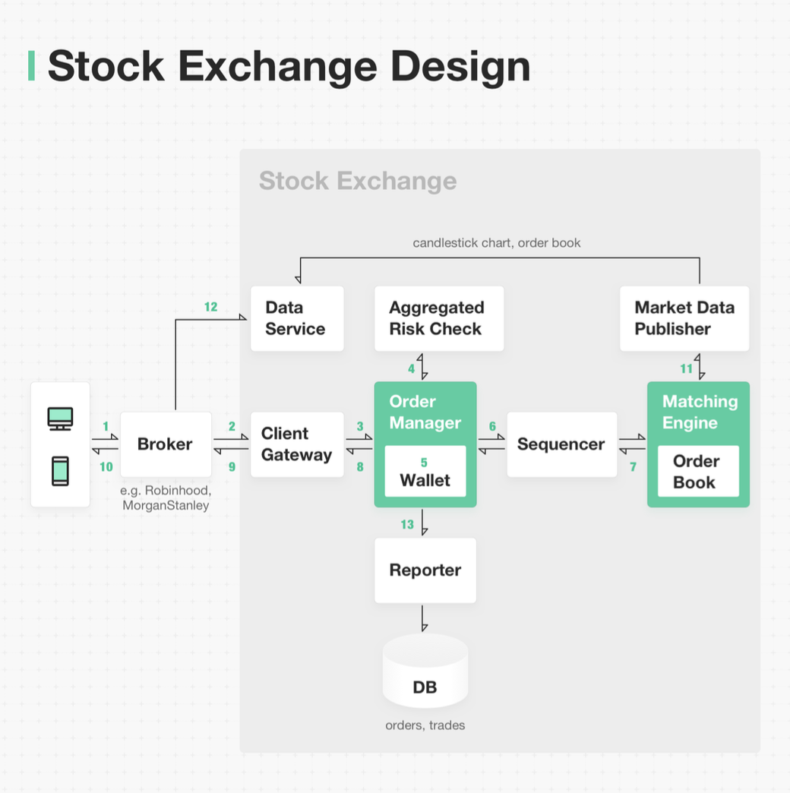

Most web systems are fine with hundreds of milliseconds of latency. A stock exchange needs microseconds. That single requirement reshapes the whole design: the order path is stripped to a minimum, communication avoids the network and the disk, and the core matching logic runs single-threaded on a pinned CPU core with no locks. This is the anatomy of an order and how the speed is achieved.

## What an exchange does

- **Order ingestion and validation** — securely receive buy and sell orders from brokers.
- **Matching** — pair buys with sells by price, then time priority.
- **Execution and confirmation** — finalize matched trades, report them back.
- **Market data** — publish real-time prices, order-book depth, and trades.
- **Clearing and settlement** — the post-trade "who owes what" and the actual transfer, usually handled by separate clearing corporations.

## The path of an order

1. **Client to broker to exchange.** A client places an order in the broker's app; the broker transmits it to the exchange.
2. **Exchange client gateway.** The front door validates format and required fields, enforces per-broker rate limits, authenticates and authorizes the broker, and normalizes the order into the exchange's internal format.
3. **Order manager and risk.** Pre-trade risk checks, defined by a risk manager: sufficient funds or securities (via the broker), price within the day's allowed bands, regulatory compliance, and enough margin in the client's account.
4. **Sequencer.** Every message — orders in, executions out — passes through a sequencer that assigns a strict global order. This gives **matching determinism**: the same orders arriving always produce the same result, which is what "fair" means here.
5. **Matching engine and order book.** Each instrument has an **order book**: a buy side (bids, highest price first) and a sell side (asks, lowest first), with orders at each price level queued **FIFO by time**. The matching engine fills an incoming order against the best opposing prices — a market buy for 100 shares consumes the lowest asks, moving up price levels (and moving the market price) until it's filled. The book's data structure needs **O(1)** reads for best bid/ask and volume-at-price, and **O(1)** updates for add, cancel, and execute.
6. **Execution reporting and market data.** A fill is sequenced and sent back through the order manager and gateway to the brokers. Separately, the exchange streams market data — prices, book depth, last trades — to a data service that brokers and vendors subscribe to.
7. **Persistence.** A reporter writes every trade's full details (client, broker, symbol, price, quantity, fill state) to a durable database for audit, regulation, and end-of-day processing.

## Getting to microseconds

The guiding rule is **do less on the critical path** — the stretch from an order entering the order manager, through risk checks and matching, to the execution confirmation leaving the order manager. Fewer tasks, less work per task, fewer network hops, no disk. Everything else moves off it.

- **Co-location.** The gateway, order manager, and matching engine run on one very powerful server or within the same rack, so there's no network between them. Containers are often avoided here for their overhead.
- **Shared memory as the bus.** Components on that server talk through shared memory, not sockets or files.
- **Single-threaded, CPU-pinned cores.** The order manager and each instrument's matching engine run single-threaded on a dedicated core. Single-threaded access to the order book means **no mutexes or semaphores** — the largest source of latency and unpredictable jitter — and pinning removes OS context switches.
- **A sequential loop.** That one thread processes messages strictly one at a time, which is where the determinism comes from.
- **Reactive off-path components.** Persistence, logging, and market-data broadcast subscribe to events on the shared-memory bus and do their work asynchronously, never blocking the match.

## The takeaway

The order book and its price-time priority are the domain core, but the performance comes from deliberately un-distributing the hot path: one machine, one thread per book, shared memory, no locks. It's the opposite of most of this category's designs, and it's what [microsecond latency](/citadel/random-thoughts/latency-number) demands — concurrency and network hops are the enemy, and [determinism](/citadel/interview/race-condition) is a feature, not just a correctness property.
