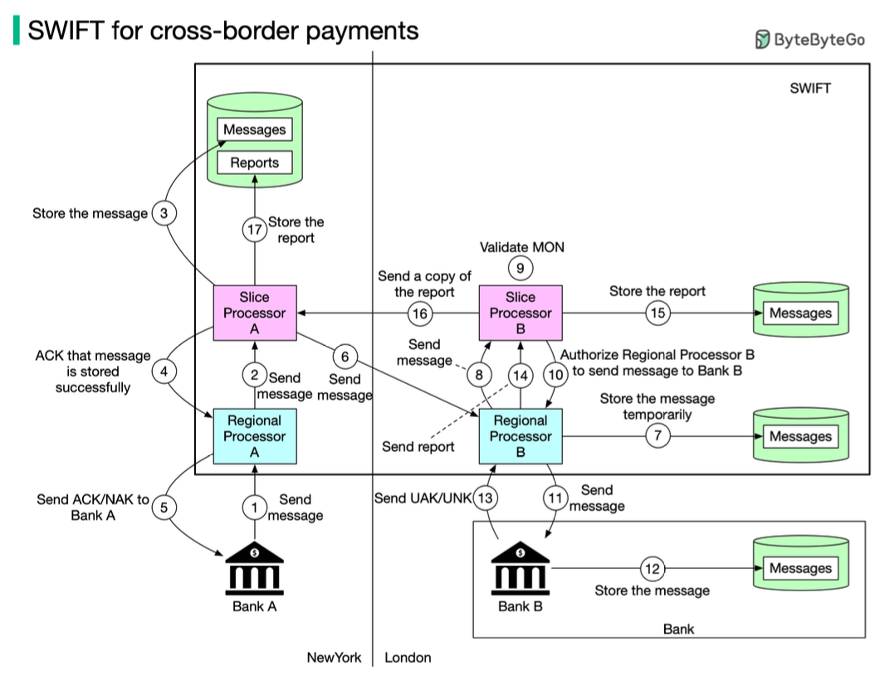
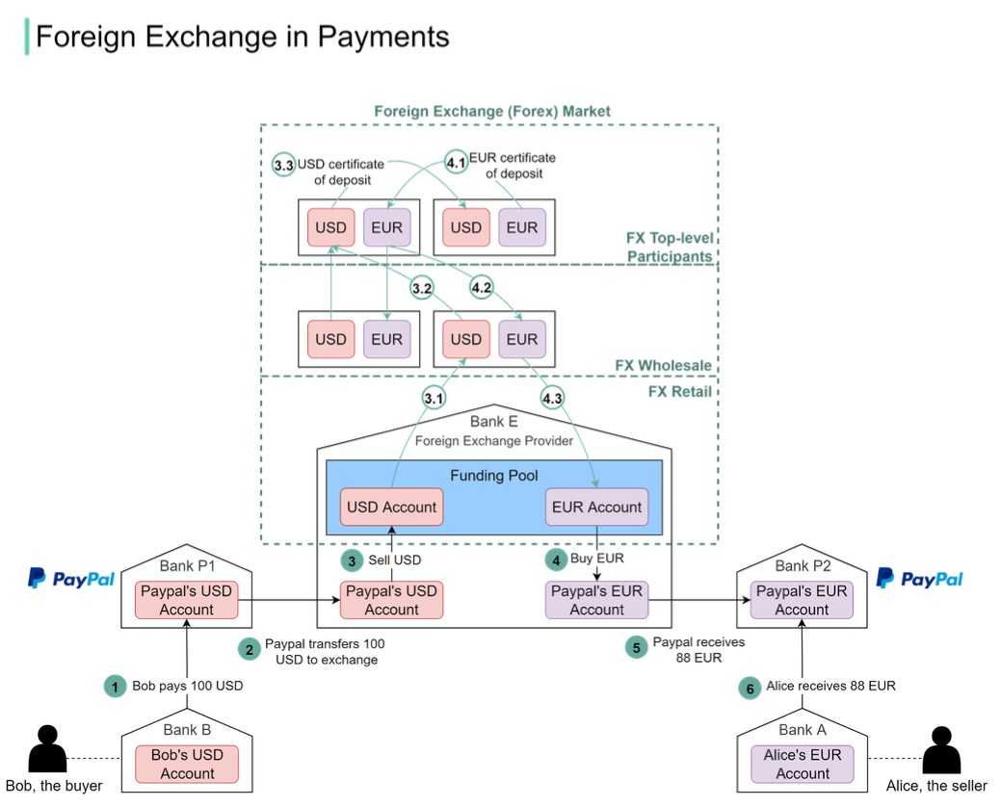

Hey everyone, and welcome back to the blog! Making an international payment often feels like a seamless click these days, but behind that simplicity lies a complex and highly secure global infrastructure. Two critical, yet often unseen, players in this arena are the **SWIFT network** for financial messaging and the **Foreign Exchange (Forex) market** for handling currency conversions.

You've probably heard SWIFT mentioned in the news, especially concerning international finance. But what exactly is it, and how does it work with Forex mechanisms to facilitate the movement of trillions of dollars in different currencies around the world every day? Let's demystify these global financial workhorses.

## What is SWIFT? The Global Financial Post Office

SWIFT, which stands for the **Society for Worldwide Interbank Financial Telecommunication**, is the main secure messaging system that links the world's banks. Think of it not as a bank itself, but as a highly secure and standardized "post office" or messaging service specifically for financial institutions. It doesn't actually transfer funds directly but sends payment orders and other financial messages between member institutions.

This Belgium-based system is run by its member banks and handles millions of these vital messages daily, forming the backbone of international finance.

*(Please note: The diagram reference is for the original SWIFT flow, Forex is discussed separately below)*

## The Journey of a SWIFT Message: A Step-by-Step Look

To understand SWIFT's role, let's trace the path of a hypothetical payment message from Bank A in New York to Bank B in London. This describes the *messaging* aspect.

The key components involved in this journey include:

* **Sending Bank (Bank A)** and **Receiving Bank (Bank B)**.
* **Regional Processors** in each bank's respective region (e.g., Regional Processor A in New York, Regional Processor B in London). These are responsible for input message validation and output message queuing.
* **Slice Processors** (e.g., Slice Processor A associated with Regional Processor A). These are responsible for securely storing and routing the messages.

Here's how the message travels:

### Phase 1: Initiation and Local Processing (Sender's Side - New York)

1. **Message Sent to Local SWIFT Network:** Bank A in New York initiates the transfer and sends a message containing all the transfer details to its local SWIFT Regional Processor A. The destination is Bank B in London.
2. **Validation and Forwarding:** Regional Processor A validates the format of Bank A's message and, if valid, forwards it to Slice Processor A.
3. **Secure Storage:** Slice Processor A securely stores this message.
4. **Storage Confirmation:** Slice Processor A informs Regional Processor A that the message has been successfully stored.
5. **Acknowledgment to Sender Bank:** Regional Processor A then sends an ACK (acknowledgment that the message will be processed and sent onwards) or a NAK (negative acknowledgment, indicating the message will *not* be sent, perhaps due to errors) back to Bank A.

### Phase 2: Transmission Across to the Recipient's Region

6. **Cross-Border Routing:** Slice Processor A now sends the stored message across the SWIFT network to Regional Processor B, located in London (Bank B's region).

### Phase 3: Processing in Recipient's Region and Delivery (Receiver's Side - London)

7. **Temporary Storage:** Regional Processor B in London receives the message and stores it temporarily.
8. **Message Output Number (MON):** Regional Processor B assigns a unique ID called a MON (Message Output Number) to the message and sends it to its corresponding Slice Processor B.
9. **MON Validation:** Slice Processor B validates this MON.
10. **Authorization for Delivery:** Slice Processor B then authorizes Regional Processor B to send the message onward to the final destination, Bank B.
11. **Delivery to Receiving Bank:** Regional Processor B sends the message to Bank B.

### Phase 4: Confirmation and Reporting Back to Sender

12. **Message Received:** Bank B receives the message and stores it.
13. **User Acknowledgment (UAK/UNK):** Bank B sends back a crucial acknowledgment to Regional Processor B. This is either a UAK (User Positive Acknowledgment), meaning Bank B received the message without any error, or a UNK (User Negative Acknowledgment), indicating an issue like a checksum failure upon receipt.
14. **Delivery Report Creation:** Regional Processor B creates a delivery report based on Bank B's UAK/UNK response and sends this report to Slice Processor B.
15. **Report Storage (Recipient's Side):** Slice Processor B stores this delivery report.
16. **Report Transmission Back:** Slice Processor B then sends a copy of this delivery report all the way back to Slice Processor A in New York.
17. **Final Report Storage (Sender's Side):** Slice Processor A receives and stores this final delivery report, completing the message lifecycle from its perspective.

## The Added Layer: Foreign Exchange (Forex) in International Payments

Often, international payments aren't just about sending instructions from Bank A to Bank B; they also involve converting one currency to another. This is where the **Foreign Exchange (Forex) market** plays a critical role, a process that happens when you pay in one currency online (e.g., USD) and the seller in another country receives funds in their local currency (e.g., EUR).

### How Forex Works with a Payment Provider (Example: Paypal)

Let's say Bob (the buyer) needs to pay 100 USD to Alice (the seller), and Alice can only receive EUR. A third-party payment provider like Paypal might facilitate this:

1. Bob sends 100 USD via Paypal. This money is transferred from Bob's bank account to Paypal's USD account held at a bank (let's call it Bank P1).
2. Paypal needs to convert these USD to EUR. To do this, it leverages a specialized foreign exchange provider (let's say Bank E). Paypal sends the 100 USD to its own USD account within Bank E.
3. The 100 USD is effectively "sold" to Bank E's funding pool (a reserve of currencies).
4. In exchange, Bank E's funding pool provides the equivalent in EUR (say, 88 EUR after exchange rates and fees). This 88 EUR is then put into Paypal's EUR account, also likely held at Bank E.
5. Paypal then transfers this 88 EUR from its EUR account at Bank E (or another of its EUR holding banks like Bank P2) to Alice's EUR bank account (Bank A).

### The Structure of the Forex Market

This currency conversion isn't just a simple swap; it involves a multi-layered market:

* **Retail Market:** This is where end-users and payment providers like PayPal access FX services. These providers often maintain "funding pools" of various currencies, which they might pre-purchase to improve efficiency.
* **Wholesale Market:** Composed of investment banks, commercial banks, and large foreign exchange providers. This market typically handles larger, accumulated orders that come from the retail market participants.
* **Top-Level Participants:** These are major multinational commercial banks that hold vast reserves of different currencies, often in the form of Certificates of Deposit (CDs) from various countries. They engage in large-volume foreign exchange trading by exchanging these certificates.

If an FX provider's funding pool (like Bank E's) runs low on a particular currency (e.g., EUR), it will go to the wholesale market to sell USD and buy EUR. If the wholesale market accumulates enough orders, it may then turn to the top-level participants to fulfill these larger currency needs.

## Important Clarification: SWIFT Moves Messages, Forex Moves (and Converts) Value

It's crucial to reiterate that **SWIFT is fundamentally a messaging system**. It provides the secure instructions for payments. The Forex mechanisms and markets are responsible for the actual currency conversion and the anagement of corresponding values during these cross-currency transactions. While a SWIFT message might initiate a payment that *requires* a currency conversion, the conversion itself happens via the Forex market infrastructure.

## Key Takeaways

* SWIFT is a vital global messaging network enabling secure communication between financial institutions for cross-border payments and other transactions.
* The SWIFT message journey involves a complex, multi-step flow through regional and slice processors to ensure messages are validated, stored, routed correctly, and their delivery status is acknowledged.
* For international payments involving different currencies, the Foreign Exchange (Forex) market handles the actual currency conversion through retail, wholesale, and top-level participant layers.
* SWIFT facilitates the *instructions* for money movement, while Forex markets and correspondent banking relationships handle the *conversion and settlement of value*.

The SWIFT network and the Forex market are both cornerstones of international finance, working in tandem to ensure that instructions for trillions of dollars worth of transactions daily are communicated reliably and the necessary currency conversions are executed efficiently across the globe.
