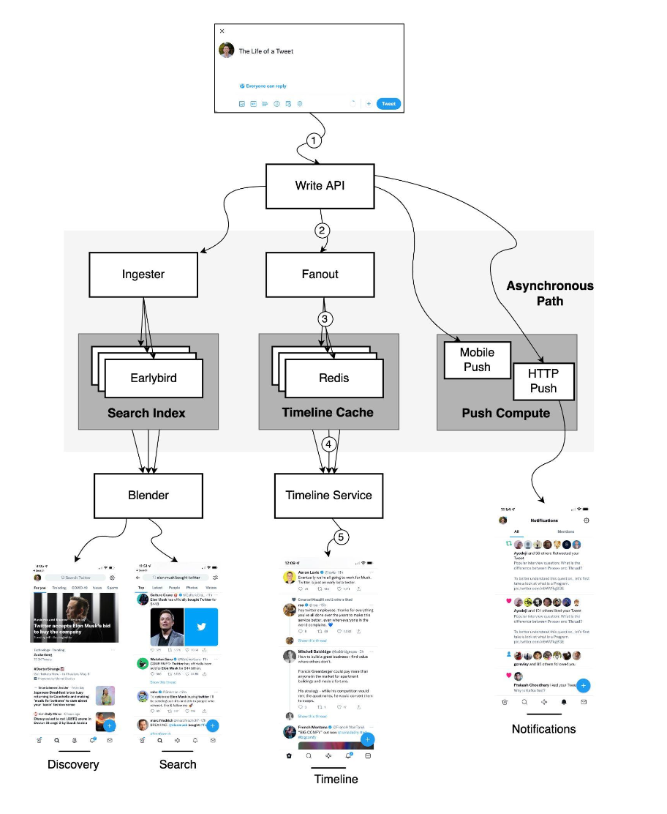

Hey everyone! Twitter, or X as it's now known, is a platform where millions of thoughts, news snippets, and conversations unfold every second. That fleeting tweet you send or the timeline you scroll through seems so simple, right? But behind that effortless user experience lies an incredibly complex and constantly evolving distributed system designed to handle immense scale and real-time interactions.

Today, let's take a peek under the hood. While the exact internal architecture is a closely guarded and evolving secret, we can piece together a picture based on past tech talks and more recent insights into specific features like its powerful recommendation engine. It's a fascinating journey from a simple tweet to a globally curated conversation!

## The Core: Life of a Tweet (A Foundational Look)

Much of our understanding of Twitter's core tweet processing comes from earlier architectural discussions, such as a tech talk given by Twitter back in 2013. While many years have passed and systems have undoubtedly evolved, the fundamental challenges of writing and reading tweets at scale remain.

### Posting a Tweet: The Write Path

When you hit that "Post" button, your tweet embarks on a rapid journey:

1.  **Write API:** Your tweet comes in through the Write API.
2.  **Ingester:** The request is often routed to an **Ingester** service. A key role of the Ingester is to annotate and tokenize tweets so the data can be indexed for search and discovery.
3.  **Fanout Service:** This is where the heavy lifting of distributing your tweet happens. The Fanout service performs a lot of processing.
    * **Delivering to Followers' Timelines:** A crucial job is "fanning out" the tweet to the home timelines of your followers. These timelines are often aggressively cached, for example, in Redis, to ensure fast loading for users. This is related to the "Timeline Cache".
    * **Asynchronous Path:** The Fanout service also triggers actions on an asynchronous path for things like sending mobile push notifications or HTTP pushes to other services.

### Viewing Your Timeline: The Read Path

When you open Twitter to see what's new:

1.  **Timeline Service:** You typically pull your home timeline through the Timeline Service.
2.  **Cache Retrieval:** This service is responsible for locating and retrieving your personalized timeline, often from a distributed caching layer like Redis which stores these pre-computed or frequently accessed timelines.

### Making Tweets Findable: Search & Discovery

Beyond just timelines, being able to search for tweets and discover new content is vital:

* **Ingester's Role:** As mentioned, the Ingester annotates and tokenizes Tweets so the data can be indexed.
* **Earlybird:** This system was described as storing Twitter's search index. It's optimized for quickly finding relevant tweets based on search queries.
* **Blender:** This component is responsible for creating the search results and discovery timelines (like "Trends" or other suggested content).

## The Algorithmic Era: Crafting the "For You" Timeline

Fast forward to today, and your main timeline is likely not just a simple chronological feed of tweets from people you follow. The "For You" timeline is a sophisticated, algorithmically curated feed designed to show you content it thinks you'll find most interesting. This is a much more complex process.

Based on information about Twitter's open-sourced algorithm for its recommendation pipeline, creating this feed happens in roughly 1.5 seconds and involves several key stages:

1.  **Candidate Sourcing:** This initial stage gathers a massive pool of potential tweets. It often starts with hundreds of millions (e.g., around 500 million Tweets) from various sources, including people you follow, topics you're interested in, and popular tweets.
2.  **Global Filtering:** The initial vast pool is then heavily filtered down to a more manageable set of candidates. For example, this might reduce the pool to around 1500 candidates, based on various heuristics and safety checks.
3.  **Scoring & Ranking:** This is where intensive machine learning comes into play. A complex neural network (for instance, one with around 48 million parameters) scores each candidate tweet based on its predicted relevance to you. Factors like your past interactions and even whether a tweet's author has a premium subscription (like the former "Twitter Blue") can influence this ranking.
4.  **Filtering (Post-Ranking):** After scoring, further filtering is applied to ensure diversity in the types of authors and content you see. This helps prevent your feed from becoming too monotonous.
5.  **Mixing:** Finally, the ranked and filtered tweets are mixed with other types of content, such as advertisements ("Ads recommendation") and "Who to Follow" suggestions, before being assembled and presented to you on your timeline.

This algorithmic approach represents a significant evolution from purely chronological or simple social graph-based timelines, aiming for a more personalized and engaging user experience.

## A Glimpse into Twitter's Tech Stack (Historically)

Building a system like Twitter requires a diverse and powerful tech stack. While this evolves constantly, a snapshot of technologies historically associated with "Twitter 1.0" gives us an idea of the components involved:

* **Mobile Development:** Swift for iOS, Kotlin for Android, and Progressive Web Apps (PWA).
* **Web Frontend:** JavaScript, React, and Redux.
* **Services Layer:** Twitter's own Finagle framework for building asynchronous RPC services, and Mesos for cluster management.
* **Caching:** Distributed caching solutions like Pelikan Cache (Twitter's own in-memory cache) and Redis are crucial for performance.
* **Databases:** A mix of databases for different purposes:
    * **Manhattan:** Twitter's own scalable, real-time, multi-tenant distributed key-value store.
    * **Relational Databases:** MySQL and PostgreSQL for certain types of structured data.
    * **Graph Databases:** FlockDB (developed by Twitter) for managing social graph data (follows, blocks).
    * **MetricsDB:** For storing time-series metrics data.
* **Message Queues:** Systems like Apache Kafka and Kestrel (another Twitter creation) for handling asynchronous tasks and data streams.
* **Data Processing:** Tools like Apache Heron (real-time stream processing, successor to Storm at Twitter), Apache Flume (for log aggregation), Tableau (for visualization), and Scalding (a Scala library for MapReduce-like jobs).
* **Storage:** Hadoop for batch processing and large-scale data storage, along with blob stores for media.
* **Infrastructure & Deployment:** Twitter data centers, alongside AWS and Google Cloud for certain services. Tools like Puppet for configuration management, and internal tools like Audubon (service registry) and Wilson (RPC tracing).

It's a testament to the engineering challenges that Twitter often had to build its own solutions when existing open-source tools couldn't meet its unique scale and performance demands.

## Key Takeaways

* Twitter's (X's) architecture is a complex distributed system designed for massive scale, handling real-time tweet posting, timeline generation, search, and sophisticated content recommendations.
* Foundational components historically included services for ingesting tweets, fanning them out to follower timelines (often cached in Redis), and dedicated systems for search indexing and retrieval.
* Modern features like the "For You" algorithmic timeline involve sophisticated multi-stage pipelines using machine learning with large neural networks to curate personalized content from hundreds of millions of tweets.
* The underlying tech stack has historically been diverse, leveraging a mix of open-source technologies (like Kafka, MySQL, PostgreSQL) and significant custom-built solutions (like Manhattan, Finagle, Pelikan Cache) to meet extreme performance and scalability requirements.
