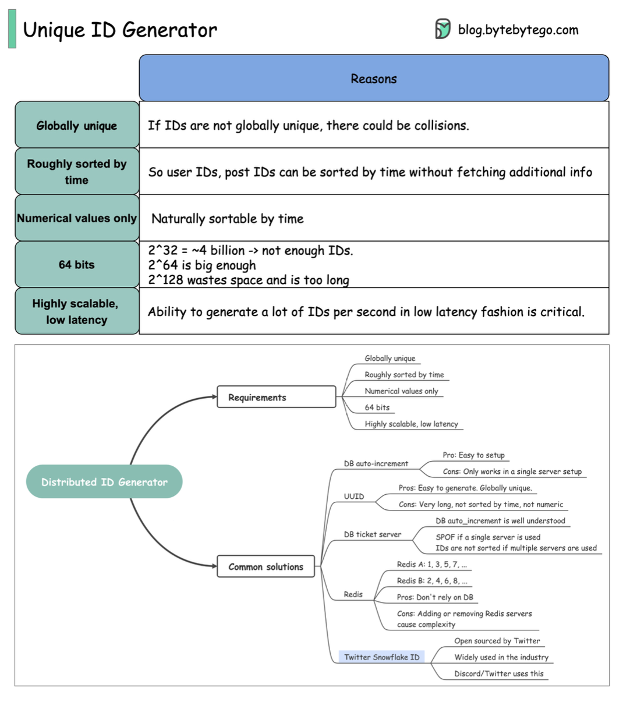

Hey system designers and developers! In the sprawling world of distributed systems, where data is vast and interactions are countless, the humble ID plays a starring role. Whether it's for a new user signing up, a social media post, a transaction, or an internal log entry, ensuring each item has a truly unique identifier across the entire globe is paramount.

But generating these globally unique IDs efficiently, at scale, and sometimes with specific ordering properties, is a fascinating challenge. It's not as simple as just incrementing a number when you have potentially thousands of requests per second across many servers! Today, let's explore why we need them and dive into some common strategies used in large-scale systems like those at Facebook, Twitter, and LinkedIn.

## Why Do We Need Globally Unique IDs Anyway? The Requirements.

When designing for large distributed systems, simply making an ID "unique" isn't always the only goal. Several requirements often come into play:

* **Globally Unique:** This is the most fundamental requirement. If IDs are not globally unique, there could be collisions, leading to data corruption or incorrect references. Imagine two different users accidentally getting the same user ID – chaos!
* **Roughly Sorted by Time:** For many use cases, like social media posts or user registrations, it's highly beneficial if IDs can be roughly sorted by the time of their creation. This allows for efficient time-based sorting (e.g., displaying recent posts) without needing to fetch and sort by a separate timestamp field.
* **Numerical Values Only:** Often preferred because numerical IDs are naturally sortable by time if they incorporate a timestamp component. They can also be more compact and efficient for database indexing compared to long strings.
* **64-bit:** This size strikes a good balance. A 32-bit ID offers roughly 4 billion unique values, which is often not enough for large-scale applications. A 64-bit ID ($2^{64}$) provides an enormous number of unique values, sufficient for most needs. Conversely, a 128-bit ID (like standard UUIDs) can be overly long and waste space.
* **Highly Scalable, Low Latency:** The ID generation system must be able to produce a massive number of IDs per second with minimal delay. This is critical for systems handling high request volumes.

## Exploring the Options: Common Solutions for Generating Unique IDs

Several approaches have been developed to generate unique IDs in distributed environments. Each has its pros and cons:

### 1. Universally Unique Identifier (UUID)

A UUID is a 128-bit number, typically represented as a 36-character hexadecimal string (e.g., `123e4567-e89b-12d3-a456-426614174000`).

* **Pros:**
  * Relatively easy to generate locally on any server without needing to coordinate with a central service.
  * Offers a high probability of global uniqueness (though collisions are theoretically possible, they are extremely rare with standard algorithms).
* **Cons:**
  * They are typically very long (128 bits / 36 characters), which can consume more storage space.
  * Standard UUIDs are not time-ordered, making them unsuitable if you need IDs that sort chronologically.
  * They are not purely numeric, which might be a requirement for some systems.
  * Can be inefficient for database indexing due to their size and randomness.

### 2. Database Auto-Increment

Most relational databases (and some NoSQL databases) offer an auto-increment feature for a primary key column.

* **Pros:**
  * Very easy to set up and use for applications with a single database server.
  * Guarantees uniqueness within that specific table.
  * Database transaction management handles concurrent requests for IDs.
* **Cons:**
  * Doesn't scale well for distributed systems with multiple database writers, as coordinating unique IDs across them becomes complex and can create a bottleneck.
  * Requires a network call to the database for each ID generation, which adds latency.
  * Can expose business intelligence, for example, if user IDs are sequential, competitors can guess the total number of users.

### 3. Database Ticket Servers (or Segment-Based DB Approach)

This is a variation of the database auto-increment strategy, designed to improve scalability. Instead of requesting one ID at a time, an ID generation service (or "ticket server") requests a batch (or "segment") of IDs from the database (e.g., "give me the next 1000 IDs") and then serves them out from its memory.

* **Pros:**
  * Significantly reduces the load and I/O pressure on the central database compared to single auto-increment requests.
  * Builds upon the well-understood database auto-increment mechanism.
* **Cons:**
  * Still relies on a central database for reserving ID ranges.
  * If a single ticket server instance goes down, it might lose the unused IDs in its current batch (unless persisted).
  * If multiple ticket servers are used without careful coordination of ranges, IDs might not be strictly time-sortable across servers, though within a batch from one server they would be.
  * Complexity in managing ranges and ensuring servers don't issue overlapping IDs.

### 4. Redis-Based Generation

Redis, being an in-memory data store, can be used to generate IDs using its atomic increment operations (like `INCR` or `INCRBY`).

* **Pros:**
  * Doesn't rely on a traditional relational database.
  * Offers better performance than disk-based database operations due to its in-memory nature.
* **Cons:**
  * Managing a Redis cluster for ID generation adds operational overhead. Adding or removing Redis servers can introduce complexity.
  * If using multiple Redis instances for sharding (e.g., one instance for odd IDs, another for even IDs), the generated IDs won't be strictly time-sortable across instances, though they would be within each instance's sequence.
  * Persistence needs to be configured correctly in Redis to avoid losing the current ID counter if the instance restarts.

### 5. Twitter Snowflake

This is a popular algorithm developed by Twitter for generating unique, roughly time-sortable, 64-bit IDs. It has been open-sourced and is widely used by companies like Discord.

A Snowflake ID is typically composed of:

* **Sign Bit:** 1 bit (usually unused, kept at 0 to ensure IDs are positive).
* **Timestamp:** 41 bits representing milliseconds since a custom epoch. This allows IDs to be roughly ordered by time and provides a lifespan of about 69 years from the epoch.
* **Machine ID / Datacenter ID:** 10 bits (can be split, e.g., 5 bits for datacenter ID and 5 bits for worker/machine ID within that datacenter). This helps ensure uniqueness across different generating machines and datacenters.
* **Sequence Number:** 12 bits, which increments for each ID generated within the same millisecond on the same machine. This allows for $2^{12} = 4096$ IDs per millisecond per machine.
* **Pros:**

  * Generates 64-bit numerical IDs, which are compact and efficient for indexing.
  * IDs are roughly sortable by time due to the timestamp component.
  * Highly scalable and low latency, as ID generation is done locally on each machine without network coordination for every ID.
* **Cons:**

  * Depends on system clock synchronization. Significant clock skew between machines could lead to out-of-order IDs or, in extreme cases, collisions if the sequence number wraps around too quickly with a backward clock jump.
  * Requires careful management and assignment of unique machine/worker IDs to prevent collisions.
  * The fixed number of bits for each component means a trade-off (e.g., longer lifespan vs. more machines vs. more IDs per millisecond).

The implementation details of algorithms like Snowflake can often be found online if you're curious to dive deeper.

## Comparing ID Generation Strategies

Here's a quick comparison of these methods based on some key attributes:

| Feature             | UUID                                    | DB Auto-Increment                       | DB Ticket Server                       | Redis `INCR`                         | Twitter Snowflake                      |
| :------------------ | :-------------------------------------- | :-------------------------------------- | :------------------------------------- | :----------------------------------- | :------------------------------------- |
| **Ordered?** | No (Standard Versions)                 | Yes (within a table/server)             | Partially (within batch/server)  | Partially (within instance)  | Roughly by time              |
| **Simplicity** | High (easy to generate)      | High (easy to setup for single server)  | Medium                                 | Medium                               | Medium to High (Algo, Machine ID mgmt) |
| **Indexable?** | Less Efficient (large, random)  | Good (typically numeric, ordered)       | Good (numeric)                         | Good (numeric)                       | Good (numeric, somewhat ordered)       |
| **Uniqueness** | Globally Probable          | Table/DB Specific              | Global (if ranges managed)             | Global (if sharding managed)         | Global (if Machine IDs unique)  |
| **In-Process Gen?** | Yes                                     | No (DB call)                    | No (service call)                      | No (service call)                    | Yes (local generation)       |
| **Single Point of Failure (SPoF)?** | No                                      | Yes (Primary DB)                        | Yes (DB for ranges / Ticket Server)  | Yes (Redis master/cluster)           | No (Decentralized)                     |

## Key Takeaways

* Generating globally unique IDs is a critical requirement for scalable distributed systems, often needing to be time-sortable and numerical.
* Simple solutions like database auto-increment struggle with scale, while UUIDs offer global uniqueness but lack time-ordering and can be bulky.
* Ticket servers and Redis-based solutions improve upon database methods but have their own complexities.
* Twitter's Snowflake algorithm provides a robust and widely adopted approach for generating 64-bit, roughly time-ordered, and highly scalable unique IDs.

The "best" approach always depends on the specific requirements of your system, balancing factors like uniqueness guarantees, sortability, performance, scalability, and operational complexity.
