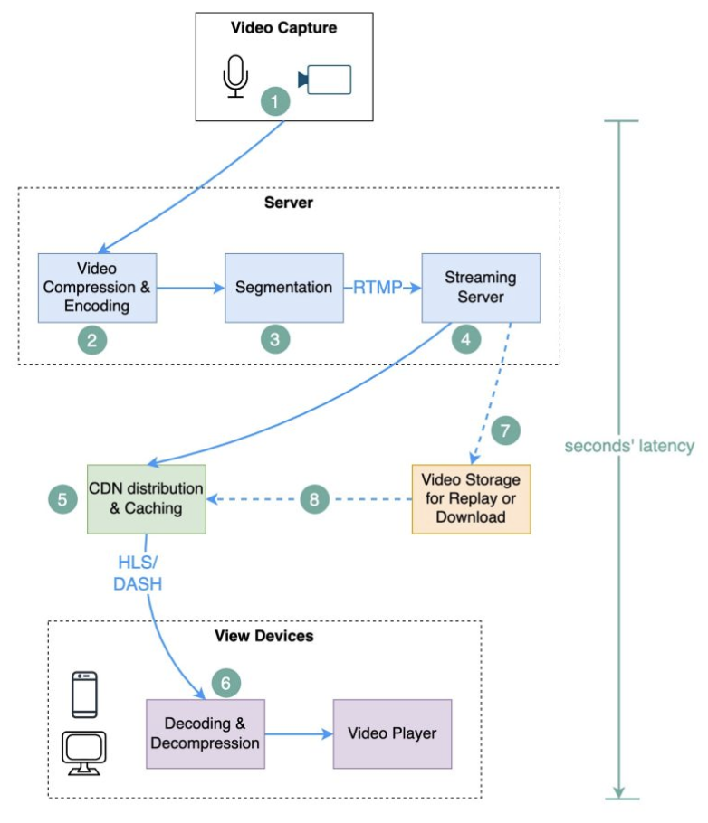

Hey everyone, and welcome back to the blog! Whether you're binge-watching your favorite series on Netflix, catching up on tutorials on YouTube, or streaming a live cricket match here in Bengaluru on Hotstar, video streaming has become an integral part of our daily lives. That seamless experience of hitting "play" (or tuning into a live event) and getting high-quality video almost instantly, regardless of your device or network speed, is something we often take for granted.

But behind this seemingly effortless delivery lies an incredibly complex and fascinating feat of system design. These platforms handle petabytes of video data, serve millions of concurrent users globally, and personalize experiences in real-time. Today, let's pull back the curtain and explore "everything around" the system design of large-scale video streaming services, covering both **On-Demand Video (VoD)** like YouTube and Netflix, and the unique challenges of **Live Video Streaming**.

## Core Challenges in Video Streaming System Design (On-Demand & Live)

Building a global video streaming platform presents a unique set of formidable challenges:

* **Massive Scale:** Billions of videos (for VoD), potentially millions of concurrent viewers (especially for live events), petabytes (or exabytes!) of data transfer.
* **High Availability & Reliability:** Users expect the service to be up 24/7. Downtime is a major issue.
* **Low Latency Playback:** Videos must start quickly and play smoothly without buffering. For live streams, minimizing the delay between the live event and the viewer's screen is critical.
* **Variable Network Conditions:** Users access content from diverse networks with varying bandwidths.
* **Diverse Range of Client Devices:** Content needs to be playable on smartphones, tablets, laptops, smart TVs, gaming consoles, etc.
* **Content Protection (DRM):** Protecting copyrighted content.
* **Personalization:** Providing relevant recommendations (for VoD).

## The Lifecycle of an On-Demand Video: From Upload to Your Screen

Let's first trace the journey of a pre-recorded video file, similar to how YouTube or Netflix VoD works.

### 1. Video Upload (The Beginning)
* **User Action:** A content creator uploads a raw video file and associated metadata (title, description, etc.).
* **Handling Large Files:** Platforms often use **Multipart Upload** for large files to object storage like **AWS S3**. This improves reliability and throughput.
* **Storage of Raw Files & Metadata:** Raw videos are stored in durable Object Storage. Metadata goes into a scalable database (SQL or NoSQL) and often a cache.

### 2. Video Processing & Transcoding (The Transformation)
This is a crucial, computationally intensive stage.
* **Triggering & Workflow:** Upload completion often triggers a message to a **Message Queue** (e.g., Kafka), decoupling upload from transcoding. Worker services then pick up these jobs.
* **Transcoding:** The raw video is converted into multiple formats, resolutions (1080p, 720p, etc.), and bitrates. This is essential for:
    * **Adaptive Bitrate Streaming (ABS):** Allows players to dynamically switch quality based on network conditions using protocols like HLS or DASH.
    * **Device Compatibility:** Ensuring playback across various devices and codecs (H.264, HEVC, VP9, AV1).
* **Output Storage:** Transcoded video segments (e.g., `.ts` for HLS, `.m4s` for DASH) and manifest files (`.m3u8`, `.mpd`) are stored back in Object Storage.
* **Other Processing:** Thumbnail generation, content analysis (moderation, recommendations), DRM encryption.
* **Status Update:** Metadata DB is updated with details of available streams.

### 3. Content Delivery for On-Demand (Bringing it to You)
* **Content Delivery Network (CDN):** The backbone for delivery.
    * Transcoded segments are distributed and cached on **CDN edge servers** globally.
    * **Netflix Open Connect (OCA)** is their custom CDN; YouTube uses Google's CDN. Third-party CDNs are also used.
* **The Streaming Process:**
    1. User requests a video. DNS routes them to an optimal CDN edge server.
    2. **Cache Hit:** If segments are cached, they stream from the edge.
    3. **Cache Miss:** Edge server fetches from origin (object storage or shield cache), caches locally, then streams.
    4. Subsequent local users benefit from the now-warm cache.
* **Streaming Protocols:** Primarily HTTP-based Adaptive Bitrate Streaming like **HLS (HTTP Live Streaming)** and **DASH (Dynamic Adaptive Streaming over HTTP)**.

## The Real-Time Rush: Designing for Live Video Streaming
Live streaming (e.g., sports events, news broadcasts, live Q&As) shares some components with VoD (like CDNs and player-side adaptive streaming) but introduces unique, more stringent challenges, especially around latency and ingest.

### Key Differences and Challenges for Live Streaming:
* **Ultra-Low Latency is Critical:** The delay between the live event happening and viewers seeing it (glass-to-glass latency) needs to be minimized, often to a few seconds or even sub-second for interactive streams.
* **Real-time Transcoding:** Video from the live source needs to be ingested, transcoded into multiple bitrates/formats, and segmented for ABS *in real-time* or near real-time.
* **Scalability for Concurrent Viewers:** Live events can attract massive, sudden spikes in concurrent viewership. The entire pipeline, from ingest to delivery, must scale rapidly.
* **Ingest Reliability:** The connection from the live source (e.g., a broadcaster's encoder) to the streaming platform's ingest servers must be highly reliable.

### Typical Live Streaming Workflow:

1.  **Live Source & Encoder:**
    * The live video feed originates from a camera or production setup.
    * An **encoder** (hardware or software) captures this feed, compresses it, and prepares it for streaming, often using protocols like **RTMP (Real-Time Messaging Protocol)**, SRT (Secure Reliable Transport), or WebRTC.

2.  **Ingest Servers:**
    * The encoder pushes the live stream to **ingest servers** within the streaming platform's infrastructure. These servers need to be geographically distributed and highly available.
    * These ingest servers receive the incoming stream.

3.  **Real-Time Transcoding & Segmentation (Live Origin):**
    * The ingested live stream is immediately fed into a **real-time transcoding engine**.
    * This engine transcodes the single input stream into multiple adaptive bitrate streams (e.g., HLS/DASH outputs with different resolutions/bitrates).
    * It also segments the video into small chunks as it's being processed. Manifest files are continuously updated.
    * This processed output is often made available from a "Live Origin" server or pushed to a designated point in the CDN.

4.  **CDN Distribution for Live:**
    * The live video segments and continuously updated manifest files are pushed or pulled by **CDN edge servers**.
    * CDNs play a crucial role in distributing the live stream to a large number of concurrent viewers with low latency. Efficient cache-fill and propagation strategies for live content are key.

5.  **Playback on Client Devices:**
    * Viewers' players connect to the CDN.
    * They fetch the manifest file (which lists available streams and segment locations) and then start downloading video segments using HLS or DASH.
    * The player continues to refresh the manifest for updates (new segments) and performs adaptive bitrate switching.

### Low-Latency Live Streaming Protocols:
While HLS/DASH are common and offer good scalability via HTTP, they traditionally introduce higher latency (e.g., 10-30 seconds or more). For ultra-low latency:
* **WebRTC (Web Real-Time Communication):** Provides browser-to-browser (or browser-to-server) real-time communication for video, audio, and data. It can achieve sub-second latency. It's more complex to scale for massive one-to-many broadcasts directly but is excellent for interactive streaming.
* **Low-Latency HLS/DASH (LL-HLS/LL-DASH):** Newer extensions to HLS and DASH designed to significantly reduce latency, often down to 2-5 seconds, while still leveraging HTTP infrastructure.
* **SRT (Secure Reliable Transport):** An open-source protocol designed for reliable, low-latency video transport over noisy networks.

## The Backend Infrastructure: Powering the Platform (VoD & Live)

A vast array of backend services supports the entire streaming experience, whether on-demand or live:
* **Microservices Architecture:** Platforms like Netflix and YouTube use microservices.
* **API Gateway (e.g., Netflix Zuul):** The front door for client requests.
* **Core Services (on compute like AWS EC2 with ELBs):** User service, metadata, recommendations, playback authorization, viewing history (Netflix uses Cassandra), live stream management, etc.
* **Databases:** A mix of SQL and NoSQL. For live streaming, fast access to stream status, viewer counts, and configurations is vital.
* **Caching (e.g., Netflix EVCache):** Used extensively.
* **Messaging/Queuing (e.g., Kafka):** For asynchronous tasks, event propagation, real-time analytics for live streams.

## "Everything Around It": Enhancing the Experience

* **Search & Discovery (VoD):** Sophisticated search.
* **Recommendation Engine (VoD):** Complex ML models.
* **Digital Rights Management (DRM):** Essential for both VoD and live premium content.
* **Real-Time Analytics & Monitoring:** Even more critical for live streaming to monitor stream health, viewer concurrency, quality of experience (QoE), and system performance.
* **Interactivity for Live Streams:** Features like live chat, polls, Q&A. These often require additional real-time messaging infrastructure (e.g., WebSockets).

## Key Takeaways

* Designing a video streaming system (both VoD and Live) is a monumental task involving massive scale, global distribution, real-time processing, and a relentless focus on user experience.
* **On-Demand Video:** Involves a pipeline of upload, extensive transcoding for ABS (HLS/DASH), and global delivery via CDNs.
* **Live Video Streaming:** Adds the challenge of real-time ingest, immediate transcoding/segmentation, and ultra-low latency delivery, often leveraging protocols like RTMP, WebRTC, or Low-Latency HLS/DASH, alongside robust CDN distribution.
* Common backend components like microservices, API gateways, diverse databases, caching, and message queues support both types of streaming.
* Surrounding systems for recommendations (VoD), DRM, and real-time analytics are crucial.

The ability to watch a cricket match live from anywhere in Bengaluru, or binge a global series, is powered by incredibly sophisticated engineering designed to make a complex system feel effortlessly simple.
