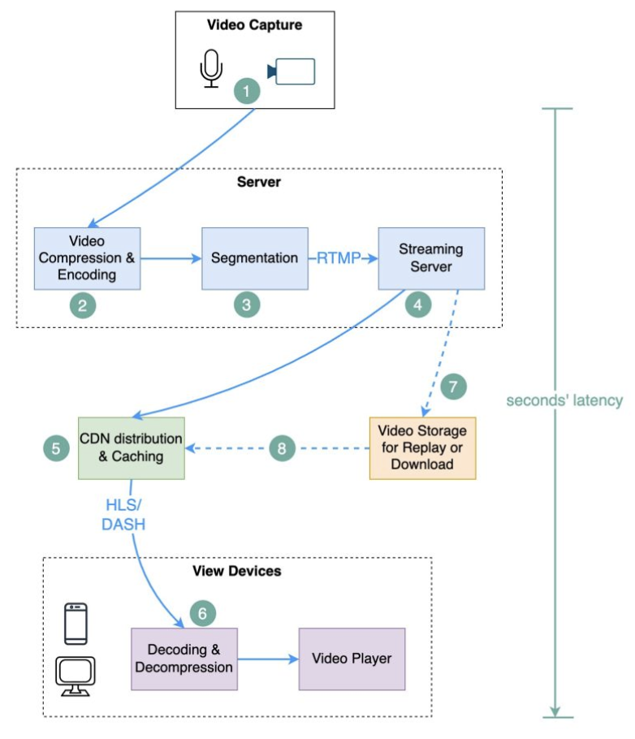

A streaming platform has to serve petabytes to millions of concurrent viewers, on every kind of device and connection, starting playback fast and without buffering. On-demand video (VoD) and live video share a delivery layer but differ sharply upstream: VoD transcodes at leisure, live transcodes a running feed with a few seconds' budget. This is the design for both.

## On-demand: upload to screen

**Upload.** The creator uploads a raw file (via multipart upload for reliability) to object storage like S3; metadata goes to a scalable database and a cache.

**Transcode.** Upload completion publishes a message to a queue (Kafka), decoupling upload from processing; workers pick up the jobs. Each raw video is transcoded into many **renditions** — resolutions (1080p, 720p, …) and bitrates — for two reasons: **adaptive bitrate streaming**, where the player switches quality to match the network, and **device compatibility** across codecs (H.264, HEVC, VP9, AV1). Output segments (`.ts` for HLS, `.m4s` for DASH) and manifest files (`.m3u8`, `.mpd`) go back to object storage. The same stage does thumbnails, content moderation, and DRM encryption, then updates the metadata database.

**Deliver.** Segments are distributed to **CDN edge servers** worldwide (Netflix Open Connect, Google's CDN, commercial CDNs). A play request is DNS-routed to a good edge; a cache hit streams from the edge, a miss fetches from origin or a shield cache and warms the edge for the next viewer. Playback is HTTP adaptive streaming — **HLS** or **DASH**.

## Live: the real-time path

Live shares the CDN and player-side adaptive streaming but adds constraints: **glass-to-glass latency** of a few seconds or less, **real-time transcoding**, sudden **viewer spikes**, and a **reliable ingest** link from the broadcaster.

1. **Source and encoder.** A camera feeds an encoder (hardware or software) that compresses and ships the stream over **RTMP**, **SRT**, or **WebRTC**.
2. **Ingest servers.** The encoder pushes to geo-distributed, highly available ingest servers.
3. **Real-time transcode and segment.** The single ingested stream is transcoded into multiple adaptive renditions and cut into short segments as it arrives, with manifests updated continuously, exposed from a "live origin".
4. **CDN distribution.** Segments and the rolling manifest are pushed or pulled to CDN edges for the concurrent audience.
5. **Playback.** Players fetch the manifest, download segments over HLS or DASH, keep refreshing the manifest for new segments, and adapt bitrate.

**Latency protocols.** Plain HLS/DASH is scalable over HTTP but runs 10–30 seconds behind. For less delay: **WebRTC** (sub-second, ideal for interactive streams, harder to scale one-to-many), **LL-HLS / LL-DASH** (2–5 seconds, keeps the HTTP infrastructure), **SRT** (reliable low-latency transport over lossy networks).

## Shared backend

Microservices behind an API gateway (Netflix's Zuul) on compute like EC2 with load balancers: user service, metadata, recommendations, playback authorization, viewing history (Cassandra at Netflix), live-stream management. A mix of SQL and NoSQL, heavy caching (Netflix's EVCache), and Kafka for async work and real-time analytics. Around it: search and recommendations (VoD), DRM for premium content, real-time monitoring of stream health and viewer concurrency, and interactivity (live chat, polls) over [WebSockets](/citadel/interview/socket-program).

## The takeaway

The delivery half is the same for both: transcode into an adaptive ladder, cut into segments, serve from a [CDN](/citadel/interview/cdn). What separates live is that every step from ingest onward runs against a wall clock. [YouTube](/citadel/system-design/youtube) and [Netflix](/citadel/system-design/netflix) are two concrete builds of this design, differing mostly in whether the CDN is custom.
