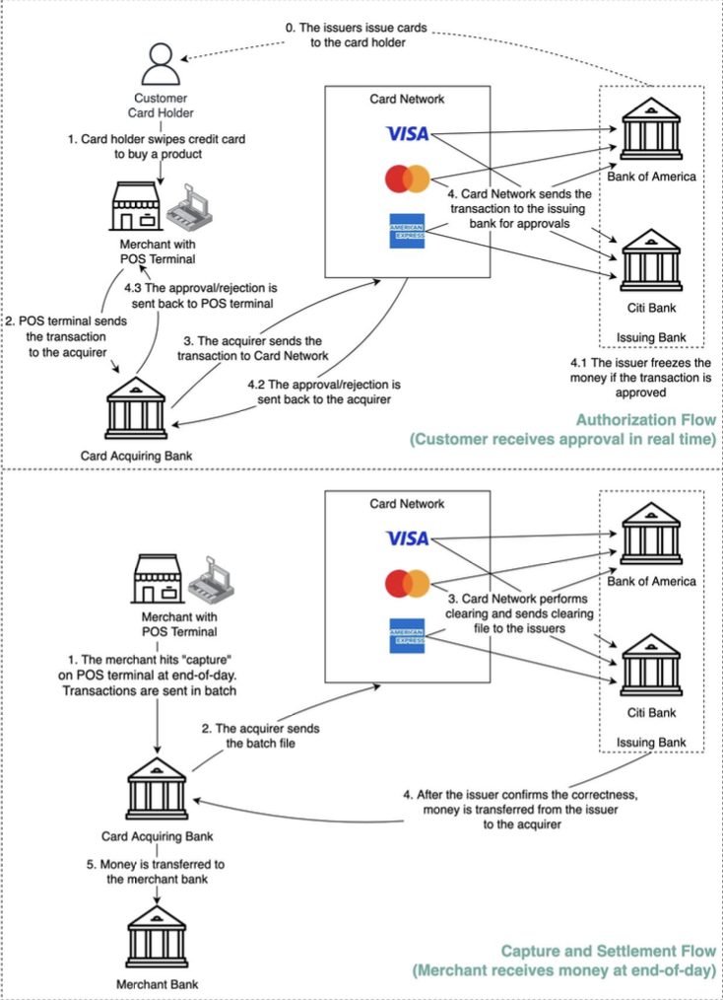

Hey everyone, and welcome back to the blog! Whether you're grabbing a coffee at a local café here in Bengaluru, shopping online, or making a purchase almost anywhere in the world, swiping, tapping, or dipping a card is a daily ritual for many. That quick transaction, often completed in seconds, feels incredibly simple. But behind that effortless "beep" lies a complex, high-speed network of communication and financial agreements orchestrated by players like Visa.

Today, let's demystify the journey of a Visa card payment. It's a fascinating look into a global system that processes an incredible volume of transactions with remarkable speed and security.

## The Players on the Field: Who's Involved in a Visa Transaction?

Before we trace the transaction, let's meet the key entities involved in making your payment happen:

* **Cardholder:** That's you! The person making the purchase with their Visa-branded card.
* **Merchant:** The business selling the goods or services.
* **Acquiring Bank (Acquirer):** The merchant's bank. This institution provides the merchant with the Point of Sale (POS) terminal (the card swipe machine) and an account to receive payments.
* **Issuing Bank (Issuer):** This is your bank, the financial institution that issued your Visa card to you.
* **Card Network (Visa):** The crucial intermediary that facilitates communication and the clearing and settlement of funds between the acquirer and the issuer. Visa, Mastercard, and American Express are major card networks. If banks had to settle transactions one-by-one with every other bank, it would be highly inefficient; card networks streamline this.

## The Two-Act Play: Authorization and Settlement

A card transaction isn't a single event but typically involves two main flows or "acts":

1.  **Authorization Flow:** This happens in real-time, right when you swipe or tap your card, to check if you *can* make the purchase.
2.  **Capture and Settlement Flow:** This happens later, usually in batches (e.g., at the end of the business day), and involves the actual movement of money.

Let's look at each act in detail.

### Act 1: The Authorization Flow – "Can I Buy This?" (Real-Time)

This is the lightning-fast sequence that determines if your purchase is approved.

* **Step 0: Card Issuance**
    * It all begins when your Issuing Bank issues a Visa card to you, the cardholder.
* **Step 1: The Swipe (or Tap/Dip)**
    * You, the cardholder, want to buy a product and present your Visa card at the merchant's Point of Sale (POS) terminal.
* **Step 2: POS Terminal to Acquirer**
    * The POS terminal securely captures your card details and the transaction amount and sends this information to the merchant's Acquiring Bank.
* **Step 3: Acquirer to Visa Network**
    * The Acquiring Bank forwards the transaction authorization request to the Visa card network.
* **Step 4: Visa Network to Issuer**
    * The Visa network intelligently routes the authorization request to your (the cardholder's) Issuing Bank for approval.
* **Step 4.1 - 4.3: Issuer's Decision & Response Back**
    * Your Issuing Bank receives the request and performs several checks:
        * Is the card valid and active?
        * Are there sufficient funds (for debit) or available credit (for credit cards)?
        * Does the transaction trigger any fraud detection alerts?
    * If all checks pass, the Issuing Bank approves the transaction and typically places a "hold" or "freeze" on the transaction amount in your account.
    * The approval (or rejection if checks fail) message is then relayed back through the Visa network to the Acquiring Bank, which then sends it to the merchant's POS terminal. This whole process usually happens in just a few seconds! The POS terminal then indicates "Approved" or "Declined."

### Act 2: The Capture and Settlement Flow – "Show Me the Money!" (Usually Batch)

Just because a transaction is authorized doesn't mean the merchant has the money yet. That happens in the settlement flow.

* **Step 1 & 2: Merchant Captures Transactions & Sends to Acquirer**
    * At the end of the business day (or another agreed-upon period), the merchant "captures" all the approved card transactions on their POS terminal. This creates a batch file of all these transactions.
    * This batch file is then sent to the merchant's Acquiring Bank. The Acquirer also sends this batch file with transactions to the card network (Visa).
* **Step 3: Clearing by Visa**
    * The Visa network performs a process called **clearing**. It receives transaction batches from many acquiring banks and sorts them by issuing bank.
    * A key part of clearing is **netting**, where mutual offset transactions between banks are calculated to reduce the total number of actual money movements needed. For example, if Bank X (an issuer) owes $1000 to various acquirers for its cardholders' purchases, and various acquirers owe Bank X $800 for refunds processed, Visa would calculate the net amount.
    * Visa then sends clearing files (detailing these net obligations) to the respective Issuing Banks and Acquiring Banks.
* **Step 4: Settlement - Issuers Pay Acquirers**
    * The Issuing Banks review and confirm the correctness of the clearing files received from Visa.
    * Then, the actual **settlement** occurs. The Issuing Banks transfer the net settlement amounts to the relevant Acquiring Banks. This fund movement usually happens through accounts that the banks hold with Visa itself or at a designated settlement bank (like a central bank).
* **Step 5: Acquirer Pays Merchant**
    * Finally, once the Acquiring Bank receives the settled funds from the Issuing Banks (via Visa), it credits the merchant's bank account with the total amount of their captured transactions, minus any applicable fees.

### The Economics: How Visa (and Banks) Make Money in this Dance

This intricate process isn't free. Several parties earn fees along the way, which is how Visa, for instance, makes money:

* A cardholder pays a merchant, say, ₹100 for a product.
* **Merchant Discount Fee:** The merchant typically pays a "merchant discount fee" to their Acquiring Bank for the privilege of accepting card payments. This fee is a percentage of the transaction value plus sometimes a fixed amount (e.g., if it's 2%, that's ₹2 on a ₹100 transaction). This fee is then shared among several players.
* **Interchange Fee:** A significant portion of this merchant discount fee (e.g., ₹1.75 out of the ₹2 in our example) is passed from the Acquiring Bank to the Cardholder's Issuing Bank. This is called the **interchange fee**, and its rates are typically set by the card network (Visa).
    * Why does the Issuing Bank get this? They bear risks like cardholder fraud or default, fund the interest-free period on credit cards, and have operational costs like account management, customer service, fraud detection, and managing clearing & settlement processes.
* **Acquirer Markup:** The Acquiring Bank keeps the remaining portion of the merchant discount fee after paying the interchange fee (e.g., ₹0.25 in our example). This is their revenue for providing services to the merchant.
* **Network Assessments & Fees (Visa's Revenue):** This is where Visa directly makes its money. The card network (Visa) charges both the Issuing Bank and the Acquiring Bank **network assessment fees** (often a percentage of the transaction volume) and **usage fees** (often a small fixed fee per transaction) for every transaction processed through its network. For example, Visa might charge a 0.11% assessment plus a ₹1.50 (converted from $0.0195) usage fee per swipe.
* **Cardholder Fees:** You, the cardholder, might also pay fees directly to your Issuing Bank, such as annual fees for certain credit cards, interest on outstanding balances, or foreign transaction fees.

## Key Takeaways

* A simple card swipe triggers a complex, two-flow process: real-time **Authorization** and batched **Capture and Settlement**.
* Key players include the Cardholder, Merchant, Acquiring Bank, Issuing Bank, and the Card Network (like Visa), which acts as the central intermediary for communication and settlement instructions.
* Visa (the network) primarily earns revenue by charging assessment and usage fees to the member banks (Acquirers and Issuers) for transactions processed over its network.
* The merchant discount fee paid by merchants is split, with the largest portion typically going to the Issuing Bank as an interchange fee.

It's a sophisticated dance of messages and money that happens billions of times a day, enabling global commerce with remarkable efficiency!
