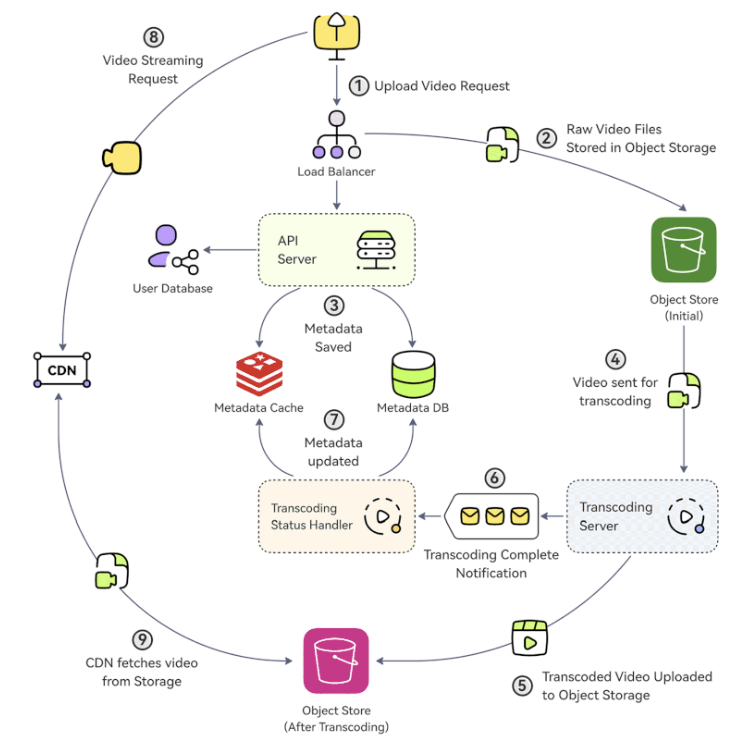

Hey everyone! YouTube. The name itself is synonymous with online video. It's a platform that handles an almost unimaginable amount of data – currently, over **500+ hours of video content are uploaded every minute on average**. How does a system at this colossal scale even begin to manage such a relentless flood of uploads while simultaneously streaming content smoothly to billions of viewers worldwide?

The engineering behind YouTube is a masterclass in distributed systems, specialized hardware, and efficient content delivery. Let's peel back the layers and explore some key aspects of how YouTube's infrastructure works, including how one might design a similar system, their innovations in video processing, and the magic behind live streaming.

## The Core Challenge: A Tsunami of Video

The primary challenge for YouTube is twofold:

1.  **Ingestion & Processing:** Efficiently handling hundreds of hours of new video uploads every minute, processing them into various formats and resolutions suitable for all types of devices and network conditions.
2.  **Delivery & Streaming:** Serving this vast library of video content to a global audience with low latency and high quality, ensuring a seamless viewing experience.

## Designing a YouTube-Like System: A High-Level Blueprint

If you were tasked with designing a system like YouTube, here’s a general architectural approach you might consider:

### Video Upload Process:

1.  **Upload Initiation:** A user creates a video upload request, providing the video file(s) and associated metadata (title, description, tags, etc.).
2.  **Raw Storage:** The raw video files are uploaded to a highly scalable and durable Object Storage solution, like Amazon S3 or Google Cloud Storage.
3.  **Metadata Management:** The video's metadata is saved into a primary database (for persistent storage) and often also into a cache (for faster retrieval of frequently accessed information).
4.  **Asynchronous Transcoding Pipeline:** The raw video file is then sent to a transcoding service or pipeline. Transcoding is the crucial process of converting the video into various formats (e.g., MP4, WebM), resolutions (e.g., 480p, 720p, 1080p, 4K), and bitrates to ensure compatibility across different devices and network speeds. This is usually an asynchronous, resource-intensive process.
5.  **Storing Transcoded Versions:** Once transcoding is complete, the various processed versions of the video are stored, typically in another Object Storage location.
6.  **Completion Notification:** A notification indicating that transcoding is complete (and whether it was successful) is sent, often via a message queue, to other services that need to know.
7.  **Metadata Update:** A "Transcoding Status Handler" service consumes this notification and updates the metadata database and cache with the status and locations of the newly transcoded video files.

### Video Streaming Process:

8.  **User Request:** A viewer clicks to watch a video. This request is typically directed to a Content Delivery Network (CDN).
9.  **CDN Delivery:**
    * If the CDN already has the requested video segments cached at an edge server near the user, it serves them directly, ensuring low latency.
    * If not cached, the CDN fetches the video (or specific segments) from the backend Object Storage where the transcoded files are kept. The CDN then caches these segments locally for future requests from users in that region.
    * Modern video streaming uses adaptive bitrate technologies (like HLS or DASH), where the video is broken into small chunks. The player on the client's device intelligently requests the best quality chunk based on current network conditions.

## Deep Dive: YouTube's Innovation in Video Transcoding - The VCU

YouTube's mission critical task is to transcode raw video uploads into different compression rates and resolutions to adapt to a myriad of viewing devices – from mobile phones (720p) to laptops (1080p) and high-resolution TVs (4K). Given the massive influx of video content, especially with surges in consumption (like during the COVID-19 pandemic), traditional software-based encoding became slow and costly at YouTube's scale.

To address this, YouTube developed its own specialized hardware:

* **Video TransCoding Units (VCUs):** These are custom-built hardware accelerators designed specifically for warehouse-scale video processing, much like GPUs are for graphics or TPUs (Tensor Processing Units) are for machine learning computations.
* **VCU Cluster Architecture:** These VCUs are deployed in clusters. Each server in such a cluster is equipped with multiple accelerator trays, and each tray holds several VCU cards. These cards, in turn, house the necessary encoders, decoders, and other video processing components.
* **Workflow & Output:** The VCU clusters take raw video, generate the various encoded versions, and then store this content in cloud storage.
* **The Impact:** This hardware-accelerated approach brought about a remarkable **20-33x improvement in computing efficiency** compared to YouTube's previously optimized software-based system. This innovation was detailed in their 2021 paper, "Warehouse-scale video acceleration: co-design and deployment in the wild."

## How YouTube Live Works (and Live Streaming in General)

Live streaming adds another layer of complexity due to its real-time nature. Here’s a general flow, applicable to platforms like YouTube Live:

1.  **Video Capture:** The streamer starts their broadcast using a camera and encoding software/hardware.
2.  **Ingestion via Point-of-Presence (PoP):** To ensure a stable upload, the streamer connects to a PoP server geographically closest to them. These PoPs act as ingestion points for the live stream.
3.  **Real-time Transcoding & Segmentation:** The incoming live video stream is immediately transcoded into various resolutions and bitrates. Simultaneously, it's divided into smaller video segments or chunks, typically a few seconds in length.
4.  **Packaging for Adaptive Streaming:** These segments are then packaged into adaptive bitrate streaming formats like HLS (HTTP Live Streaming) or MPEG-DASH. These formats allow video players to switch between different quality streams based on the viewer's network conditions. This involves creating manifest files that list the available streams and segments.
5.  **CDN Distribution:** The manifest files and video chunks are rapidly distributed and cached across a global CDN.
6.  **Viewer Experience:** Viewers connect to the live stream, and their video player fetches the manifest file from a nearby CDN edge server. The player then requests the appropriate video segments, continuously adapting the quality for a smooth experience.
7.  **Optional Storage for Replay:** The live stream can also be optionally recorded and stored (e.g., in Amazon S3) for later video-on-demand (VOD) playback.

## Key Takeaways

* YouTube's scale (500+ hours of video uploaded per minute) necessitates a highly optimized and distributed architecture for video ingestion, processing, and delivery.
* A typical YouTube-like system involves object storage for raw and transcoded videos, a metadata database, an asynchronous transcoding pipeline, and a CDN for efficient global delivery.
* YouTube developed custom hardware accelerators called Video Transcoding Units (VCUs) to achieve significant (20-33x) efficiency gains in video processing at scale.
* Live streaming involves real-time transcoding, segmentation, packaging into adaptive bitrate formats (like HLS), and rapid distribution via CDNs.

The engineering behind YouTube is a continuous evolution, constantly pushing the boundaries of video processing and delivery at an unprecedented scale.
