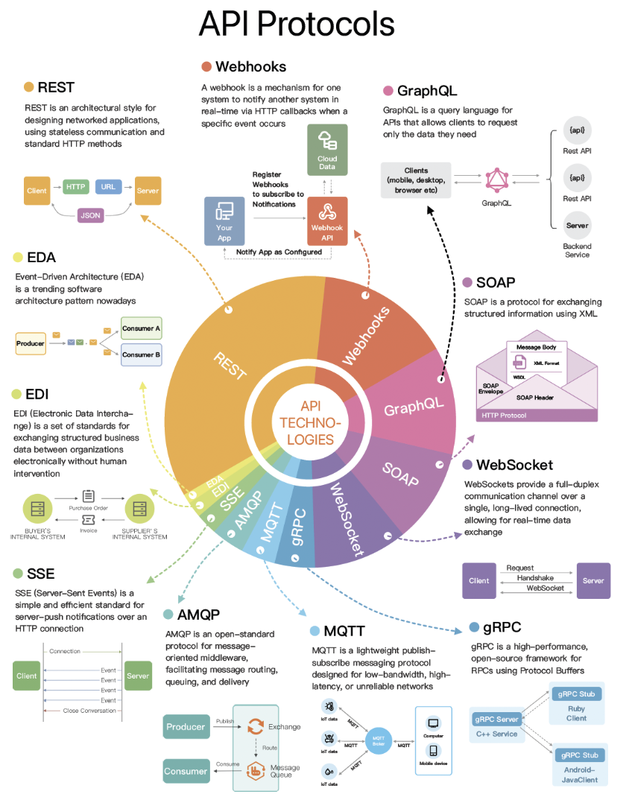
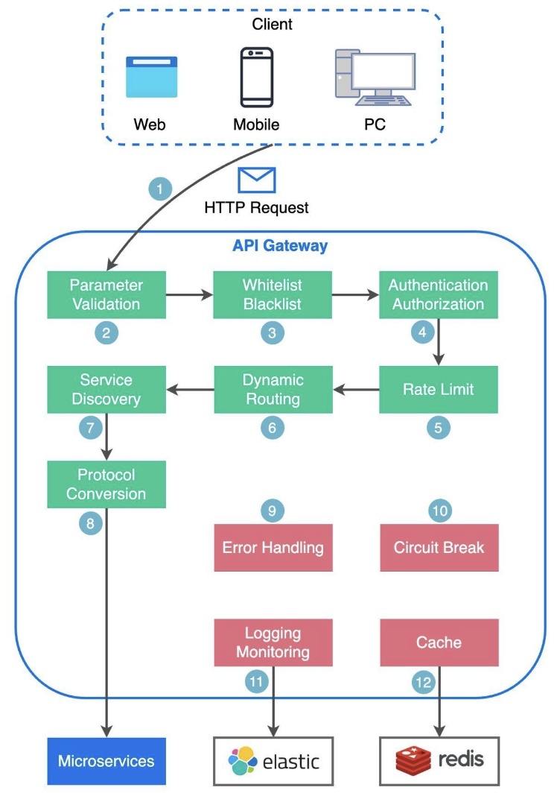

Hey tech explorers! In today's hyper-connected digital landscape, we interact with countless applications and services that seamlessly share data and functionality. But have you ever paused to think about what makes this intricate dance possible? The answer, more often than not, lies in **APIs (Application Programming Interfaces)**.

APIs are the unsung heroes, the crucial intermediaries that allow different software systems to communicate and work together. They are the building blocks of modern applications, from the social media apps on your phone to complex enterprise systems. Today, let's pull back the curtain on APIs, understand their various styles, explore how to make them performant, the role of API Gateways, and the best practices for designing effective and secure interfaces.

## What Exactly is an API?

An API, or Application Programming Interface, is fundamentally a set of rules and protocols that allows different software applications and services to communicate with each other. Think of it as a contract between two pieces of software: one piece of software offers information or functionality, and the other consumes it.

* It defines how software components should interact.
* It facilitates data exchange and access to functionality between these components.
* An API typically consists of **endpoints** (the URLs you interact with), **requests** (how you ask for something), and **responses** (what you get back).

## Why Are APIs So Important?

APIs are the bedrock of modern software architecture for several reasons:

* **Modularity & Microservices:** APIs enable breaking down large, monolithic applications into smaller, manageable microservices, each handling a specific function and communicating via APIs.
* **Integration:** They allow disparate systems, even those built with different technologies, to connect and share data.
* **Reusability:** Functionality exposed via an API can be reused by multiple applications, saving development time and effort.
* **Innovation:** APIs empower third-party developers to build new applications and services on top of existing platforms, fostering a vibrant ecosystem (think of all the apps built using Twitter's or Google Maps' APIs).

## A Tour of Common API Architectural Styles

Not all APIs are built the same way. Different architectural styles have evolved, each with its own patterns and best use cases.

### 1. REST (Representational State Transfer)

REST is an architectural style for designing networked applications, using stateless communication and standard HTTP methods. It's arguably the most popular style for web services today.
* **How it works:** Uses standard HTTP methods (GET, POST, PUT, DELETE, etc.), communicates statelessly, and resources are identified by URLs.
* **Data Format:** Flexible, commonly uses JSON, but can also use XML, HTML, or plain text.
* **Use Cases:** Ideal for web services and mobile APIs due to its simplicity and alignment with HTTP.
* **Key Principles:** Client-Server, Stateless, Cacheable, Layered System, Code-On-Demand (optional), and a Uniform Interface.

### 2. GraphQL

Developed by Meta (formerly Facebook) in 2012 and publicly released in 2015, GraphQL is a query language for APIs and a server-side runtime for executing those queries by using a type system you define for your data.
* **How it works:** Allows clients to request *exactly* the data they need and nothing more, often in a single request, even if the data spans multiple resources. It can aggregate multiple traditional REST requests into one efficient query.
* **Features:** Supports queries (reading data), mutations (applying data modifications to resources), and subscriptions (receiving real-time updates on schema modifications).
* **Use Cases:** Great for applications with complex data requirements, mobile apps where bandwidth is a concern, and systems with rapidly evolving frontend needs. It's suitable for complex systems where relationships are graph-like.

### 3. gRPC (Google Remote Procedure Call)

gRPC is a high-performance, open-source universal RPC framework initially developed by Google. It enables client applications to directly call methods on a server application on a different machine as if it were a local object.
* **How it works:** Uses Protocol Buffers (Protobufs) by default as its Interface Definition Language (IDL) for serializing structured data. This makes gRPC messages smaller and faster compared to JSON or XML, sometimes said to be 5X faster than JSON. The gRPC library handles encoding/decoding and data transmission.
* **Transport:** Leverages HTTP/2 for transport, which allows for many improvements like multiplexing and bi-directional streaming.
* **Use Cases:** Excellent for communication between microservices in high-performance scenarios, IoT devices, and polyglot (multiple language) environments.

### 4. Webhooks (Reverse APIs / Push APIs)

Webhooks are a mechanism for one system to notify another system in real-time via HTTP callbacks when a specific event occurs.
* **How it works:** Instead of your application constantly polling for updates (pulling), a webhook is an HTTP callback. The source application makes an HTTP request to a URL provided by your application when a specific event occurs. The server sends HTTP requests to the client.
* **Nature:** Event-driven and asynchronous.
* **Use Cases:** Commonly used for notifications from third-party services, such as payment gateways (Stripe, PayPal notifying of a successful transaction), version control systems (GitHub notifying of a new commit), or any scenario where you need immediate updates on external events.

### 5. SOAP (Simple Object Access Protocol)

SOAP is a protocol for exchanging structured information using XML. It has a well-defined enveloped message structure.
* **Data Format:** Exclusively XML.
* **Characteristics:** Mature, comprehensive, and often seen as more rigid than REST.
* **Use Cases:** Still found in enterprise applications, financial services, payment gateways, identity management, and for integrating with legacy systems.

### 6. WebSocket

WebSockets provide a full-duplex communication channel over a single, long-lived TCP connection, allowing for real-time data exchange.
* **How it works:** After an initial HTTP handshake to upgrade the connection, the client and server can send data to each other in real-time without the overhead of new HTTP requests for each message. Unlike REST which "pulls" data, WebSocket enables data to be "pushed".
* **Nature:** Real-time, bidirectional.
* **Use Cases:** Ideal for applications requiring low-latency data exchange, such as live chat applications, online gaming, and real-time stock trading platforms.

### Messaging & Eventing Protocols (Often for EDA)
Event-Driven Architecture (EDA) is a trending software architecture pattern, and several protocols are key in this space.

* **MQTT (Message Queuing Telemetry Transport):**
    * **Description:** MQTT is a lightweight publish-subscribe messaging protocol designed for low-bandwidth, high-latency, or unreliable networks. It's ideal for constrained devices.
    * **Use Cases:** IoT (Internet of Things) applications, mobile messaging, sensor networks.

* **AMQP (Advanced Message Queuing Protocol):**
    * **Description:** AMQP is an open-standard protocol for message-oriented middleware, facilitating reliable message routing, queuing, and delivery between applications and systems. It defines brokers and exchanges for complex routing.
    * **Use Cases:** Enterprise messaging, financial systems, systems requiring reliable, interoperable messaging.

* **SSE (Server-Sent Events):**
    * **Description:** SSE is a simple and efficient standard for server-push notifications over a regular HTTP connection. The server can send updates to the client, but the client cannot send data back over the same SSE connection (it's unidirectional from server to client after initial setup).
    * **Use Cases:** Real-time notifications from server to client like news feeds, live score updates, stock tickers where client-to-server real-time interaction isn't the primary need.

### Other Notable Protocols

* **EDI (Electronic Data Interchange):**
    * **Description:** EDI is a set of standards for exchanging structured business data (like purchase orders, invoices) between organizations electronically, without human intervention.
    * **Use Cases:** Business-to-business (B2B) transactions, supply chain management, healthcare.

## Crafting Quality APIs: Design, Security & Performance

Designing an API that is effective, user-friendly, secure, *and* performant is crucial.

### Optimizing API Performance - Every Millisecond Counts!
API performance is critical; for example, Amazon found that every 100ms of latency could cost them 1% in sales. Here are common ways to improve API performance:
* **Result Pagination:** For APIs returning large datasets, pagination is crucial. This method optimizes large result sets by streaming them back to the client or breaking them into manageable chunks, enhancing service responsiveness. Common techniques include:
    * Offset-based Pagination: Uses an `offset` and `limit`. Simple but can be inefficient for large offsets.
    * Cursor-based Pagination: Uses a `cursor` (unique identifier) to mark position. More efficient for large datasets.
    * Page-based Pagination: Specifies `page` number and `size`. Easy to use but similar performance issues as offset-based for large page numbers.
    * Keyset-based Pagination: Uses a key (like primary key) to filter. Efficient but requires a unique, indexed key.
    * Time-based Pagination: Uses a timestamp. Useful for time-ordered data.
    * Hybrid Pagination: Combines multiple techniques.
* **Asynchronous Logging:** Instead of writing logs to disk on every call (which adds I/O overhead), send logs to a lock-free ring buffer and return immediately. Logs are then periodically flushed to disk.
* **Data Caching:** Store frequently accessed data in a cache (e.g., Redis) to speed up retrieval. Clients check the cache before querying the database.
* **Payload Compression:** To reduce data transmission time, requests and responses can be compressed (e.g., using gzip), making upload and download processes quicker.
* **Connection Pooling:** Opening and closing database connections adds significant overhead. A connection pool maintains a number of open connections for applications to reuse, managing their lifecycle efficiently.
* **Choose Performant Protocols:** For internal microservice communication where performance is key, consider high-performance protocols like gRPC over more verbose options.

### Design & Security Best Practices

* **Domain-Driven Design:** Your API paths and resource names should be intuitive and reflect your domain model. Use nouns for resources (e.g., `/users`, `/orders`). API design is not just URL paths; it includes choosing proper resource names, identifiers, and path patterns.
* **Proper HTTP Methods:** Utilize HTTP verbs semantically.
* **Idempotency:** Ensure operations that can be retried (like `PUT` and `DELETE`) are idempotent.
* **Versioning:** Implement a clear versioning strategy (e.g., `/v1/users`, `/v2/users`) to manage changes and maintain backward compatibility.
* **Security is Paramount:**
    * **HTTPS Everywhere:** Always use HTTPS to encrypt data in transit.
    * **Authentication:** Verify client identity. Common methods include Basic Auth, API Keys, Token Authentication (e.g., JWT), and OAuth 2.0. When generating API keys, one can generate a unique app ID for each client and different public/private key pairs for varying authorizations (e.g., read-only, read-write).
    * **Authorization:** Once authenticated, ensure the client has permission for the action.
    * **Input Validation:** Rigorously validate all incoming data.
    * **Rate Limiting & Throttling:** Protect your API from abuse by limiting request frequency. Design rate limiting rules based on user, action group, IP, etc..
    * **HMAC Signatures for Enhanced Security:** For HMAC authentication, clients generate a signature using attributes like public app ID, request URI, content, HTTP method, the secret API key, a request timestamp, and a nonce to ensure integrity and prevent replay attacks.
* **Handle Large Datasets Gracefully:** Beyond pagination, consider filtering and sorting capabilities to allow clients to request specific subsets of data.
* **Meaningful HTTP Status Codes:** Use standard HTTP status codes to indicate request outcomes.
* **Clear Documentation:** Provide comprehensive, accurate, and easy-to-understand documentation (e.g., using OpenAPI/Swagger).
* **Effective Error Handling:** Return descriptive error messages but avoid exposing sensitive internal details.

### The Gatekeeper and Conductor: A Deep Dive into API Gateways

As applications grow, especially with the adoption of microservices, managing direct client-to-service communication becomes incredibly complex and introduces a host of challenges. This is where an **API Gateway** steps in as an essential architectural component. An API gateway is a server that acts as an API front-end, a single entry point for all client requests to the backend services of an application. Think of it as a sophisticated traffic manager and security guard standing between your clients and your complex web of backend services.

Let's look at the typical flow and its key functions:

1.  **Client Request:** The client (web browser, mobile app, or another service) sends an HTTP request to the API gateway.
2.  **Parsing & Basic Validation:** The API gateway parses the request and often validates basic attributes in the HTTP request.
3.  **Allowlist/Denylist Checks:** The gateway may perform checks against pre-configured allow-lists or deny-lists (e.g., based on IP addresses) to filter traffic.
4.  **Authentication & Authorization:** This is a crucial security function. The API gateway often integrates with an identity provider (IdP) or an authentication service to verify the client's identity (Authentication - "who are you?") and check if they have the necessary permissions for the requested resource or operation (Authorization - "what are you allowed to do?"). This offloads auth logic from individual microservices.
5.  **Rate Limiting & Throttling:** To protect backend services from being overwhelmed by too many requests (either from legitimate high traffic or malicious attacks like DoS), the API gateway applies rate limiting rules. If a client exceeds the defined limits, their requests might be rejected or queued.
6.  **Request Routing (Service Discovery & Path Matching):** Once the request is validated and authorized, the API gateway needs to route it to the appropriate backend microservice (or services). This often involves:
    * **Path Matching:** Understanding the request path to determine which service should handle it.
    * **Service Discovery:** Interacting with a service registry (like Eureka or Consul) to find the current network location (IP address and port) of the target service instances, which is vital in dynamic cloud environments where instances scale up and down.
7.  **Protocol Translation (Optional):** The API gateway can transform the incoming request into the appropriate protocol required by the backend microservices (e.g., translating an external RESTful JSON request into an internal gRPC request).
8.  **Request to Backend Service(s):** The gateway forwards the (potentially transformed) request to the chosen backend service(s).
9.  **API Composition / Aggregation (Optional):** For some client requests, the API gateway might need to invoke multiple backend microservices and then aggregate their responses into a single, unified response for the client. This pattern is particularly useful for optimizing chatty client-server interactions.
10. **Response Handling & Transformation:** The gateway receives the response from the backend service(s), potentially transforms it (e.g., converting from an internal format back to a format expected by the client), and forwards it to the client.
11. **Caching:** The API gateway can cache responses from backend services for frequently requested, cacheable data. This improves response times for clients and reduces load on backend services.
12. **Logging, Monitoring & Analytics:** The API gateway is a prime location for centralized logging of all API traffic, collecting metrics on API usage (request counts, error rates, latencies), and providing data for monitoring and analytics dashboards (often using tools like an ELK stack - Elasticsearch, Logstash, Kibana).
13. **Error Handling & Circuit Breaking:** The API gateway can handle errors gracefully. If a backend service is unresponsive or failing, the gateway can implement circuit breaker patterns to prevent cascading failures and return appropriate error responses to the client without repeatedly bombarding the failing service.

**Benefits of Using an API Gateway:**

* **Decoupling:** Clients are decoupled from the internal structure of the backend services. Microservices can be refactored, split, or combined without affecting external clients as long as the API contract exposed by the gateway remains consistent.
* **Centralized Cross-Cutting Concerns:** Handles common tasks like authentication, authorization, rate limiting, logging, and monitoring in one place, rather than requiring each microservice to implement them.
* **Simplified Client Interaction:** Clients have a single entry point, simplifying their interaction with a potentially complex microservices backend.
* **Improved Security:** Provides a unified point for enforcing security policies.
* **Optimized Performance:** Features like caching and request/response transformation can improve overall performance.

**Considerations:**

* The API gateway itself can become a potential bottleneck or single point of failure if not designed for high availability and scalability.
* It adds another network hop, which could introduce some latency if not carefully managed and optimized.
* Defining and managing the gateway's configuration (routing rules, security policies) can become complex for very large systems.

Questions often arise about the difference between a load balancer and an API gateway. While both manage traffic, a load balancer typically operates at Layer 4 (transport) or Layer 7 (application) to distribute traffic across multiple instances of the *same* service for scalability and availability. An API gateway is usually a Layer 7 component that provides more sophisticated features like request routing to *different* services, API composition, authentication, rate limiting, and protocol translation, acting as a more intelligent entry point to a system of services.

In many setups, an external load balancer might distribute traffic to multiple instances of an API gateway, which then routes requests to various backend microservices, each of which might also be behind its own internal load balancer.

## API vs. SDK: Understanding the Tooling Landscape

While both APIs and SDKs are essential tools in the software development world, they serve distinct purposes and are often used in conjunction. Let's break down the differences:

| Feature              | API (Application Programming Interface)                                                                                                | SDK (Software Development Kit)                                                                                                                              |
| :------------------- | :------------------------------------------------------------------------------------------------------------------------------------- | :---------------------------------------------------------------------------------------------------------------------------------------------------------- |
| **Primary Purpose** | A set of rules and protocols that allows different software applications and services to communicate with each other.            | A comprehensive package of tools, libraries, sample code, and documentation to assist developers in building applications for a specific platform/service. |
| **Nature** | An interface – a contract defining interaction methods.                                                                           | A toolkit – a collection of resources to facilitate development.                                                                               |
| **What it Provides** | Defines how software components should interact; facilitates data exchange and functionality access between components. Typically consists of endpoints, requests, and responses. | Tools, libraries, code samples, documentation, debuggers, and sometimes IDE integrations, often tailored to specific platforms or frameworks.    |
| **Focus** | Communication and interoperability between different software pieces.                                                              | Simplifying and accelerating development for a *specific* platform, framework, or hardware by providing higher-level abstractions.                |
| **Usage** | Directly called by software to request services or data from another piece of software.                                                | Used by developers during the development process to build applications. The SDK often makes API calls under the hood.                                    |
| **Analogy** | Like a restaurant menu: it tells you what you can order (endpoints/requests) and what you'll get (responses).                        | Like a fully equipped chef's kitchen set for a specific cuisine: provides all the tools, recipes (sample code), and ingredients (libraries) needed to cook. |
| **Compatibility & Performance** | APIs themselves are about the contract. Performance depends on the API's implementation.                                         | SDKs are often tailored to specific platforms or frameworks, ensuring compatibility and potentially optimal performance on that platform.                |
| **Advanced Features**| The API *defines* access to functionalities.                                                                                         | SDKs can offer access to advanced features and capabilities specific to the platform, which might be otherwise challenging to implement from scratch. |

The choice between directly using an API or leveraging an SDK depends on the development goals and requirements of the project. Often, if a service provider offers both an API and an SDK for their platform, developers will prefer using the SDK because it simplifies common tasks, handles boilerplate code (like authentication or request formatting for the API), and allows them to get started more quickly.

## Key Takeaways

* APIs are crucial interfaces enabling software communication, with styles like REST, GraphQL, gRPC, and Webhooks catering to diverse needs.
* Optimizing API performance through pagination, caching, compression, connection pooling, and asynchronous logging is vital for user experience and system efficiency.
* Designing effective APIs involves thoughtful resource naming, HTTP method usage, versioning, robust security (authentication, authorization, input validation, rate limiting), and clear error handling.
* API Gateways play a critical role in modern architectures by centralizing cross-cutting concerns.
* Thorough testing and clear documentation are non-negotiable for successful API development and adoption.

APIs are truly the glue holding our digital world together, enabling the rich, interconnected experiences we often take for granted.
